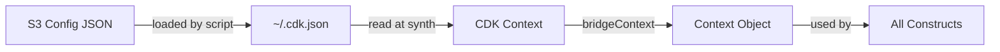

# @sevenpico/cdk-bridge

Bridge between SevenPico's Terraform platform outputs and CDK constructs. Reads per-environment configuration from the CDK context key `sevenpico` and returns a `Context` object for use across all SevenPico CDK constructs.

## Diagram



## Platform Bridge

SevenPico's infrastructure is deployed per-environment and per-region. Each deployment writes a JSON configuration file to S3 containing the Terraform platform outputs — VPC IDs, account IDs, naming labels, and other shared values.

Before running `cdk synth`, a helper script downloads the appropriate config file from S3 and writes it to `~/.cdk.json` under the `sevenpico` context key. CDK then makes this available via `scope.node.tryGetContext('sevenpico')` at synth time.

How it works:

1. A script loads the per-environment JSON config from S3 into `~/.cdk.json`
2. CDK reads `~/.cdk.json` at synth time, making values available via `scope.node.tryGetContext`
3. `bridgeContext(scope)` reads the `sevenpico` key, validates it, and returns a fully computed `Context` object
4. All constructs receive this `Context` and use it for naming, tagging, and the enabled check

## Usage

```typescript
import { App, Stack } from 'aws-cdk-lib';
import { bridgeContext, bridgeString, CdkBridge } from '@sevenpico/cdk-bridge';

const app = new App();
const stack = new Stack(app, 'MyStack');

// Get the context object for use in all constructs
const ctx = bridgeContext(stack);

// Read an arbitrary platform output as a string
const vpcId = bridgeString(stack, 'vpcId');

// Or use the class API (JSII-compatible)
const ctx2 = CdkBridge.context(stack);
const vpcId2 = CdkBridge.string(stack, 'vpcId');
```

Example `~/.cdk.json`:

```json
{
  "context": {
    "sevenpico": {
      "namespace": "7p",
      "environment": "prod",
      "stage": "api",
      "region": "us-east-1",
      "tags": { "CostCenter": "platform" },
      "vpcId": "vpc-abc123",
      "accountId": "123456789012"
    }
  }
}
```

## Deployed Resources

This package creates no AWS resources. It is a pure utility library for reading CDK context at synth time.

## Inputs

| Name | Description | Type | Default | Required |
|------|-------------|------|---------|:--------:|
| `namespace` | Namespace label (e.g. `7p`) | `string` | — | ✓ |
| `environment` | Environment label (e.g. `prod`) | `string` | — | ✓ |
| `stage` | Stage label (e.g. `api`) | `string` | — | ✓ |
| `tenant` | Optional tenant label | `string` | — | |
| `region` | AWS region override | `string` | — | |
| `project` | Project label | `string` | — | |
| `delimiter` | Label delimiter | `string` | `-` | |
| `enabled` | Disable all constructs using this context | `boolean` | `true` | |
| `tags` | Additional tags applied to all resources | `Record<string, string>` | `{}` | |

## Outputs

| Name | Description | Type |
|------|-------------|------|
| `bridgeContext(scope)` | Fully computed Context for use in constructs | `Context` |
| `bridgeString(scope, key, default?)` | Platform output value as string | `string` |
| `bridgeValue(scope, key)` | Platform output value (arbitrary type) | `unknown` |
| `readBridgeConfig(scope)` | Raw bridge config object from CDK context | `BridgeConfig` |

## Special Considerations

`bridgeContext` throws at synth time if the `sevenpico` context key is not present. Always run the bridge setup script before `cdk synth` in CI and local development.

The `BridgeConfig` interface intentionally omits an index signature for JSII compatibility. Arbitrary platform output keys (e.g. `vpcId`, `accountId`) are accessed via `bridgeValue(scope, key)` or `bridgeString(scope, key)`.

## Roadmap

### v0.1.0

- [x] Initial implementation
- [x] BDD test coverage
- [x] `bridgeContext`, `bridgeValue`, `bridgeString`, `readBridgeConfig`
- [x] JSII-compatible `CdkBridge` class wrapper

### v0.2.0

- [ ] Support multiple context profiles (e.g. `sevenpico:prod`, `sevenpico:staging`)

## License

Apache 2.0 — see [LICENSE](../../LICENSE).
