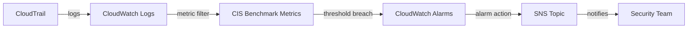

# @sevenpico/cdk-construct-cloudtrail-cloudwatch-alarms

Monitor critical security events in your AWS environment by creating CIS Benchmark CloudWatch metric filters and alarms on a CloudTrail log group. This construct provisions CloudWatch Metric Filters, CloudWatch Alarms, and SNS alarm actions for 14 security-relevant event categories.

## Diagram

## CIS Benchmark Security Alerting

Organizations running workloads on AWS need visibility into critical security events such as root account usage, unauthorized API calls, IAM policy modifications, and VPC configuration changes. The CIS AWS Foundations Benchmark recommends monitoring these events through CloudWatch metric filters and alarms on CloudTrail logs.

How the deployed resources work:

1. **CloudWatch Metric Filters** watch a CloudTrail-connected log group for specific event patterns (e.g., root account usage, failed console sign-ins)
2. **CloudWatch Alarms** evaluate the filtered metrics against a threshold and trigger when the count meets or exceeds the configured value
3. **SNS Alarm Actions** forward alarm notifications to an SNS topic for delivery to your security team via email, Slack, PagerDuty, or other subscribers

This construct creates up to 14 metric filter and alarm pairs, one for each CIS Benchmark category. You can optionally limit which alarms are created using the `enabledAlarms` prop.

## Deployed Resources

- **AWS::Logs::MetricFilter** - Filters CloudTrail log events matching CIS Benchmark patterns and publishes metrics.
- **AWS::CloudWatch::Alarm** - Monitors each CIS Benchmark metric and triggers when the threshold is breached.

## Usage

See the [examples](./examples) directory for complete usage examples.

- [Complete Example](./examples/complete)

## Inputs

| Name | Description | Type | Default | Required |
|------|-------------|------|---------|:--------:|
| `context` | SevenPico context for naming and tagging | `Context` | — | yes |
| `logGroupName` | Name of the CloudTrail CloudWatch Logs log group to watch | `string` | — | yes |
| `snsTopicArn` | ARN of the SNS topic that receives alarm notifications | `string` | — | yes |
| `alarmNamespace` | CloudWatch metric namespace for all generated metrics | `string` | `'CISBenchmark'` | |
| `alarmPeriodSeconds` | Evaluation period in seconds for each alarm | `number` | `300` | |
| `alarmEvaluationPeriods` | Number of evaluation periods before alarm triggers | `number` | `1` | |
| `alarmThreshold` | Metric threshold that triggers the alarm | `number` | `1` | |
| `enabledAlarms` | Subset of alarm IDs to enable; when omitted all 14 alarms are created | `string[]` | all alarms | |

## Outputs

| Name | Description | Type |
|------|-------------|------|
| `alarms` | All created CloudWatch alarms | `cloudwatch.Alarm[] \| undefined` |

## Special Considerations

- The `logGroupName` must reference a CloudWatch Logs log group that receives CloudTrail events. Typically this is created by a CloudTrail construct with `cloudWatchLogsEnabled: true`.
- The `snsTopicArn` must reference an existing SNS topic. Use `@sevenpico/cdk-construct-sns` to create one.
- When `context.enabled` is `false`, no resources are created and `alarms` is `undefined`.
- Valid values for `enabledAlarms`: `unauthorized-api`, `no-mfa-console`, `root-usage`, `iam-policy-changes`, `cloudtrail-changes`, `console-failures`, `kms-key-deletion`, `s3-bucket-policy`, `vpc-changes`, `security-group-changes`, `nacl-changes`, `network-gateway-changes`, `route-table-changes`, `organization-changes`.

## Roadmap

### v0.1.0

- [x] Initial implementation
- [x] BDD test coverage
- [x] Context-based naming and tagging

### v0.2.0

- [ ] Custom metric filter patterns
- [ ] Per-alarm threshold overrides

## License

Apache 2.0 — see [LICENSE](../../LICENSE).
