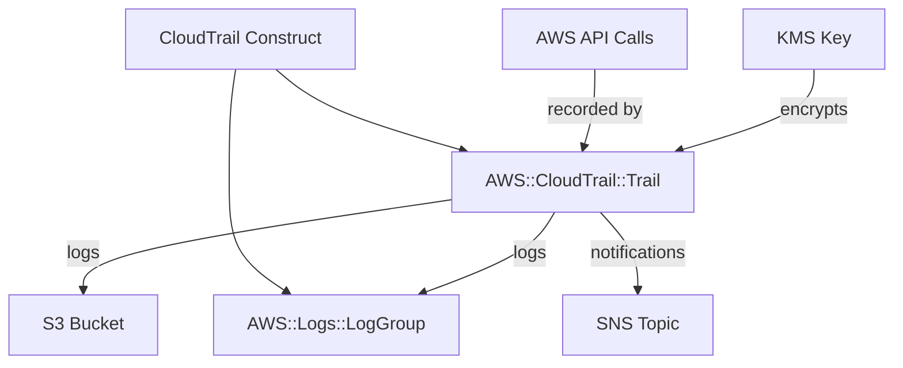

# @sevenpico/cdk-construct-cloudtrail

Provisions an AWS CloudTrail trail that records API activity across an AWS account or organization. Creates a CloudTrail trail with optional CloudWatch Logs integration, SNS notifications, KMS encryption, and configurable event selectors for management and data events.

## Diagram

## Audit Trail for API Activity

Use this construct when you need a centralized audit trail of all API activity in your AWS account or organization. CloudTrail records management events and optionally data events (such as S3 object-level operations or Lambda function invocations), enabling compliance, security analysis, and operational troubleshooting.

How the deployed resources work:

1. **CloudTrail Trail** records API calls across your AWS account (or all regions) and delivers log files to an S3 bucket.
2. **CloudWatch Logs Log Group** (optional) receives trail events in near real-time for monitoring and alerting.
3. **SNS Topic** (optional, imported by ARN) receives delivery notifications when new log files arrive in S3.
4. **KMS Key** (optional, imported by ARN) encrypts trail log files at rest.

Pass the `context` prop to get deterministic trail naming (e.g., `7p-prod-audit`) and consistent tagging across all your infrastructure.

## Deployed Resources

- **AWS::CloudTrail::Trail** - CloudTrail trail that records API activity and delivers logs to S3, with optional CloudWatch Logs, SNS, KMS, and insight detection.
- **AWS::Logs::LogGroup** - Optional CloudWatch Logs log group for near real-time trail event delivery (created when `cloudWatchLogsEnabled` is `true`).

## Usage

See the [examples](./examples) directory for complete usage examples.

- [Complete Example](./examples/complete)

## Inputs

| Name | Description | Type | Default | Required |
|------|-------------|------|---------|:--------:|
| `context` | SevenPico context for naming and tagging | `Context` | — | ✓ |
| `s3BucketName` | S3 bucket name where trail logs are delivered | `string` | — | ✓ |
| `s3KeyPrefix` | S3 key prefix for log files | `string` | `''` | |
| `includeGlobalServiceEvents` | Include events from global services such as IAM | `boolean` | `true` | |
| `isMultiRegionTrail` | Record events in all regions | `boolean` | `true` | |
| `enableLogFileValidation` | Validate log file integrity using digest files | `boolean` | `true` | |
| `cloudWatchLogsEnabled` | Send trail events to a CloudWatch Logs log group | `boolean` | `false` | |
| `cloudWatchLogsRetentionDays` | CloudWatch Logs retention in days | `number` | `90` | |
| `snsTopicArn` | SNS topic ARN for trail delivery notifications | `string` | — | |
| `kmsKeyArn` | KMS key ARN used to encrypt log files | `string` | — | |
| `enableInsights` | Enable CloudTrail Insights to detect unusual API activity | `boolean` | `false` | |
| `managementEvents` | Management event selector (`ReadWrite`, `Read`, `Write`, `None`) | `string` | `ReadWrite` | |
| `dataEvents` | Data event selectors for S3 objects or Lambda functions | `CloudtrailDataEventSelector[]` | — | |

## Outputs

| Name | Description | Type |
|------|-------------|------|
| `trail` | The CloudTrail trail | `cloudtrail.Trail \| undefined` |
| `logGroup` | CloudWatch Logs log group (when `cloudWatchLogsEnabled`) | `logs.LogGroup \| undefined` |

## Special Considerations

- The S3 bucket must already exist and have the correct bucket policy to allow CloudTrail to write logs. This construct does not create the logging bucket.
- When `cloudWatchLogsEnabled` is `true`, a CloudWatch Logs log group is created and CloudTrail is granted permission to write to it via an IAM role created automatically by CDK.
- The SNS topic and KMS key are imported by ARN and must already exist in your account.
- When `context.enabled` is `false`, no resources are created and all public properties are `undefined`.

## Roadmap

### v0.1.0

- [x] Initial implementation
- [x] BDD test coverage
- [x] Context-based naming and tagging

### v0.2.0

- [ ] Organization trail support
- [ ] Advanced event selectors

## License

Apache 2.0 — see [LICENSE](../../LICENSE).
