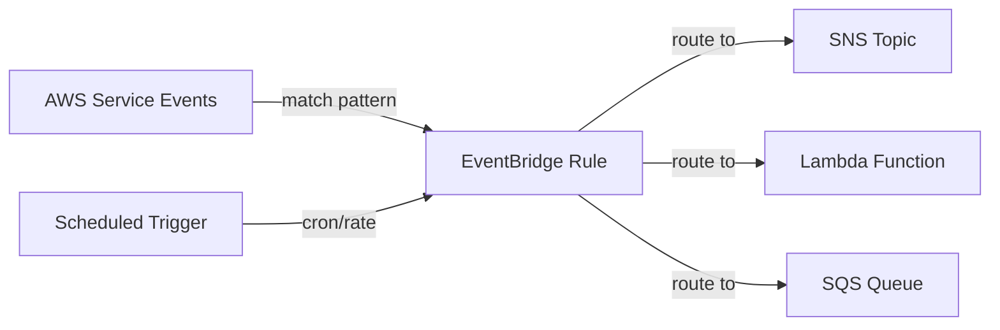

# @sevenpico/cdk-construct-cloudwatch-events

Provisions CloudWatch (EventBridge) event rules that monitor AWS service events and route them to targets such as SNS topics, Lambda functions, or SQS queues. Supports scheduled events (cron/rate expressions) and event pattern matching.

## Diagram

## Event-Driven Monitoring and Automation

Use this construct to react to AWS service events or run scheduled tasks by routing events to SNS, Lambda, or SQS targets. This is the CDK equivalent of SevenPico's `terraform-aws-cloudwatch-events` Terraform module.

How the deployed resources work:

1. **EventBridge Rules** match incoming AWS service events by event pattern or fire on a cron/rate schedule.
2. **Targets** (SNS, Lambda, or SQS) receive matched events for downstream processing, alerting, or automation.
3. **Input Transformers** optionally reshape event payloads before delivery to targets.

Define one or more rules with event patterns or schedules, each with one or more targets. All resources are named and tagged using the SevenPico context system.

## Deployed Resources

- **AWS::Events::Rule** - One EventBridge rule per entry in the `rules` array, matching events by pattern or schedule.

## Usage

See the [examples](./examples) directory for complete usage examples.

- [Complete Example](./examples/complete)

## Inputs

| Name | Description | Type | Default | Required |
|------|-------------|------|---------|:--------:|
| `context` | SevenPico context for naming and tagging | `Context` | — | ✓ |
| `rules` | One or more event rules to create | `CloudwatchEventRule[]` | — | ✓ |
| `rules[].name` | Logical rule name appended to the context ID | `string` | — | ✓ |
| `rules[].description` | Human-readable description for the event rule | `string` | `undefined` | |
| `rules[].schedule` | Cron or rate schedule expression | `string` | `undefined` | |
| `rules[].eventPattern` | EventBridge event pattern as a JSON string | `string` | `undefined` | |
| `rules[].targets` | One or more targets to route matched events to | `CloudwatchEventTarget[]` | — | ✓ |
| `rules[].targets[].type` | Target resource type: 'sns', 'lambda', or 'sqs' | `string` | — | ✓ |
| `rules[].targets[].arn` | ARN of the target resource | `string` | — | ✓ |
| `rules[].targets[].inputTransformer` | Optional input transformer to reshape event payload | `CloudwatchEventInputTransformer` | `undefined` | |
| `rules[].targets[].inputTransformer.inputPathsMap` | Map of JSON path expressions to named variables | `Record<string, string>` | — | ✓ |
| `rules[].targets[].inputTransformer.inputTemplate` | Template string referencing named variables | `string` | — | ✓ |

## Outputs

| Name | Description | Type |
|------|-------------|------|
| `rules` | All created EventBridge rules | `events.Rule[] \| undefined` |

## Special Considerations

- `schedule` and `eventPattern` are mutually exclusive on each rule. If both are provided, `schedule` takes precedence.
- Target type must be one of `'sns'`, `'lambda'`, or `'sqs'`. Other values throw an error.
- When context is disabled (`enabled: false`), no resources are created and all public properties are `undefined`.

## Roadmap

### v0.1.0

- [x] Initial implementation
- [x] BDD test coverage
- [x] Context-based naming and tagging

### v0.2.0

- [ ] Support for additional target types (Step Functions, CodePipeline)
- [ ] Dead-letter queue configuration for targets

## License

Apache 2.0 — see [LICENSE](../../LICENSE).
