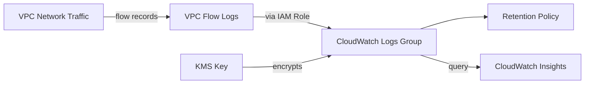

# @sevenpico/cdk-construct-cloudwatch-flow-logs

Captures VPC network traffic metadata and sends it to CloudWatch Logs for monitoring and analysis. Provisions a CloudWatch Logs log group, an IAM role for VPC Flow Logs, and the VPC Flow Log resource itself.

## Diagram

## VPC Flow Log Monitoring

Use this construct to capture network traffic metadata (source/destination IPs, ports, protocol, action, bytes) from a VPC and store it in CloudWatch Logs. This enables security analysis, network troubleshooting, and compliance auditing of VPC traffic patterns.

How the deployed resources work:

1. **VPC Flow Logs** captures network traffic metadata from the specified VPC
2. **IAM Role** grants VPC Flow Logs permission to write log events to CloudWatch Logs
3. **CloudWatch Logs Log Group** stores the flow log records with configurable retention and optional KMS encryption

To use this construct, provide a VPC ID and a SevenPico context. The construct creates all required resources with deterministic naming based on the context. Optionally configure traffic filtering (ALL, ACCEPT, or REJECT), log retention period, and KMS encryption.

## Deployed Resources

- **AWS::Logs::LogGroup** - CloudWatch Logs log group that stores VPC flow log records with configurable retention and optional KMS encryption.
- **AWS::IAM::Role** - IAM role with a trust policy for `vpc-flow-logs.amazonaws.com` and permissions to write to CloudWatch Logs.
- **AWS::EC2::FlowLog** - VPC Flow Log resource that captures network traffic metadata and sends it to the CloudWatch Logs log group.

## Usage

See the [examples](./examples) directory for complete usage examples.

- [Minimal](./examples/minimal)
- [Comprehensive](./examples/comprehensive)
- [Disabled](./examples/disabled)

## Inputs

| Name | Description | Type | Default | Required |
|------|-------------|------|---------|:--------:|
| `context` | SevenPico context for naming and tagging | `Context` | — | ✓ |
| `vpcId` | ID of the VPC to capture flow logs for | `string` | — | ✓ |
| `trafficType` | Which traffic to capture: 'ALL', 'ACCEPT', or 'REJECT' | `string` | `'ALL'` | |
| `cloudwatchLogRetentionDays` | CloudWatch Logs log group retention in days | `number` | `365` | |
| `logGroupKmsKeyArn` | ARN of a KMS key used to encrypt the CloudWatch Logs log group | `string` | — | |

## Outputs

| Name | Description | Type |
|------|-------------|------|
| `logGroup` | The CloudWatch Logs log group receiving flow records | `logs.LogGroup \| undefined` |
| `flowLog` | The VPC Flow Log resource | `ec2.FlowLog \| undefined` |
| `role` | The IAM role granting VPC Flow Logs write access to CloudWatch Logs | `iam.Role \| undefined` |

## Special Considerations

- The log group name follows the pattern `/aws/vpc/flowlogs/{contextId}` for consistency with AWS conventions.
- The IAM role name follows the pattern `{contextId}-flow-logs-role`.
- `Vpc.fromLookup` is used to reference the VPC, which requires the VPC to exist and be discoverable at synthesis time. Ensure the CDK environment is configured with the correct account and region.
- When `logGroupKmsKeyArn` is provided, the KMS key must grant `logs.{region}.amazonaws.com` permission to use it for encryption.
- When `context.enabled` is `false`, no resources are created and all public properties are `undefined`.

## Roadmap

### v0.1.0

- [x] Initial implementation
- [x] BDD test coverage
- [x] Context-based naming and tagging

### v0.2.0

- [ ] Custom flow log format fields
- [ ] Support for multiple VPCs

## License

Apache 2.0 — see [LICENSE](../../LICENSE).
