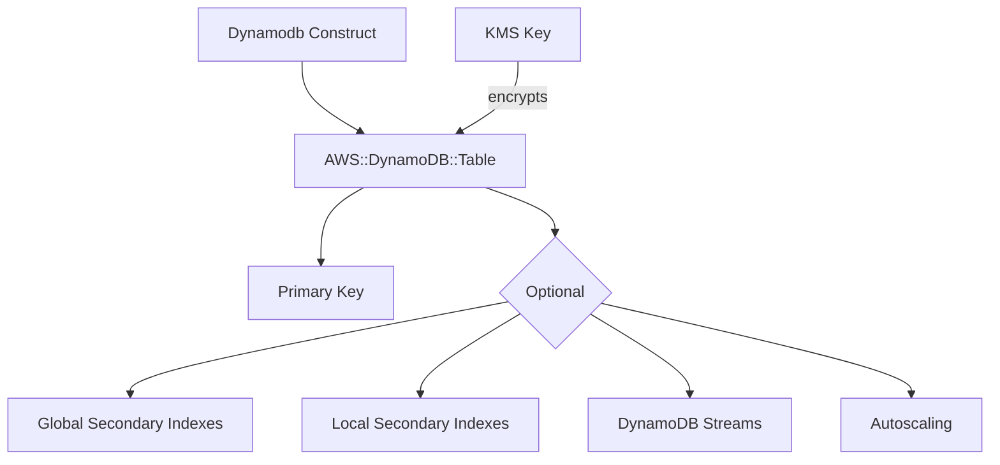

# @sevenpico/cdk-construct-dynamodb

Provisions a DynamoDB table with configurable billing mode, secondary indexes, encryption, streams, TTL, point-in-time recovery, and autoscaling using SevenPico's context system for consistent naming and tagging.

## Diagram

## Managed DynamoDB Table

Use this construct when you need a DynamoDB table with production-ready defaults including encryption, point-in-time recovery, and TTL. It supports both provisioned and on-demand billing modes, global and local secondary indexes, DynamoDB Streams, and read/write autoscaling.

How the deployed resources work:

1. **DynamoDB Table** stores data with a partition key and optional sort key, named using the SevenPico context ID.
2. **Secondary Indexes** (GSI/LSI) provide alternative query patterns on the same table.
3. **Autoscaling** (optional) adjusts provisioned read/write capacity based on utilization targets.
4. **KMS Key** (optional) encrypts the table with a customer-managed key instead of the default AWS-managed encryption.

Instantiate the construct with your SevenPico context and a hash key. All other settings have sensible defaults: provisioned billing at 5 RCU/WCU, AWS-managed encryption, PITR enabled, and TTL on the `Expires` attribute.

## Deployed Resources

- **AWS::DynamoDB::Table** - The DynamoDB table with configured key schema, billing, encryption, and optional streams.
- **AWS::ApplicationAutoScaling::ScalableTarget** - (Optional) Autoscaling targets for read and write capacity.
- **AWS::ApplicationAutoScaling::ScalingPolicy** - (Optional) Target-tracking scaling policies for read and write utilization.

## Usage

See the [examples](./examples) directory for complete usage examples.

- [Complete Example](./examples/complete)

## Inputs

| Name | Description | Type | Default | Required |
|------|-------------|------|---------|:--------:|
| `context` | SevenPico context for naming and tagging | `Context` | — | yes |
| `hashKey` | Hash key attribute name | `string` | — | yes |
| `hashKeyType` | Hash key type | `string` | `'S'` | |
| `rangeKey` | Range key attribute name | `string` | — | |
| `rangeKeyType` | Range key type | `string` | `'S'` | |
| `billingMode` | Billing mode | `string` | `'PROVISIONED'` | |
| `readCapacity` | Read capacity units (PROVISIONED only) | `number` | `5` | |
| `writeCapacity` | Write capacity units (PROVISIONED only) | `number` | `5` | |
| `enableAutoscaler` | Enable autoscaling (PROVISIONED only) | `boolean` | `false` | |
| `autoscaleReadMin` | Autoscale read min capacity | `number` | `5` | |
| `autoscaleReadMax` | Autoscale read max capacity | `number` | `20` | |
| `autoscaleWriteMin` | Autoscale write min capacity | `number` | `5` | |
| `autoscaleWriteMax` | Autoscale write max capacity | `number` | `20` | |
| `autoscaleReadTarget` | Autoscale read target utilization (percent) | `number` | `50` | |
| `autoscaleWriteTarget` | Autoscale write target utilization (percent) | `number` | `50` | |
| `enableEncryption` | Enable server-side encryption | `boolean` | `true` | |
| `kmsKeyArn` | KMS key ARN for customer-managed encryption | `string` | — | |
| `enablePointInTimeRecovery` | Enable point-in-time recovery | `boolean` | `true` | |
| `enableStreams` | Enable DynamoDB Streams | `boolean` | `false` | |
| `streamViewType` | Stream view type | `string` | — | |
| `ttlEnabled` | Enable TTL | `boolean` | `true` | |
| `ttlAttribute` | TTL attribute name | `string` | `'Expires'` | |
| `tableClass` | Table class | `string` | `'STANDARD'` | |
| `dynamodbAttributes` | Additional non-key attributes (Terraform parity) | `DynamodbAttribute[]` | `[]` | |
| `globalSecondaryIndexes` | Global secondary indexes | `DynamodbGsi[]` | `[]` | |
| `localSecondaryIndexes` | Local secondary indexes | `DynamodbLsi[]` | `[]` | |
| `replicas` | Cross-region replica configurations | `DynamodbReplicaConfig[]` | `[]` | |

## Outputs

| Name | Description | Type |
|------|-------------|------|
| `table` | The DynamoDB table | `dynamodb.Table \| undefined` |

## Special Considerations

- When `billingMode` is `PAY_PER_REQUEST`, `readCapacity` and `writeCapacity` are ignored and autoscaling is not available.
- The `kmsKeyArn` prop must be an ARN (not an alias). The construct uses `kms.Key.fromKeyArn` to resolve the key, which requires an environment-agnostic ARN.
- The table has a `RETAIN` removal policy by default to prevent accidental data loss.
- **dynamodbAttributes**: Accepted for Terraform module parity but has no effect in CDK. DynamoDB tables in CDK are schemaless — only key attributes (partition key, sort key) need declaration, which are handled via partitionKey/sortKey props.
- When context is disabled (`enabled: false`), all public properties are `undefined` and no resources are created.

## Roadmap

### v0.1.0

- [x] Initial implementation
- [x] BDD test coverage
- [x] Context-based naming and tagging

### v0.2.0

- [ ] DynamoDB Contributor Insights
- [ ] Table-level backup configuration

## License

Apache 2.0 — see [LICENSE](../../LICENSE).
