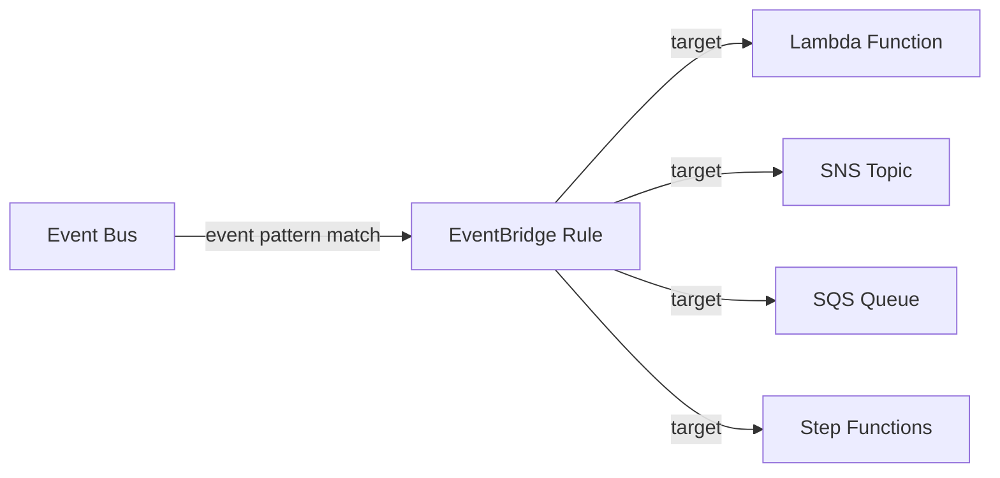

# @sevenpico/cdk-construct-eventbridge-rule

Provisions a single Amazon EventBridge rule with one target. Supports cross-bus routing, optional IAM role for target invocation, and configurable event patterns using SevenPico's context system for consistent naming and tagging.

## Diagram

## Event-Driven Service Integration

Use this construct when you need to route events from an EventBridge bus to a downstream service. It creates a rule that matches events by pattern and forwards them to a target resource (Lambda, SQS, SNS, Step Functions, or another event bus).

How the deployed resources work:

1. **EventBridge Rule** matches incoming events on the source bus using the configured event pattern.
2. **Target** receives matched events. The target can be any AWS resource ARN (Lambda, SQS, SNS, etc.) or another EventBridge bus for cross-bus routing.
3. **IAM Role** (optional) provides the rule permission to invoke the target when cross-service authorization is needed.

Instantiate the construct with your SevenPico context, an event pattern, and a target ARN. Optionally configure a source event bus, target role, or cross-bus routing.

## Deployed Resources

- **AWS::Events::Rule** - The EventBridge rule that matches events and routes them to the target.

## Usage

See the [examples](./examples) directory for complete usage examples.

- [Complete Example](./examples/complete)

## Inputs

| Name | Description | Type | Default | Required |
|------|-------------|------|---------|:--------:|
| `context` | SevenPico context for naming and tagging | `Context` | — | yes |
| `eventPattern` | Event pattern object defining what events this rule matches | `object` | — | yes |
| `targetArn` | ARN of the rule target resource | `string` | — | yes |
| `description` | Rule description | `string` | — | |
| `ruleEnabled` | Whether the rule is enabled | `boolean` | `true` | |
| `targetId` | Unique target ID | `string` | `contextId(ctx)-target` | |
| `targetRoleArn` | IAM role ARN for invoking the target | `string` | — | |
| `sourceEventBusName` | Source event bus name or ARN | `string` | default event bus | |
| `targetEventBusArn` | Target event bus ARN (for cross-bus routing) | `string` | — | |

## Outputs

| Name | Description | Type |
|------|-------------|------|
| `rule` | The EventBridge rule | `events.Rule \| undefined` |

## Special Considerations

- For generic ARN targets, the construct uses the `CfnRule.targets` escape hatch to set the raw target ARN, which supports all target types without requiring typed CDK target wrappers.
- When `targetEventBusArn` is provided, the construct uses CDK's `targets.EventBus` for cross-bus routing instead of the generic ARN target.
- The `eventPattern` prop accepts a plain object that is cast to `events.EventPattern`. Follow the EventBridge event pattern syntax (e.g., `{ source: ['aws.s3'], detailType: ['Object Created'] }`).
- When context is disabled (`enabled: false`), all public properties are `undefined` and no resources are created.

## Roadmap

### v0.1.0

- [x] Initial implementation
- [x] BDD test coverage
- [x] Context-based naming and tagging

### v0.2.0

- [ ] Multiple targets per rule
- [ ] Input transformer support

## License

Apache 2.0 — see [LICENSE](../../LICENSE).
