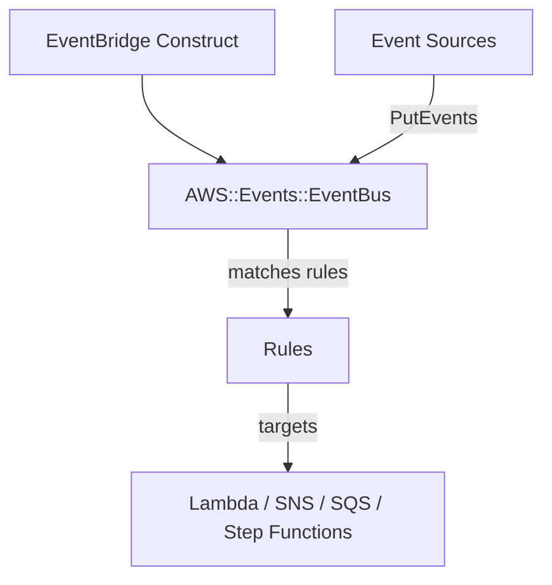

# @sevenpico/cdk-construct-eventbridge

Provisions a custom Amazon EventBridge event bus with an optional resource-based policy and optional KMS encryption. Uses SevenPico's context system for consistent naming and tagging.

## Diagram

## Custom Event Bus for Service Integration

Use this construct when you need a custom EventBridge event bus to decouple services and route events. It provisions the bus with optional encryption and access policies, following SevenPico naming conventions.

How the deployed resources work:

1. **EventBridge Event Bus** receives events from producers via PutEvents API calls and matches them against rules.
2. **Resource Policy** (optional) controls cross-account or cross-service access to the event bus.
3. **KMS Encryption** (optional) encrypts events at rest using a customer-managed or AWS-managed key.

Instantiate the construct with your SevenPico context. Optionally provide a KMS key identifier for encryption, a policy document for cross-account access, or a partner event source name.

## Deployed Resources

- **AWS::Events::EventBus** - The custom EventBridge event bus for event routing.
- **AWS::Events::EventBusPolicy** - Resource-based policy for the event bus (created only when `policyDocument` is provided).

## Usage

See the [examples](./examples) directory for complete usage examples.

- [Complete Example](./examples/complete)

## Inputs

| Name | Description | Type | Default | Required |
|------|-------------|------|---------|:--------:|
| `context` | SevenPico context for naming and tagging | `Context` | — | yes |
| `eventBusName` | Event bus name override | `string` | `contextId(ctx)` | |
| `kmsKeyIdentifier` | KMS key identifier (ARN or alias) for encryption | `string` | — | |
| `eventSourceName` | Partner event source name | `string` | — | |
| `policyDocument` | Event bus resource policy as JSON string | `string` | — | |

## Outputs

| Name | Description | Type |
|------|-------------|------|
| `eventBus` | The custom event bus | `events.EventBus \| undefined` |

## Special Considerations

- KMS encryption is applied via the `CfnEventBus` L1 escape hatch since the CDK L2 `EventBus` construct does not expose `kmsKeyIdentifier` directly.
- The `policyDocument` should be a JSON string representing a single IAM policy statement. It is parsed and passed to `CfnEventBusPolicy.statement`.
- When `eventSourceName` is provided, the bus is created as a partner event bus. The event bus name must match the partner event source name.
- When context is disabled (`enabled: false`), all public properties are `undefined` and no resources are created.

## Roadmap

### v0.1.0

- [x] Initial implementation
- [x] BDD test coverage
- [x] Context-based naming and tagging

### v0.2.0

- [ ] EventBridge rules and targets support
- [ ] Archive and replay configuration

## License

Apache 2.0 — see [LICENSE](../../LICENSE).
