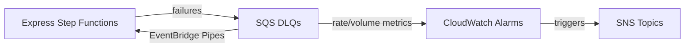

# @sevenpico/cdk-construct-express-sfn-error-notification

Monitors multiple EXPRESS Step Functions state machines for failures with automatic reprocessing. For each monitored state machine, provisions a dedicated DLQ, rate/volume CloudWatch alarms, and an EventBridge Pipe.

## Diagram

## Express Step Functions Error Monitoring

Use this construct when you need to monitor multiple EXPRESS Step Functions state machines for failures. Unlike standard state machines, EXPRESS workflows log failures to CloudWatch Logs rather than emitting EventBridge events. This construct provisions a full set of monitoring resources per state machine via a map-based configuration.

How the deployed resources work:

1. Each state machine in the map gets a dedicated SQS dead-letter queue for capturing failures
2. CloudWatch alarms monitor each DLQ for both growth rate and total volume
3. When alarms trigger, they notify the shared SNS topics for operator awareness
4. EventBridge Pipes read messages from each DLQ and re-invoke the corresponding state machine

Configure the construct by providing a map of logical names to state machine configurations, plus shared SNS topic ARNs. All IAM permissions and pipe wiring are handled automatically.

## Deployed Resources

Per state machine entry:
- **SQS Queue** - Dead-letter queue for that state machine's failures
- **CloudWatch Alarm (Rate)** - Rate alarm on DLQ growth
- **CloudWatch Alarm (Volume)** - Volume alarm on DLQ depth
- **EventBridge Pipe** - Reads DLQ and re-invokes the state machine
- **CloudWatch Log Group** - Pipe execution logs
- **IAM Role** - Pipe execution role

## Usage

See the [examples](./examples) directory for complete usage examples.

- [Complete Example](./examples/complete)

## Inputs

| Name | Description | Type | Default | Required |
|------|-------------|------|---------|:--------:|
| `context` | SevenPico context for naming and tagging | `Context` | — | ✓ |
| `stepFunctions` | Map of logical name to state machine config | `Record<string, ExpressSfnTarget>` | — | ✓ |
| `rateAlarmSnsTopicArn` | ARN of SNS topic for all rate alarms | `string` | — | ✓ |
| `volumeAlarmSnsTopicArn` | ARN of SNS topic for all volume alarms | `string` | — | ✓ |
| `sqsMessageRetentionSeconds` | SQS message retention in seconds | `number` | `604800` | |
| `sqsVisibilityTimeoutSeconds` | SQS visibility timeout in seconds | `number` | `30` | |
| `alarmPeriodSeconds` | Alarm evaluation period in seconds | `number` | `60` | |
| `alarmDatapointsToAlarm` | Data points to alarm | `number` | `1` | |
| `alarmEvaluationPeriods` | Evaluation periods | `number` | `5` | |
| `eventbridgePipeBatchSize` | Batch size for all pipes | `number` | `1` | |
| `eventbridgePipeLogLevel` | Log level for all pipes | `string` | `'ERROR'` | |
| `cloudwatchLogRetentionDays` | CloudWatch log retention for pipes | `number` | `90` | |
| `targetStepFunctionInputTemplate` | Input template for all pipe targets | `string` | `'<$.detail.input>'` | |
| `sqsKmsConfig` | KMS encryption config for all DLQs | `SqsKmsConfig` | — | |

## Outputs

| Name | Description | Type |
|------|-------------|------|
| `deadLetterQueues` | DLQs keyed by logical name | `Record<string, sqs.Queue>` |
| `rateAlarms` | Rate alarms keyed by logical name | `Record<string, cw.Alarm>` |
| `volumeAlarms` | Volume alarms keyed by logical name | `Record<string, cw.Alarm>` |
| `pipes` | Pipes keyed by logical name | `Record<string, pipes.CfnPipe>` |

## Special Considerations

- This construct is for **EXPRESS** Step Functions. For standard state machines, use `@sevenpico/cdk-construct-sfn-error-notification`.
- The alarm defaults (1 datapoint / 5 periods) are lighter than the standard SFN variant (2/2), matching the higher-frequency nature of EXPRESS workflows.
- The default visibility timeout is 30 seconds (vs 2s for standard SFN).
- Each state machine gets its own DLQ, alarms, and pipe -- resource names include the map key.

## Roadmap

### v0.1.0

- [x] Initial implementation
- [x] BDD test coverage
- [x] Context-based naming and tagging

### v0.2.0

- [ ] Per-machine alarm threshold overrides
- [ ] CloudWatch Logs metric filter for EXPRESS execution failures

## License

Apache 2.0 — see [LICENSE](../../LICENSE).
