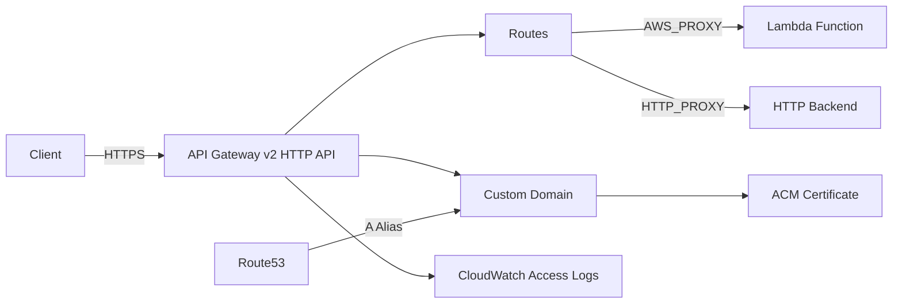

# @sevenpico/cdk-construct-http-api-gateway

Provisions an Amazon API Gateway v2 HTTP API with configurable routes, integrations, authorizers, VPC links, optional custom domain, and CloudWatch access logging. This construct wraps the HTTP API resource with SevenPico's context-based naming and tagging system.

## Diagram

## HTTP API with Lambda and HTTP Backends

Use this construct to expose serverless or HTTP-based backends through a managed HTTP API with custom domain support. The HTTP API is a lightweight, low-latency alternative to REST APIs for Lambda proxy and HTTP proxy workloads.

How the deployed resources work:

1. **API Gateway v2 HTTP API** receives inbound HTTPS requests and routes them based on method and path patterns
2. **Integrations** forward matched requests to Lambda functions (AWS_PROXY) or HTTP backends (HTTP_PROXY)
3. **Custom Domain** (optional) provides a branded endpoint backed by an ACM certificate, with Route53 alias records for DNS resolution
4. **CloudWatch Log Group** captures access logs for observability and debugging

Configure the construct by defining integration targets, route mappings, and optional features like CORS, custom domains, and access logging.

## Deployed Resources

- **AWS::ApiGatewayV2::Api** - The HTTP API with protocol type HTTP
- **AWS::ApiGatewayV2::Stage** - Default stage with optional auto-deploy and stage variables
- **AWS::ApiGatewayV2::Integration** - Lambda proxy or HTTP proxy integrations
- **AWS::ApiGatewayV2::Route** - Route definitions mapping HTTP methods and paths to integrations
- **AWS::ApiGatewayV2::DomainName** - Custom domain (when dnsName and acmCertificateArn provided)
- **AWS::ApiGatewayV2::ApiMapping** - Maps the API to the custom domain
- **AWS::Logs::LogGroup** - CloudWatch access log group (enabled by default)
- **AWS::Route53::RecordSet** - A-record alias to the custom domain (when route53ZoneIds provided)
- **AWS::ApiGatewayV2::VpcLink** - VPC links for private integrations (when vpcLinks provided)

## Usage

See the [examples](./examples) directory for complete usage examples.

- [Minimal](./examples/minimal)
- [Comprehensive](./examples/comprehensive)
- [Disabled](./examples/disabled)

## Inputs

| Name | Description | Type | Default | Required |
|------|-------------|------|---------|:--------:|
| `context` | SevenPico context for naming and tagging | `Context` | — | yes |
| `description` | API description | `string` | `undefined` | |
| `disableExecuteApiEndpoint` | Disable default execute-api endpoint | `boolean` | `true` | |
| `apiVersion` | API version string | `string` | `'0.0.1'` | |
| `corsConfiguration` | CORS preflight configuration | `HttpApiCorsConfig` | `undefined` | |
| `routes` | Route definitions keyed by logical name | `Record<string, HttpApiRoute>` | `undefined` | |
| `integrations` | Integration definitions keyed by logical name | `Record<string, HttpApiIntegration>` | `undefined` | |
| `authorizers` | Authorizer definitions keyed by logical name | `Record<string, HttpApiAuthorizer>` | `undefined` | |
| `vpcLinks` | VPC link definitions keyed by logical name | `Record<string, HttpApiVpcLink>` | `undefined` | |
| `dnsName` | Custom domain name (requires acmCertificateArn) | `string` | `undefined` | |
| `route53ZoneIds` | Route53 hosted zone IDs for DNS alias records | `string[]` | `undefined` | |
| `acmCertificateArn` | ACM certificate ARN for custom domain TLS | `string` | `undefined` | |
| `enableAutoDeploy` | Enable auto-deploy on changes | `boolean` | `false` | |
| `stageVariables` | Stage variables for the default stage | `Record<string, string>` | `undefined` | |
| `accessLoggingEnabled` | Enable CloudWatch access logging | `boolean` | `true` | |
| `accessLogFormat` | Custom access log format string | `string` | JSON format | |
| `cloudwatchLogsRetentionDays` | CloudWatch log retention in days | `number` | `7` | |

## Outputs

| Name | Description | Type |
|------|-------------|------|
| `api` | The HTTP API resource | `apigwv2.CfnApi \| undefined` |
| `logGroup` | Access log CloudWatch log group | `logs.LogGroup \| undefined` |
| `customDomain` | Custom domain resource | `apigwv2.CfnDomainName \| undefined` |

## Special Considerations

- **VPC Links** are created using L1 `CfnVpcLink` with subnet IDs and security group IDs passed directly. No VPC lookup is required.
- **Route53 alias records** are created as L1 `CfnRecordSet` resources pointing directly to the custom domain's regional endpoint, avoiding zone-name resolution requirements of the L2 `ARecord` construct.
- **Authorizers** (JWT, Lambda) are defined in the props interface for Terraform parity but integration with routes requires additional wiring in the construct consumer.
- **CORS methods** are passed as string values (e.g., `'GET'`, `'POST'`) directly to the CloudFormation `CorsConfiguration` property.

## Roadmap

### v0.1.0

- [x] Initial implementation
- [x] BDD test coverage
- [x] Context-based naming and tagging
- [x] Lambda and HTTP proxy integrations
- [x] Custom domain with ACM and Route53
- [x] CloudWatch access logging

### v0.2.0

- [ ] JWT authorizer integration with routes
- [ ] Lambda authorizer integration with routes
- [ ] VPC link integration with HTTP integrations

## License

Apache 2.0 — see [LICENSE](../../LICENSE).
