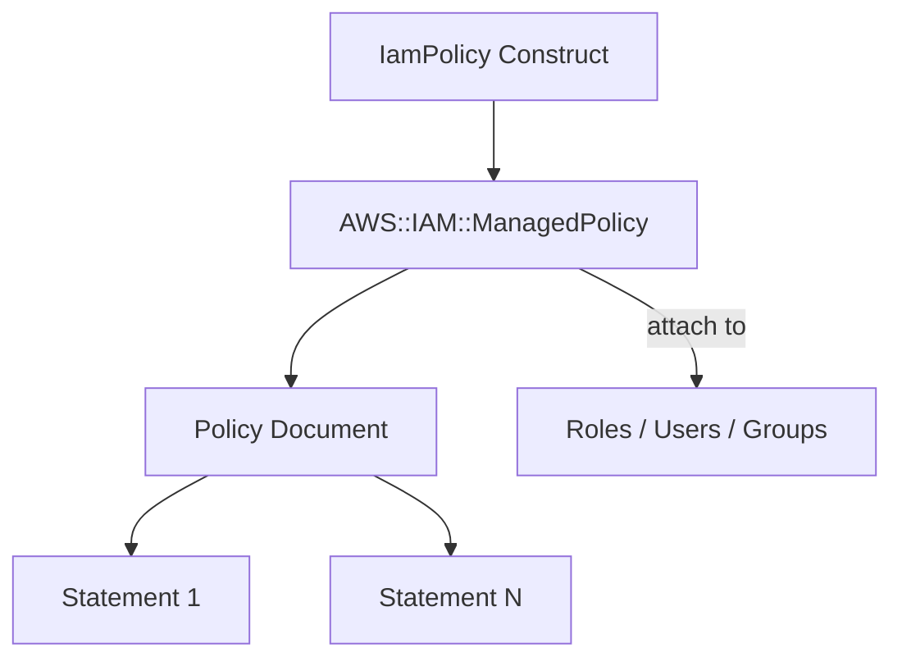

# @sevenpico/cdk-construct-iam-policy

Produces an IAM policy document from a map of policy statements and optionally provisions it as a managed IAM policy in AWS. Supports merging multiple source documents, override documents, and conditional statements.

## Diagram

## Managed Policy with Document Merging

Use this construct when you need to compose an IAM policy from multiple sources — inline statements, existing policy document JSON strings, and override documents — and optionally create a managed IAM policy resource. The policy document JSON is always available via the `json` property, even when the managed policy resource is not created.

How the deployed resources work:

1. **Policy Document** is computed by merging inline `policyStatements`, `sourcePolicyDocuments`, and `overridePolicyDocuments`. Override statements replace source statements with matching SIDs.
2. **Managed Policy** is optionally created in AWS when `iamPolicyEnabled` is true, using the computed policy document.
3. The `json` property provides the computed policy document as a JSON string, always available regardless of whether the managed policy is created.

Pass the `context` prop to get deterministic policy naming (e.g., `7p-prod-s3-read`) and consistent tagging.

## Deployed Resources

- **AWS::IAM::ManagedPolicy** - (Optional) IAM managed policy with the computed policy document. Only created when `iamPolicyEnabled` is true and context is enabled.

## Usage

See the [examples](./examples) directory for complete usage examples.

- [Minimal](./examples/minimal)
- [Comprehensive](./examples/comprehensive)
- [Disabled](./examples/disabled)

## Inputs

| Name | Description | Type | Default | Required |
|------|-------------|------|---------|:--------:|
| `context` | SevenPico context for naming and tagging | `Context` | — | ✓ |
| `policyStatements` | Map of SID to policy statement definition | `Record<string, IamPolicyStatement>` | `{}` | |
| `sourcePolicyDocuments` | IAM policy document JSON strings to merge | `string[]` | `[]` | |
| `overridePolicyDocuments` | Override policy document JSON strings (replace by SID) | `string[]` | `[]` | |
| `description` | Policy description | `string` | — | |
| `iamPolicyEnabled` | Create IAM managed policy resource | `boolean` | `false` | |
| `iamPolicyId` | Policy document ID (enables SID auto-assignment) | `string` | — | |
| `sourceJsonUrl` | URL hint for fetching policy JSON externally (not used internally) | `string` | — | |

## Outputs

| Name | Description | Type |
|------|-------------|------|
| `json` | Policy document as JSON string (always computed) | `string` |
| `policy` | The IAM managed policy | `iam.ManagedPolicy \| undefined` |

## Special Considerations

- The `json` property is always computed, even when `iamPolicyEnabled` is false or `context.enabled` is false. This allows using the construct purely as a policy document builder.
- Override documents replace source statements with matching SIDs. Non-matching override statements are appended.
- `sourceJsonUrl` is a hint for callers only. URL fetching must be done outside this construct; pass the fetched JSON via `sourcePolicyDocuments`.
- When `context.enabled` is false, no AWS resources are created but `json` is still available.

## Roadmap

### v0.1.0

- [x] Initial implementation
- [x] BDD test coverage
- [x] Context-based naming and tagging
- [x] Policy statement merging with SID-based overrides
- [x] Source and override document support

### v0.2.0

- [ ] Policy size validation
- [ ] Policy document versioning

## License

Apache 2.0 — see [LICENSE](../../LICENSE).
