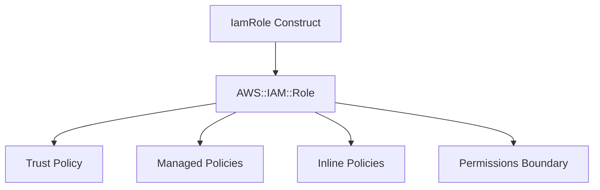

# @sevenpico/cdk-construct-iam-role

Provisions an IAM Role with configurable trust policy, managed policies, inline policies, and optional EC2 instance profile. Creates an IAM Role with the full set of policy attachments needed for service or cross-account access.

## Diagram

## Service and Cross-Account Roles

Use this construct when you need an IAM role for AWS service principals (Lambda, ECS, EC2), cross-account access, or federated identity providers. The construct handles the trust policy, managed policy attachments, inline policies, and optional permissions boundary in a single declaration.

How the deployed resources work:

1. **IAM Role** is created with a configurable trust policy that defines which principals can assume the role.
2. **Managed Policies** are attached from ARNs you provide for pre-built AWS or custom policies.
3. **Inline Policies** are created from JSON documents for role-specific permissions.
4. **Instance Profile** (optional) is created for EC2 roles that need to be attached to instances.

Pass the `context` prop to get deterministic role naming (e.g., `7p-prod-lambda`) and consistent tagging.

## Deployed Resources

- **AWS::IAM::Role** - IAM role with trust policy, managed policies, and inline policies.
- **AWS::IAM::Policy** - Inline policies attached to the role (one per `policyDocuments` merge, plus named `inlinePolicies`).
- **AWS::IAM::InstanceProfile** - Optional EC2 instance profile (when `instanceProfileEnabled` is true).

## Usage

See the [examples](./examples) directory for complete usage examples.

- [Complete Example](./examples/complete)

## Inputs

| Name | Description | Type | Default | Required |
|------|-------------|------|---------|:--------:|
| `context` | SevenPico context for naming and tagging | `Context` | — | ✓ |
| `roleDescription` | Description of the IAM role | `string` | — | ✓ |
| `principals` | Map of principal type to identifiers | `Record<string, string[]>` | — | |
| `assumeRolePolicyDocumentOverride` | Custom assume role policy JSON | `string` | — | |
| `policyDocuments` | IAM policy document JSON strings to merge | `string[]` | `[]` | |
| `policyDescription` | Description for merged inline policy | `string` | — | |
| `managedPolicyArns` | Managed policy ARNs to attach | `string[]` | `[]` | |
| `maxSessionDuration` | Maximum session duration in seconds | `number` | `3600` | |
| `permissionsBoundary` | Permissions boundary policy ARN | `string` | — | |
| `path` | IAM path | `string` | `/` | |
| `useFullname` | Use full context ID as role name | `boolean` | `true` | |
| `assumeRoleActions` | Actions for assume role policy | `string[]` | `['sts:AssumeRole', 'sts:TagSession']` | |
| `assumeRoleConditions` | Conditions for assume role policy | `IamAssumeRoleCondition[]` | `[]` | |
| `instanceProfileEnabled` | Create EC2 instance profile | `boolean` | `false` | |
| `inlinePolicies` | Map of policy name to JSON document | `Record<string, string>` | `{}` | |
| `tagsEnabled` | Apply context tags | `boolean` | `true` | |

## Outputs

| Name | Description | Type |
|------|-------------|------|
| `role` | The IAM role | `iam.Role \| undefined` |
| `instanceProfile` | EC2 instance profile | `iam.CfnInstanceProfile \| undefined` |

## Special Considerations

- The trust policy is applied via CfnRole escape hatch to support complex multi-principal configurations that CDK's `assumedBy` single-principal API cannot express.
- When `useFullname` is false, the role name uses only `context.name` instead of the full context ID.
- When `context.enabled` is `false`, no resources are created and all output properties are `undefined`.

## Roadmap

### v0.1.0

- [x] Initial implementation
- [x] BDD test coverage
- [x] Context-based naming and tagging

### v0.2.0

- [ ] Support for SAML and OIDC federation patterns
- [ ] Role policy size validation

## License

Apache 2.0 — see [LICENSE](../../LICENSE).
