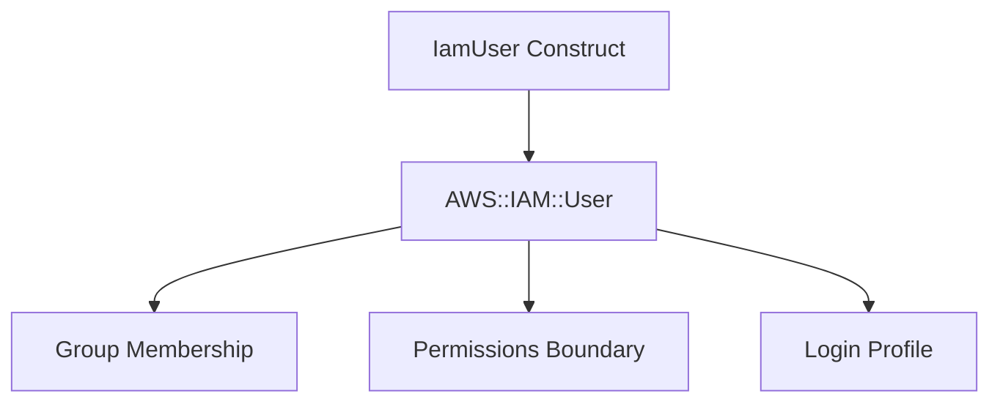

# @sevenpico/cdk-construct-iam-user

Provisions an IAM user with optional console login profile, group membership, and permissions boundary. Creates an IAM User with configurable path and password settings.

## Diagram

## IAM User with Console Access

Use this construct when you need to provision an IAM user for console access or programmatic use. The construct handles group membership, permissions boundaries, and login profile configuration in a single declaration.

How the deployed resources work:

1. **IAM User** is created with a configurable username, path, and optional permissions boundary.
2. **Group Membership** is configured by adding the user to specified IAM groups.
3. **Login Profile** is optionally created (enabled by default) with configurable password reset requirements.

Pass the `context` prop to get consistent tagging across all your infrastructure. Note that the username is set explicitly via the `userName` prop rather than derived from context, allowing email-address usernames.

## Deployed Resources

- **AWS::IAM::User** - IAM user with configurable path, permissions boundary, and optional login profile.
- **AWS::IAM::UserToGroupAddition** - (Optional) Adds the user to specified IAM groups.

## Usage

See the [examples](./examples) directory for complete usage examples.

- [Minimal](./examples/minimal)
- [Comprehensive](./examples/comprehensive)
- [Disabled](./examples/disabled)

## Inputs

| Name | Description | Type | Default | Required |
|------|-------------|------|---------|:--------:|
| `context` | SevenPico context for naming and tagging | `Context` | — | ✓ |
| `userName` | IAM username (recommendation: use email address) | `string` | — | ✓ |
| `path` | IAM path | `string` | `/` | |
| `groups` | IAM group names to add this user to | `string[]` | `[]` | |
| `permissionsBoundary` | Permissions boundary policy ARN | `string` | — | |
| `forceDestroy` | Force destroy user even with non-managed resources | `boolean` | `false` | |
| `loginProfileEnabled` | Enable console login profile | `boolean` | `true` | |
| `pgpKey` | PGP key or keybase username for password encryption (hint only) | `string` | — | |
| `passwordResetRequired` | Require password reset on first login | `boolean` | `true` | |
| `passwordLength` | Length of generated password | `number` | `24` | |

## Outputs

| Name | Description | Type |
|------|-------------|------|
| `user` | The IAM user | `iam.User \| undefined` |

## Special Considerations

- The `userName` is set explicitly via props rather than derived from `context.id`. This allows email-address usernames that would be invalid as context IDs.
- Login profile is enabled by default. Set `loginProfileEnabled: false` to create a user without console access.
- The login profile does not set a password directly. Password generation should use AWS Secrets Manager or be set via the console/CLI post-deploy.
- The `pgpKey` prop is preserved for documentation and operational purposes. PGP encryption of the initial password is not a CDK concern.
- When `context.enabled` is false, no resources are created and `user` is `undefined`.

## Roadmap

### v0.1.0

- [x] Initial implementation
- [x] BDD test coverage
- [x] Context-based tagging
- [x] Group membership
- [x] Permissions boundary
- [x] Login profile with password reset

### v0.2.0

- [ ] Access key creation
- [ ] SSH key management
- [ ] MFA device configuration

## License

Apache 2.0 — see [LICENSE](../../LICENSE).
