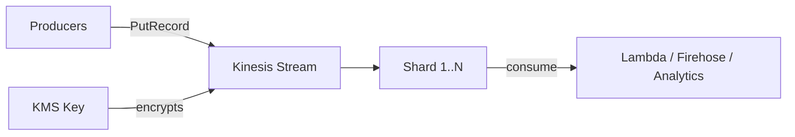

# @sevenpico/cdk-construct-kinesis-stream

Provisions an AWS Kinesis Data Stream with configurable capacity mode, encryption, shard-level CloudWatch metrics, and optional registered consumers. Uses SevenPico's context system for consistent naming and tagging.

## Diagram

## Real-Time Data Streaming

Use this construct when you need to ingest and process real-time streaming data with AWS Kinesis. It encapsulates the common pattern of creating a Kinesis Data Stream with encryption, shard-level metrics, and optional enhanced fan-out consumers.

How the deployed resources work:

1. **Kinesis Data Stream** receives data records from producers via PutRecord/PutRecords API calls, distributing them across shards.
2. **KMS Encryption** (enabled by default) encrypts data at rest using the AWS-managed `alias/aws/kinesis` key or a custom KMS key.
3. **Stream Consumers** (optional) provide enhanced fan-out with dedicated throughput for each registered consumer application.

Instantiate the construct with your SevenPico context. Configure capacity mode (PROVISIONED or ON_DEMAND), shard count, retention period, encryption, and consumer count as needed.

## Deployed Resources

- **AWS::Kinesis::Stream** - The Kinesis Data Stream for real-time data ingestion and processing.
- **AWS::Kinesis::StreamConsumer** - Registered stream consumers with enhanced fan-out (created when `consumerCount > 0`).

## Usage

See the [examples](./examples) directory for complete usage examples.

- [Complete Example](./examples/complete)

## Inputs

| Name | Description | Type | Default | Required |
|------|-------------|------|---------|:--------:|
| `context` | SevenPico context for naming and tagging | `Context` | — | yes |
| `shardCount` | Number of shards (ignored in ON_DEMAND mode) | `number` | `1` | |
| `retentionPeriodHours` | Data retention in hours (24-168) | `number` | `24` | |
| `shardLevelMetrics` | Shard-level CloudWatch metrics to enable | `string[]` | `['IncomingBytes', 'OutgoingBytes']` | |
| `enforceConsumerDeletion` | Deregister consumers before stream deletion | `boolean` | `true` | |
| `encryptionType` | Encryption type: 'KMS' or 'NONE' | `string` | `'KMS'` | |
| `kmsKeyId` | KMS key ID or alias | `string` | `'alias/aws/kinesis'` | |
| `streamMode` | Stream capacity mode: 'PROVISIONED' or 'ON_DEMAND' | `string` | `'PROVISIONED'` | |
| `consumerCount` | Number of registered stream consumers to create | `number` | `0` | |

## Outputs

| Name | Description | Type |
|------|-------------|------|
| `stream` | The Kinesis Data Stream | `kinesis.Stream \| undefined` |

## Special Considerations

- In **ON_DEMAND** mode, the `shardCount` prop is ignored — AWS manages shard scaling automatically.
- The default KMS encryption uses the AWS-managed `alias/aws/kinesis` key via `StreamEncryption.MANAGED`. Providing a custom `kmsKeyId` (ARN) switches to `StreamEncryption.KMS` with a customer-managed key.
- Shard-level metrics are mapped from human-readable names (e.g., `'IncomingBytes'`) to CDK `ShardLevelMetrics` enum values. Unknown metric names are silently filtered out.
- When context is disabled (`enabled: false`), all public properties are `undefined` and no resources are created.

## Roadmap

### v0.1.0

- [x] Initial implementation
- [x] BDD test coverage
- [x] Context-based naming and tagging

### v0.2.0

- [ ] Kinesis Firehose delivery stream integration
- [ ] Auto-scaling policies for provisioned mode

## License

Apache 2.0 — see [LICENSE](../../LICENSE).
