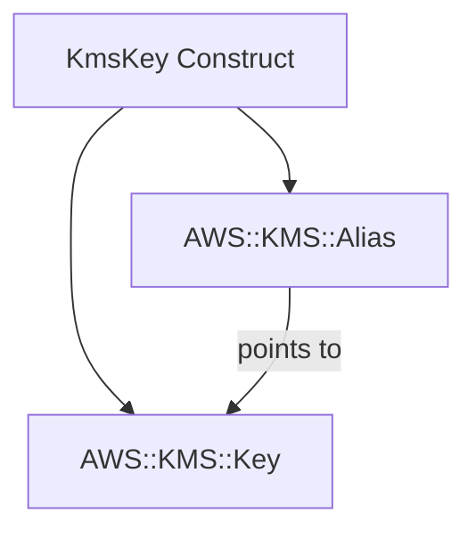

# @sevenpico/cdk-construct-kms-key

Provisions a KMS Customer Master Key with a named alias for encrypting data at rest. Creates an AWS KMS Key and a KMS Alias that points to it.

## Diagram

## Encrypting Data at Rest

Use this construct when you need a dedicated, customer-managed KMS key for encrypting S3 buckets, EBS volumes, RDS instances, Secrets Manager secrets, or any other AWS service that supports KMS encryption. Customer-managed keys give you full control over key policies, rotation, and auditing.

How the deployed resources work:

1. **KMS Key** is created with automatic annual rotation enabled by default and a configurable pending deletion window.
2. **KMS Alias** provides a human-readable name (`alias/{context.id}` by default) so other constructs and services can reference the key by name rather than ARN.

Pass the `context` prop to get deterministic naming (e.g., `alias/7p-prod-secrets`) and consistent tagging across all your infrastructure.

## Deployed Resources

- **AWS::KMS::Key** - Customer-managed encryption key with configurable rotation, usage, and key spec.
- **AWS::KMS::Alias** - Human-readable alias that points to the KMS key.

## Usage

See the [examples](./examples) directory for complete usage examples.

- [Complete Example](./examples/complete)

## Inputs

| Name | Description | Type | Default | Required |
|------|-------------|------|---------|:--------:|
| `context` | SevenPico context for naming and tagging | `Context` | — | ✓ |
| `description` | Description shown in the AWS console | `string` | `context.id` | |
| `alias` | Alias name (must start with `alias/`) | `string` | `alias/{context.id}` | |
| `pendingWindowInDays` | Days before key is deleted after destroy (7-30) | `number` | `10` | |
| `enableKeyRotation` | Enable automatic annual key rotation | `boolean` | `true` | |
| `policy` | Key policy JSON document | `string` | AWS-managed default | |
| `keyUsage` | Key usage | `string` | `ENCRYPT_DECRYPT` | |
| `keySpec` | Key spec | `string` | `SYMMETRIC_DEFAULT` | |
| `multiRegion` | Create a multi-region primary key | `boolean` | `false` | |

## Outputs

| Name | Description | Type |
|------|-------------|------|
| `key` | The KMS key | `kms.Key \| undefined` |
| `alias` | The KMS alias | `kms.Alias \| undefined` |

## Special Considerations

- The key's removal policy is set to `RETAIN` to prevent accidental data loss. Destroying the stack will not delete the key — it must be manually removed.
- When `context.enabled` is `false`, no resources are created and both `key` and `alias` are `undefined`.
- The `multiRegion` property cannot be changed after key creation.
- Custom key policies passed via the `policy` prop must be valid JSON strings.

## Roadmap

### v0.1.0

- [x] Initial implementation
- [x] BDD test coverage
- [x] Context-based naming and tagging

### v0.2.0

- [ ] Grant helper methods for common encryption/decryption patterns
- [ ] Support for imported keys

## License

Apache 2.0 — see [LICENSE](../../LICENSE).
