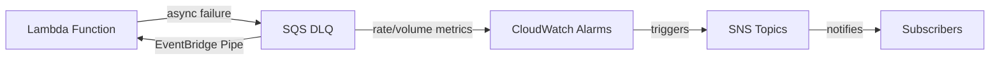

# @sevenpico/cdk-construct-lambda-error-notification

Monitors a Lambda function for errors by provisioning a dead-letter queue with automatic reprocessing. Provisions an SQS DLQ, two CloudWatch alarms (rate-based and volume-based), and an EventBridge Pipe that re-routes failed messages back to the Lambda.

## Diagram

## Lambda Error Monitoring and Reprocessing

Use this construct when you need automatic error monitoring and reprocessing for a Lambda function. It provides a comprehensive error handling pattern that detects failures, alerts operators, and automatically retries failed invocations.

How the deployed resources work:

1. The Lambda function is configured with the SQS DLQ as its dead-letter destination for failed async invocations
2. CloudWatch alarms monitor the DLQ for both the rate of new messages (growth) and the total message count (volume)
3. When alarms trigger, they notify configured SNS topics for operator awareness
4. An EventBridge Pipe continuously reads messages from the DLQ and re-invokes the Lambda for automatic reprocessing

Configure the construct by providing the Lambda function ARN, function name, execution role name, and SNS topic ARNs for alarm notifications. The construct handles all IAM permissions between the resources automatically.

## Deployed Resources

- **SQS Queue** - Dead-letter queue that captures failed Lambda invocations
- **CloudWatch Alarm (Rate)** - Monitors the rate of growth of messages in the DLQ
- **CloudWatch Alarm (Volume)** - Monitors the total number of visible messages in the DLQ
- **EventBridge Pipe** - Reads messages from the DLQ and re-invokes the Lambda function
- **CloudWatch Log Group** - Captures EventBridge Pipe execution logs
- **IAM Role** - Execution role for the EventBridge Pipe

## Usage

See the [examples](./examples) directory for complete usage examples.

- [Complete Example](./examples/complete)

## Inputs

| Name | Description | Type | Default | Required |
|------|-------------|------|---------|:--------:|
| `context` | SevenPico context for naming and tagging | `Context` | — | ✓ |
| `lambdaArn` | ARN of the Lambda function to monitor | `string` | — | ✓ |
| `lambdaFunctionName` | Name of the Lambda function | `string` | — | ✓ |
| `lambdaRoleName` | Name of the Lambda execution role | `string` | — | ✓ |
| `rateAlarmSnsTopicArn` | ARN of the SNS topic for rate alarm | `string` | — | ✓ |
| `volumeAlarmSnsTopicArn` | ARN of the SNS topic for volume alarm | `string` | — | ✓ |
| `alarmPeriodSeconds` | CloudWatch alarm evaluation period in seconds | `number` | `60` | |
| `alarmDatapointsToAlarm` | Data points required to trigger alarm | `number` | `1` | |
| `alarmEvaluationPeriods` | Number of evaluation periods | `number` | `5` | |
| `rateAlarmName` | Custom rate alarm name | `string` | `{context.id}-dlq-rate` | |
| `volumeAlarmName` | Custom volume alarm name | `string` | `{context.id}-dlq-volume` | |
| `sqsQueueName` | SQS queue name override | `string` | `{context.id}-dlq` | |
| `sqsMessageRetentionSeconds` | SQS message retention in seconds | `number` | `604800` | |
| `sqsVisibilityTimeoutSeconds` | SQS visibility timeout in seconds | `number` | `2` | |
| `sqsKmsConfig` | KMS encryption config for the SQS DLQ | `SqsKmsConfig` | — | |
| `snsKmsKeyId` | KMS key ID for SNS topic encryption | `string` | — | |
| `eventbridgePipeName` | EventBridge Pipe name override | `string` | `{context.id}-pipe` | |
| `eventbridgePipeBatchSize` | Batch size for the EventBridge Pipe | `number` | `1` | |
| `eventbridgePipeLogLevel` | Log level for the EventBridge Pipe | `string` | `'ERROR'` | |
| `cloudwatchLogRetentionDays` | CloudWatch log retention for pipe in days | `number` | `90` | |
| `targetLambdaInputTemplate` | Input template for the pipe target | `string` | `'<$.requestPayload>'` | |
| `lambdaAsyncMaxEventAgeSeconds` | Lambda async max event age in seconds | `number` | `3600` | |
| `lambdaAsyncMaxRetryAttempts` | Lambda async max retry attempts | `number` | `2` | |

## Outputs

| Name | Description | Type |
|------|-------------|------|
| `deadLetterQueue` | The DLQ for failed Lambda invocations | `sqs.Queue \| undefined` |
| `rateAlarm` | CloudWatch rate (growth) alarm | `cw.Alarm \| undefined` |
| `volumeAlarm` | CloudWatch volume (count) alarm | `cw.Alarm \| undefined` |
| `pipe` | EventBridge Pipe for DLQ reprocessing | `pipes.CfnPipe \| undefined` |

## Special Considerations

- The Lambda function must be configured separately to use the DLQ as its dead-letter destination for async invocations.
- The construct grants `sqs:SendMessage` to the Lambda execution role and `events.amazonaws.com` service principal on the DLQ.
- The EventBridge Pipe uses a `FIRE_AND_FORGET` invocation type for reprocessing, so retried messages will also be subject to the Lambda's own retry/DLQ configuration.
- KMS encryption for the DLQ is optional via `sqsKmsConfig`.

## Roadmap

### v0.1.0

- [x] Initial implementation
- [x] BDD test coverage
- [x] Context-based naming and tagging

### v0.2.0

- [ ] Lambda async event configuration (maxEventAge, maxRetryAttempts)
- [ ] Custom alarm thresholds per alarm

## License

Apache 2.0 — see [LICENSE](../../LICENSE).
