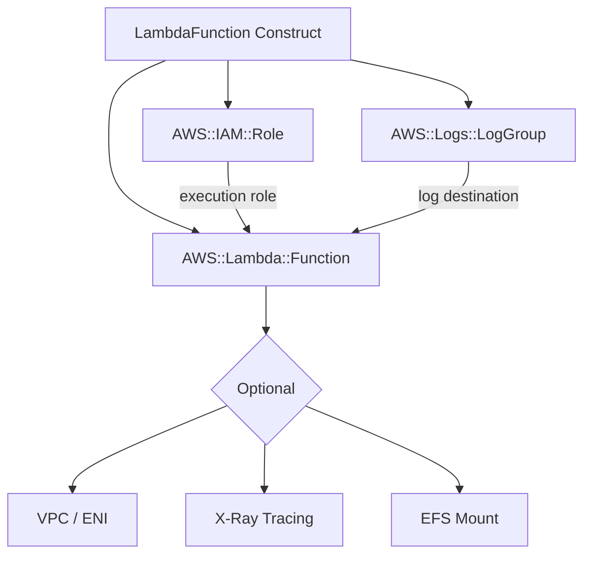

# @sevenpico/cdk-construct-lambda-function

An AWS CDK construct that provisions an AWS Lambda function with a dedicated IAM execution role, CloudWatch log group, and optional integrations: VPC, X-Ray tracing, Lambda Insights, SSM parameter access, and EFS file system.

## Architecture



## Installation

```bash
npm install @sevenpico/cdk-construct-lambda-function
```

## Usage

```typescript
import { LambdaFunction } from '@sevenpico/cdk-construct-lambda-function';
import { makeContext } from '@sevenpico/cdk-context';

const context = makeContext({ namespace: 'acme', stage: 'prod', name: 'processor' });

new LambdaFunction(this, 'MyFunction', {
  context,
  s3Bucket: 'my-deploy-bucket',
  s3Key: 'lambda/processor.zip',
  handler: 'index.handler',
  runtime: 'nodejs20.x',
  memorySizeMb: 256,
  timeoutSeconds: 30,
  tracingMode: 'Active',
});
```

## Props

| Prop | Type | Default | Description |
|------|------|---------|-------------|
| `context` | `Context` | *required* | SevenPico context |
| `functionName` | `string` | `contextId(ctx)` | Lambda function name |
| `handler` | `string` | `'index.handler'` | Handler entrypoint |
| `runtime` | `string` | `'nodejs20.x'` | Runtime identifier |
| `filename` | `string` | — | Local path to deployment ZIP |
| `s3Bucket` | `string` | — | S3 bucket for deployment package |
| `s3Key` | `string` | — | S3 key for deployment package |
| `s3ObjectVersion` | `string` | — | S3 object version |
| `imageUri` | `string` | — | ECR image URI (for Image package type) |
| `packageType` | `string` | `'Zip'` | Package type (`Zip` or `Image`) |
| `description` | `string` | — | Function description |
| `memorySizeMb` | `number` | `128` | Memory in MB |
| `timeoutSeconds` | `number` | `3` | Timeout in seconds |
| `reservedConcurrentExecutions` | `number` | `-1` | Reserved concurrency (`-1` = no limit) |
| `architecture` | `string` | `'x86_64'` | Architecture (`x86_64` or `arm64`) |
| `environment` | `LambdaEnvironment` | — | Environment variables |
| `kmsKeyArn` | `string` | — | KMS key ARN for env var encryption |
| `layers` | `string[]` | — | Lambda layer ARNs (max 5) |
| `publish` | `boolean` | `false` | Publish new version on deploy |
| `tracingMode` | `string` | — | X-Ray mode (`Active` or `PassThrough`) |
| `lambdaInsightsEnabled` | `boolean` | `false` | Enable Lambda Insights |
| `cloudwatchLogsRetentionDays` | `number` | — | Log retention in days |
| `cloudwatchLogsKmsKeyArn` | `string` | — | KMS key for log encryption |
| `vpcConfig` | `LambdaVpcConfig` | — | VPC configuration |
| `fileSystemConfig` | `LambdaFileSystemConfig` | — | EFS configuration |
| `ssmParameterNames` | `string[]` | — | SSM parameter prefixes to read |
| `roleSourcePolicyDocuments` | `string[]` | — | Additional IAM policy JSON docs |
| `roleName` | `string` | — | Existing role name to use |

## Public Properties

| Property | Type | Description |
|----------|------|-------------|
| `fn` | `lambda.Function \| undefined` | The Lambda function |
| `role` | `iam.Role \| undefined` | The execution role |
| `logGroup` | `logs.LogGroup \| undefined` | The CloudWatch log group |

## Context

| Field | Usage |
|-------|-------|
| `context.id` | Default function name, role name, log group name |
| `context.tags` | Applied to all resources |
| `context.enabled` | If `false`, no resources created |

## License

See [LICENSE](./LICENSE).
