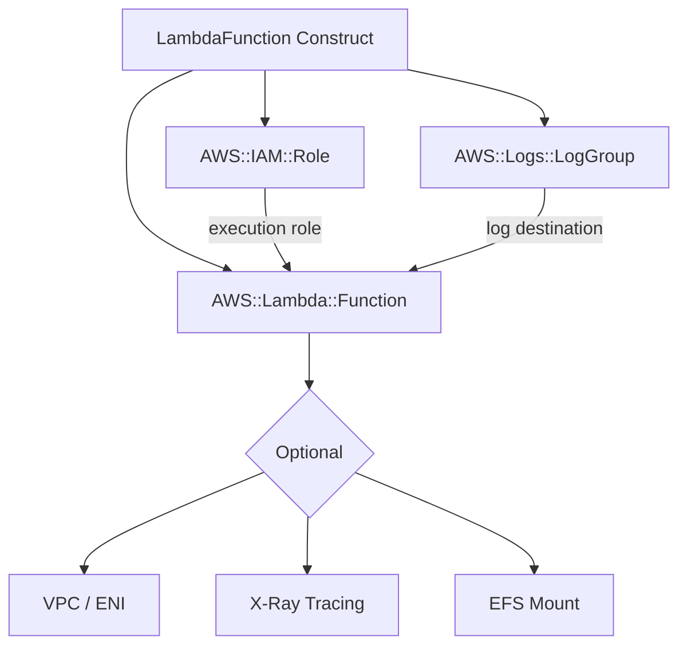

# @sevenpico/cdk-construct-lambda-function

Provisions an AWS Lambda function with a dedicated IAM execution role and CloudWatch log group in a single construct declaration. Creates `AWS::Lambda::Function`, `AWS::IAM::Role`, and `AWS::Logs::LogGroup` resources with optional VPC, X-Ray tracing, Lambda Insights, SSM parameter access, and EFS file system integrations.

## Diagram

## Lambda Function with Execution Role and Log Group

Use this construct when you need a Lambda function with consistent naming, tagging, and a pre-wired execution role. The construct automatically creates the CloudWatch log group before the function so log retention is controlled by CDK, and it adds managed policies to the execution role based on the integrations you enable (VPC, X-Ray, Lambda Insights, SSM).

How the deployed resources work:

1. **CloudWatch Log Group** (`/aws/lambda/{functionName}`) is created first so CDK controls retention and encryption settings independently of the Lambda function lifecycle.
2. **IAM Execution Role** is created with `AWSLambdaBasicExecutionRole` and additional managed policies added automatically when `vpcConfig`, `tracingMode`, or `lambdaInsightsEnabled` are set. Custom policy documents can be injected via `roleSourcePolicyDocuments`.
3. **Lambda Function** is created referencing the log group and execution role. VPC configuration is applied via CfnFunction escape hatch. An existing role can be used instead of creating one by supplying `roleName`.

Pass the `context` prop to get deterministic naming (e.g., `acme-dev-app` as both function name and role name prefix) and consistent tagging.

## Deployed Resources

- **AWS::IAM::Role** - Lambda execution role with least-privilege managed policies based on enabled integrations.
- **AWS::Logs::LogGroup** - CloudWatch log group with configurable retention and optional KMS encryption.
- **AWS::Lambda::Function** - Lambda function with configurable runtime, memory, timeout, architecture, layers, and optional VPC/EFS/X-Ray integrations.

## Usage

See the [examples](./examples) directory for complete usage examples.

- [Minimal](./examples/minimal)
- [Comprehensive](./examples/comprehensive)
- [Disabled](./examples/disabled)

## Inputs

| Name | Description | Type | Default | Required |
|------|-------------|------|---------|:--------:|
| `context` | SevenPico context for naming and tagging | `Context` | — | ✓ |
| `functionName` | Function name override | `string` | `context.id` | |
| `handler` | Handler entrypoint (e.g. `index.handler`) | `string` | `index.handler` | |
| `runtime` | Runtime identifier (e.g. `nodejs20.x`) | `string` | `nodejs20.x` | |
| `filename` | Local path to deployment ZIP file | `string` | — | |
| `s3Bucket` | S3 bucket containing deployment package | `string` | — | |
| `s3Key` | S3 key of deployment package | `string` | — | |
| `s3ObjectVersion` | S3 object version | `string` | — | |
| `imageUri` | ECR image URI (use with `packageType: 'Image'`) | `string` | — | |
| `packageType` | Deployment package type (`Zip` or `Image`) | `string` | `Zip` | |
| `description` | Function description | `string` | — | |
| `memorySizeMb` | Memory in MB | `number` | `128` | |
| `timeoutSeconds` | Timeout in seconds | `number` | `3` | |
| `reservedConcurrentExecutions` | Reserved concurrency (`-1` = no limit) | `number` | `-1` | |
| `architecture` | Instruction set architecture (`x86_64` or `arm64`) | `string` | `x86_64` | |
| `environment` | Environment variables | `LambdaEnvironment` | — | |
| `kmsKeyArn` | KMS key ARN for environment variable encryption | `string` | — | |
| `layers` | Lambda layer ARNs (max 5) | `string[]` | — | |
| `publish` | Publish new version on each deploy | `boolean` | `false` | |
| `tracingMode` | X-Ray tracing mode (`Active` or `PassThrough`) | `string` | — | |
| `lambdaInsightsEnabled` | Enable CloudWatch Lambda Insights | `boolean` | `false` | |
| `cloudwatchLogsRetentionDays` | Log retention in days | `number` | — | |
| `cloudwatchLogsKmsKeyArn` | KMS key ARN for log group encryption | `string` | — | |
| `vpcConfig` | VPC configuration (security group and subnet IDs) | `LambdaVpcConfig` | — | |
| `fileSystemConfig` | EFS access point configuration | `LambdaFileSystemConfig` | — | |
| `ssmParameterNames` | SSM parameter name prefixes the function can read | `string[]` | — | |
| `roleSourcePolicyDocuments` | Additional IAM policy document JSON strings for the execution role | `string[]` | — | |
| `roleName` | Existing IAM role name to use instead of creating one | `string` | — | |

## Outputs

| Name | Description | Type |
|------|-------------|------|
| `fn` | The Lambda function | `lambda.Function \| undefined` |
| `role` | The execution role (only when not using `roleName`) | `iam.Role \| undefined` |
| `logGroup` | The CloudWatch log group | `logs.LogGroup \| undefined` |

## Special Considerations

- One of `filename`, `s3Bucket`/`s3Key`, or `imageUri` must be provided; otherwise the construct throws at synth time.
- The log group is created with `RemovalPolicy.DESTROY`, meaning it will be deleted on stack teardown. Adjust via CDK aspects if you need retention after deletion.
- When `roleName` is provided, the construct imports the existing role and `role` output is `undefined` — no new IAM role is created.
- VPC configuration is applied via CfnFunction escape hatch because CDK's `vpc` prop requires a resolved `IVpc` object, not raw IDs.
- When `context.enabled` is `false`, no resources are created and all output properties are `undefined`.

## Roadmap

### v0.1.0

- [x] Initial implementation
- [x] BDD test coverage
- [x] Context-based naming and tagging

### v0.2.0

- [ ] EventBridge rule trigger support
- [ ] CloudWatch log subscription filter support

## License

Apache 2.0 — see [LICENSE](../../LICENSE).
