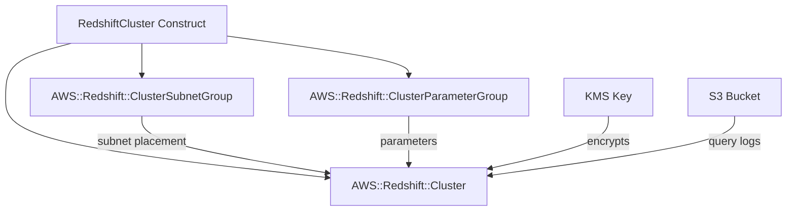

# @sevenpico/cdk-construct-redshift-cluster

Provisions an Amazon Redshift cluster with a subnet group and parameter group. Supports single-node and multi-node configurations, optional encryption, S3 query logging, snapshot restore, and IAM role associations using SevenPico's context system for consistent naming and tagging.

## Diagram

## Managed Redshift Cluster

Use this construct when you need a Redshift cluster for data warehousing and analytics workloads. It provisions the cluster along with its required subnet group and parameter group, handling the configuration boilerplate.

How the deployed resources work:

1. **Cluster Subnet Group** defines which VPC subnets the cluster can be placed in.
2. **Cluster Parameter Group** holds engine configuration parameters (e.g., query logging, WLM settings).
3. **Redshift Cluster** runs the data warehouse with the configured node type, billing, encryption, and networking.

Instantiate the construct with your SevenPico context, subnet IDs, and an admin password. All other settings have sensible defaults: single-node dc2.large, port 5439, no encryption, and skip final snapshot on deletion.

## Deployed Resources

- **AWS::Redshift::ClusterSubnetGroup** - Defines the VPC subnets for cluster placement.
- **AWS::Redshift::ClusterParameterGroup** - Engine configuration parameters for the cluster.
- **AWS::Redshift::Cluster** - The Redshift cluster with configured nodes, encryption, logging, and IAM roles.

## Usage

See the [examples](./examples) directory for complete usage examples.

- [Complete Example](./examples/complete)

## Inputs

| Name | Description | Type | Default | Required |
|------|-------------|------|---------|:--------:|
| `context` | SevenPico context for naming and tagging | `Context` | — | yes |
| `subnetIds` | VPC subnet IDs for the cluster | `string[]` | — | yes |
| `adminPassword` | Master password (recommend Secrets Manager reference) | `string` | — | yes |
| `clusterIdentifier` | Cluster identifier override | `string` | `contextId(ctx)` | |
| `databaseName` | Initial database name | `string` | `'dev'` | |
| `adminUser` | Master username | `string` | `'admin'` | |
| `nodeType` | Node instance type | `string` | `'dc2.large'` | |
| `clusterType` | Cluster type | `string` | `'single-node'` | |
| `numberOfNodes` | Number of compute nodes (multi-node only) | `number` | `2` | |
| `vpcSecurityGroupIds` | VPC security group IDs | `string[]` | — | |
| `availabilityZone` | Specific availability zone | `string` | AWS selects | |
| `preferredMaintenanceWindow` | Maintenance window | `string` | — | |
| `automatedSnapshotRetentionPeriod` | Snapshot retention in days | `number` | `1` | |
| `port` | Cluster port | `number` | `5439` | |
| `engineVersion` | Redshift engine version | `string` | `'1.0'` | |
| `publiclyAccessible` | Make cluster publicly accessible | `boolean` | `false` | |
| `encrypted` | Enable encryption at rest | `boolean` | `false` | |
| `kmsKeyArn` | KMS key ARN for encryption | `string` | — | |
| `enhancedVpcRouting` | Enable enhanced VPC routing | `boolean` | `false` | |
| `elasticIp` | Elastic IP address | `string` | — | |
| `skipFinalSnapshot` | Skip final snapshot on deletion | `boolean` | `true` | |
| `finalSnapshotIdentifier` | Final snapshot identifier | `string` | — | |
| `snapshotIdentifier` | Snapshot identifier to restore from | `string` | — | |
| `iamRoles` | IAM role ARNs to associate (max 10) | `string[]` | — | |
| `loggingEnabled` | Enable query/connection logging | `boolean` | `false` | |
| `loggingBucketName` | S3 bucket name for logs | `string` | — | |
| `loggingS3KeyPrefix` | S3 key prefix for logs | `string` | — | |
| `allowVersionUpgrade` | Allow major version upgrades | `boolean` | `false` | |
| `availabilityZoneRelocationEnabled` | Enable AZ relocation (RA3 nodes only) | `boolean` | `false` | |
| `clusterParameters` | Cluster parameter overrides | `RedshiftClusterParameter[]` | `[]` | |

## Outputs

| Name | Description | Type |
|------|-------------|------|
| `cluster` | The Redshift cluster | `redshift.CfnCluster \| undefined` |
| `subnetGroup` | The cluster subnet group | `redshift.CfnClusterSubnetGroup \| undefined` |
| `parameterGroup` | The cluster parameter group | `redshift.CfnClusterParameterGroup \| undefined` |

## Special Considerations

- This construct uses L1 (Cfn) constructs because CDK's L2 Redshift constructs do not expose all configuration options needed for production use.
- The `adminPassword` prop accepts a plain string. For production use, pass a Secrets Manager dynamic reference (e.g., `{{resolve:secretsmanager:MySecret:SecretString:password}}`).
- When `clusterType` is `single-node`, the `numberOfNodes` prop is ignored.
- AZ relocation (`availabilityZoneRelocationEnabled`) is only supported on RA3 node types.
- When context is disabled (`enabled: false`), all public properties are `undefined` and no resources are created.

## Roadmap

### v0.1.0

- [x] Initial implementation
- [x] BDD test coverage
- [x] Context-based naming and tagging

### v0.2.0

- [ ] Snapshot schedule configuration
- [ ] Resize support (classic vs. elastic)

## License

Apache 2.0 — see [LICENSE](../../LICENSE).
