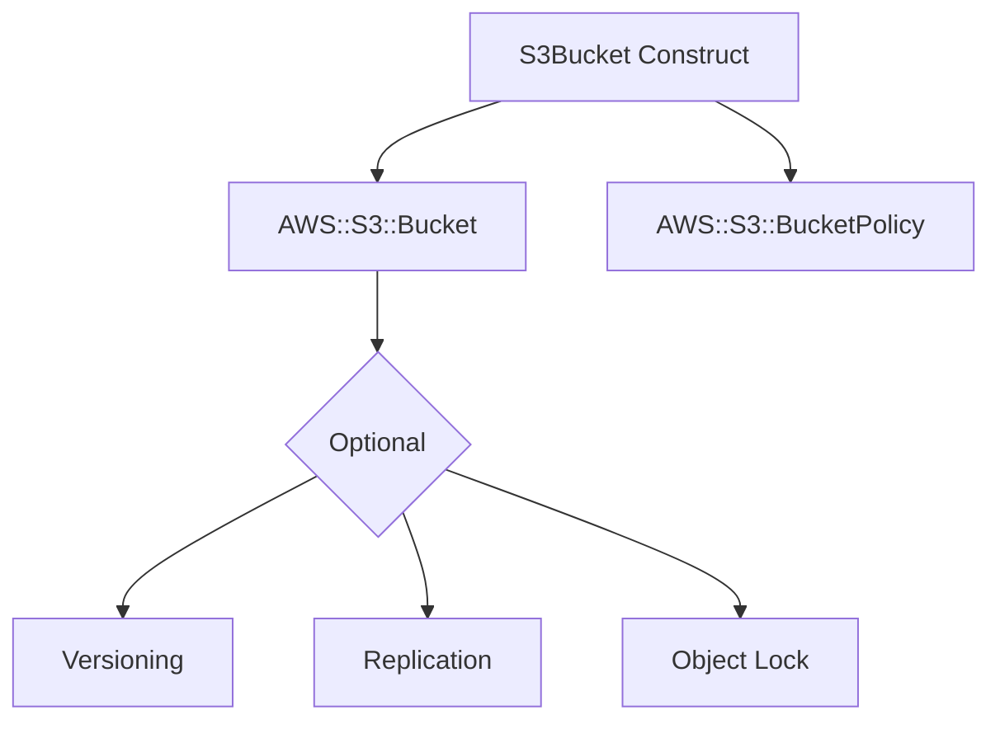

# @sevenpico/cdk-construct-s3-bucket

Provisions a fully-configured S3 bucket with sensible security defaults. Creates an S3 Bucket with optional bucket policy, versioning, encryption, lifecycle rules, CORS, replication, and object lock.

## Diagram

## Secure Object Storage

Use this construct when you need an S3 bucket with secure defaults for storing application data, logs, backups, or static assets. All public access is blocked by default and versioning is enabled to protect against accidental deletions.

How the deployed resources work:

1. **S3 Bucket** is created with configurable versioning, server-side encryption (SSE-S3 or SSE-KMS), lifecycle rules, CORS, transfer acceleration, object ownership, and object lock.
2. **Bucket Policy** is optionally created to enforce SSL-only access and/or encrypted uploads only, plus any custom policy documents you provide.

Pass the `context` prop to get deterministic bucket naming (e.g., `7p-prod-assets`) and consistent tagging across all your infrastructure.

## Deployed Resources

- **AWS::S3::Bucket** - S3 bucket with configurable encryption, versioning, lifecycle, CORS, and public access blocking.
- **AWS::S3::BucketPolicy** - Optional bucket policy enforcing SSL and/or encrypted uploads.

## Usage

See the [examples](./examples) directory for complete usage examples.

- [Minimal](./examples/minimal)
- [S3-Managed Encrypted](./examples/s3-managed-encrypted)
- [KMS Encrypted](./examples/kms-encrypted)
- [Comprehensive](./examples/comprehensive)
- [Disabled](./examples/disabled)

## Inputs

| Name | Description | Type | Default | Required |
|------|-------------|------|---------|:--------:|
| `context` | SevenPico context for naming and tagging | `Context` | — | ✓ |
| `bucketName` | Override the bucket name | `string` | `context.id` | |
| `versioningEnabled` | Enable versioning | `boolean` | `true` | |
| `sseAlgorithm` | SSE algorithm (`AES256` or `aws:kms`) | `string` | `AES256` | |
| `kmsKeyArn` | KMS key ARN for SSE-KMS encryption | `string` | — | |
| `bucketKeyEnabled` | Enable S3 bucket key to reduce KMS costs | `boolean` | `false` | |
| `blockPublicAcls` | Block public ACLs | `boolean` | `true` | |
| `blockPublicPolicy` | Block public bucket policies | `boolean` | `true` | |
| `ignorePublicAcls` | Ignore public ACLs | `boolean` | `true` | |
| `restrictPublicBuckets` | Restrict public buckets | `boolean` | `true` | |
| `forceDestroy` | Force destroy even with objects | `boolean` | `false` | |
| `lifecycleRules` | Lifecycle rules | `S3LifecycleRule[]` | `[]` | |
| `corsRules` | CORS rules | `S3CorsRule[]` | `[]` | |
| `objectOwnership` | Object ownership | `string` | `BucketOwnerEnforced` | |
| `transferAccelerationEnabled` | Enable transfer acceleration | `boolean` | `false` | |
| `mfaDeleteEnabled` | Enable MFA delete (requires versioning) | `boolean` | `false` | |
| `replicationRules` | Cross-region replication rules | `S3ReplicationRule[]` | — | |
| `replicationRoleArn` | IAM role ARN for replication | `string` | — | |
| `loggingBucketName` | Logging target bucket name | `string` | — | |
| `loggingPrefix` | Logging target prefix | `string` | — | |
| `sourcePolicyDocuments` | Additional IAM policy documents (JSON strings) | `string[]` | `[]` | |
| `allowEncryptedUploadsOnly` | Enforce encrypted uploads only | `boolean` | `false` | |
| `allowSslRequestsOnly` | Enforce SSL/TLS requests only | `boolean` | `false` | |
| `objectLockMode` | Object lock mode (`GOVERNANCE` or `COMPLIANCE`) | `string` | — | |
| `objectLockRetentionDays` | Object lock retention days | `number` | — | |
| `objectLockRetentionYears` | Object lock retention years | `number` | — | |

## Outputs

| Name | Description | Type |
|------|-------------|------|
| `bucket` | The S3 bucket | `s3.Bucket \| undefined` |

## Special Considerations

- By default the removal policy is `RETAIN` to prevent accidental data loss. Set `forceDestroy: true` to enable `DESTROY` policy with auto-delete objects.
- When `context.enabled` is `false`, no resources are created and `bucket` is `undefined`.
- Replication requires both `replicationRules` and `replicationRoleArn` to be set, and the source bucket must have versioning enabled.
- Object lock requires specifying `objectLockMode` along with either `objectLockRetentionDays` or `objectLockRetentionYears`.

## Roadmap

### v0.1.0

- [x] Initial implementation
- [x] BDD test coverage
- [x] Context-based naming and tagging

### v0.2.0

- [ ] Event notification configuration
- [ ] Intelligent tiering configuration
- [ ] Website hosting configuration

## License

Apache 2.0 — see [LICENSE](../../LICENSE).
