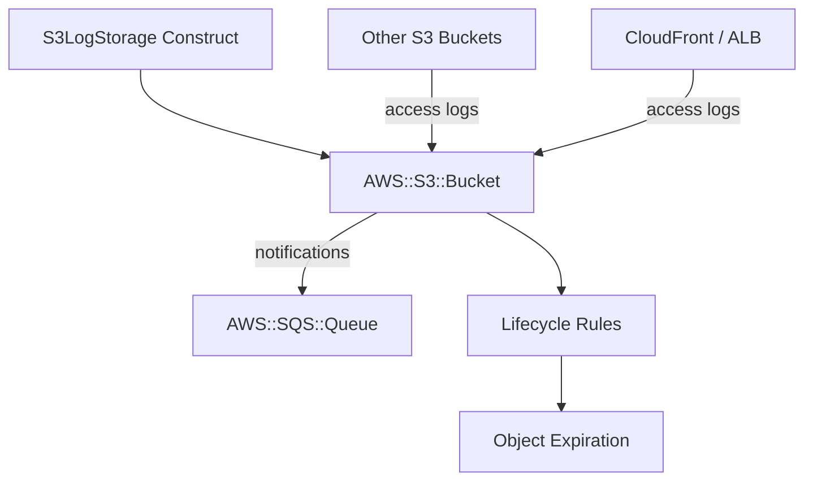

# @sevenpico/cdk-construct-s3-log-storage

Provisions an S3 bucket pre-configured for receiving access logs from other AWS services (S3, CloudFront, CloudTrail, ALB). Optionally creates an SQS queue for bucket event notifications.

## Diagram

## Centralized Log Storage

Use this construct when you need a single, hardened S3 bucket to receive access logs from multiple AWS services. It wraps the `S3Bucket` construct with opinionated defaults suited for log storage: SSL-only enforcement, `ObjectWriter` ownership (required for log delivery ACL grants), versioning enabled, and all public access blocks active.

How the deployed resources work:

1. **S3 Bucket** receives access logs from other S3 buckets, CloudFront distributions, ALBs, and CloudTrail trails.
2. **Bucket Policy** enforces SSL-only access by default, denying any requests made over plain HTTP.
3. **SQS Queue** (optional) receives notifications when new objects are created in the bucket, enabling downstream processing pipelines.

Configure the construct with `S3LogStorageProps` to customize encryption, lifecycle rules, and notification settings. Point other buckets' `serverAccessLogsBucket` to this bucket's name.

## Deployed Resources

- **AWS::S3::Bucket** - Hardened log storage bucket with versioning, SSL enforcement, and public access blocks.
- **AWS::S3::BucketPolicy** - Enforces SSL-only requests (deny on `aws:SecureTransport: false`).
- **AWS::SQS::Queue** - (Optional) Receives S3 event notifications for new object creation.

## Inputs

| Name | Description | Type | Default | Required |
|------|-------------|------|---------|:--------:|
| `context` | SevenPico context for naming and tagging | `Context` | — | ✓ |
| `bucketName` | Override the bucket name | `string` | `context.id` | |
| `versioningEnabled` | Enable versioning | `boolean` | `true` | |
| `sseAlgorithm` | SSE algorithm | `string` | `'AES256'` | |
| `kmsKeyArn` | KMS key ARN for SSE-KMS | `string` | — | |
| `bucketKeyEnabled` | Enable S3 bucket key | `boolean` | `false` | |
| `blockPublicAcls` | Block public ACLs | `boolean` | `true` | |
| `blockPublicPolicy` | Block public bucket policies | `boolean` | `true` | |
| `ignorePublicAcls` | Ignore public ACLs | `boolean` | `true` | |
| `restrictPublicBuckets` | Restrict public buckets | `boolean` | `true` | |
| `forceDestroy` | Force destroy even with objects | `boolean` | `false` | |
| `allowSslRequestsOnly` | Enforce SSL-only requests | `boolean` | `true` | |
| `sourcePolicyDocuments` | Additional IAM policy documents (JSON strings) | `string[]` | — | |
| `objectOwnership` | S3 object ownership | `string` | `'ObjectWriter'` | |
| `lifecycleRules` | Lifecycle rules | `S3LifecycleRule[]` | — | |
| `accessLogBucketName` | Logging target bucket name (for access logs of this bucket) | `string` | — | |
| `accessLogPrefix` | Logging prefix | `string` | — | |
| `notificationsEnabled` | Enable bucket event notifications | `boolean` | `false` | |
| `notificationsType` | Notification target type | `string` | `'SQS'` | |
| `notificationsPrefix` | S3 key prefix filter for notifications | `string` | — | |
| `mfaDeleteEnabled` | Enable MFA delete | `boolean` | `false` | |

## Outputs

| Name | Description | Type |
|------|-------------|------|
| `bucket` | The log storage S3 bucket | `s3.Bucket \| undefined` |
| `notificationQueue` | SQS queue for bucket notifications (if enabled) | `sqs.Queue \| undefined` |

## Special Considerations

- The bucket uses `ObjectWriter` ownership by default, which is required for S3 server access log delivery via ACL grants.
- When `notificationsEnabled` is `true` and `notificationsType` is `'SQS'` (the default), an SQS queue is created and wired to receive `OBJECT_CREATED` events. If `notificationsPrefix` is set, only objects matching that prefix trigger notifications.
- When `context.enabled` is `false`, no resources are created and all public properties are `undefined`.
- This construct wraps `@sevenpico/cdk-construct-s3-bucket` with log-storage-specific defaults. All S3 bucket configuration props are passed through.

## Roadmap

### v0.1.0

- [x] Initial implementation
- [x] BDD test coverage
- [x] Context-based naming and tagging
- [x] Optional SQS event notifications

### v0.2.0

- [ ] SNS notification target support
- [ ] Lambda notification target support

## License

Apache 2.0 — see [LICENSE](../../LICENSE).
