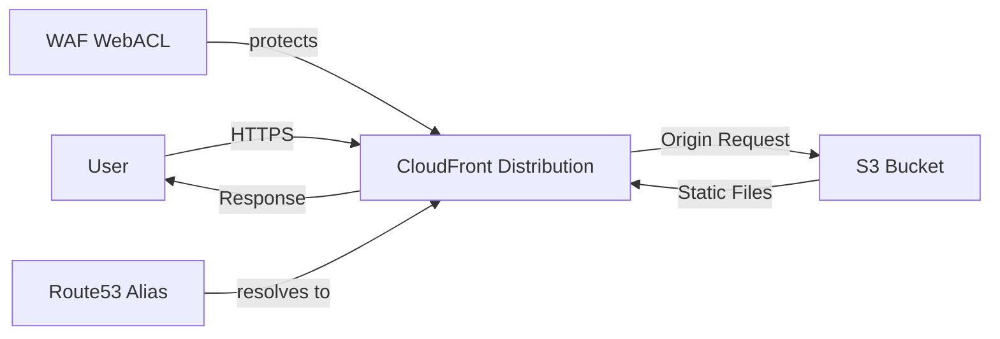

# @sevenpico/cdk-construct-s3-website

Provisions a static website hosted on S3 with a CloudFront distribution, optional WAF protection, and optional Route53 DNS alias. Supports OAC-based origin access, custom error responses, geo-restriction, and deployment principal grants.

## Diagram

## Static Website Hosting with CloudFront

Use this construct when you need to deploy a static website (SPA, marketing site, documentation) behind a CloudFront distribution with HTTPS, custom domain support, and optional WAF protection.

How the deployed resources work:

1. The S3 origin bucket stores static website files with all public access blocked
2. CloudFront serves content via OAC (Origin Access Control) with HTTPS redirect
3. Optional WAF WebACL protects the distribution with AWS managed rule groups
4. Optional Route53 A record creates a DNS alias pointing to the CloudFront distribution
5. Deployment principals are granted PutObject access to the origin bucket

Configure the construct with an ACM certificate ARN (must be in us-east-1), custom error responses for SPA routing, geo-restrictions, and TLS protocol version.

## Deployed Resources

- **AWS::S3::Bucket** - Origin bucket for static website files, with S3-managed encryption and all public access blocked.
- **AWS::CloudFront::Distribution** - CDN distribution with OAC, HTTPS redirect, custom error responses, and optional geo-restriction.
- **AWS::CloudFront::OriginAccessControl** - Secure access from CloudFront to the S3 origin bucket using SigV4.
- **AWS::WAFv2::WebACL** - (Optional) Web application firewall with 7 AWS managed rule groups for CloudFront scope.
- **AWS::Route53::RecordSet** - (Optional) DNS A record alias pointing to the CloudFront distribution.

## Usage

See the [examples](./examples) directory for complete usage examples.

- [Minimal](./examples/minimal)
- [Comprehensive](./examples/comprehensive)
- [Disabled](./examples/disabled)

## Inputs

| Name | Description | Type | Default | Required |
|------|-------------|------|---------|:--------:|
| `context` | SevenPico context for naming and tagging | `Context` | — | ✓ |
| `acmCertificateArn` | ACM certificate ARN (must be in us-east-1) | `string` | — | ✓ |
| `additionalAliases` | Additional CloudFront aliases (CNAMEs) | `string[]` | `[]` | |
| `defaultRootObject` | Default root object | `string` | `'index.html'` | |
| `customErrorResponses` | Custom error responses | `CustomErrorResponse[]` | 404 -> index.html | |
| `wafEnabled` | Enable WAF on CloudFront | `boolean` | `false` | |
| `cloudfrontAccessLoggingEnabled` | Enable CloudFront access logging | `boolean` | `false` | |
| `cloudfrontAccessLogBucketId` | S3 bucket ID to receive CloudFront access logs | `string` | — | |
| `cloudfrontAccessLogPrefix` | CloudFront access log prefix | `string` | — | |
| `s3AccessLoggingEnabled` | Enable S3 origin access logging | `boolean` | `true` | |
| `s3AccessLogBucketId` | S3 bucket for S3 access logs | `string` | — | |
| `s3AccessLogPrefix` | S3 access log prefix | `string` | — | |
| `corsAllowedOrigins` | CORS allowed origins | `string[]` | — | |
| `deploymentPrincipalArns` | IAM ARNs allowed to deploy | `string[]` | `[]` | |
| `parentZoneId` | Route53 hosted zone ID | `string` | — | |
| `parentZoneName` | Route53 hosted zone name | `string` | — | |
| `dnsAliasEnabled` | Create Route53 DNS alias | `boolean` | `false` | |
| `tlsProtocolVersion` | TLS protocol version | `string` | `'TLSv1.2_2021'` | |
| `geoRestriction` | Geo restriction configuration | `GeoRestriction` | — | |
| `functionAssociations` | CloudFront function associations | `FunctionAssociation[]` | — | |

## Outputs

| Name | Description | Type |
|------|-------------|------|
| `originBucket` | The S3 origin bucket | `s3.Bucket \| undefined` |
| `distribution` | The CloudFront distribution | `cloudfront.Distribution \| undefined` |
| `dnsRecord` | The Route53 alias record | `route53.ARecord \| undefined` |

## Special Considerations

- The ACM certificate must be in **us-east-1** for CloudFront distributions, regardless of the stack region.
- When `wafEnabled` is true, 7 AWS managed rule groups are applied (CommonRuleSet, IpReputation, KnownBadInputs, SQLi, Linux, Unix, AnonymousIpList).
- The origin bucket uses S3-managed encryption with all public access blocked. Access is exclusively via CloudFront OAC.
- DNS alias requires both `dnsAliasEnabled: true` and a valid `parentZoneId`.

## Roadmap

### v0.1.0

- [x] Initial implementation
- [x] BDD test coverage
- [x] Context-based naming and tagging
- [x] CloudFront with OAC
- [x] Optional WAF with managed rules
- [x] Optional Route53 DNS alias

### v0.2.0

- [x] CORS configuration support
- [x] CloudFront access logging to S3
- [ ] Custom CloudFront cache policies

## License

Apache 2.0 — see [LICENSE](../../LICENSE).
