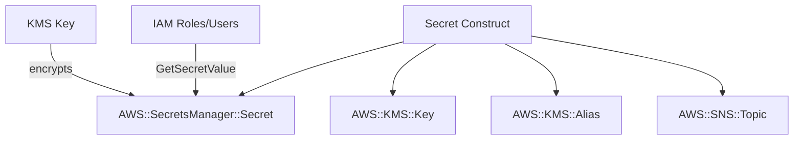

# @sevenpico/cdk-construct-secret

Provisions an AWS Secrets Manager secret with an optional dedicated KMS key, optional SNS topic for change notifications, optional cross-region replication, and configurable read access principals.

## Diagram



## Secrets Manager with KMS Encryption

Use this construct when you need to provision a Secrets Manager secret with optional dedicated KMS encryption, cross-region replication, and controlled read access via IAM resource policies.

How the deployed resources work:

1. A dedicated KMS key is created (by default) for encrypting the secret, with key rotation enabled
2. A KMS alias is created for the key using the context-derived name
3. The Secrets Manager secret is created with optional initial value and encryption key
4. IAM resource policies grant read access to specified principals
5. An optional SNS topic is created for secret change notifications

## Deployed Resources

- **AWS::SecretsManager::Secret** - The secret with configurable encryption, description, and optional cross-region replication.
- **AWS::KMS::Key** - (Optional, default: created) Dedicated KMS key with rotation enabled and configurable deletion window.
- **AWS::KMS::Alias** - (Optional) Alias for the KMS key.
- **AWS::SNS::Topic** - (Optional) SNS topic for secret update notifications, encrypted with the same KMS key.

## Usage

```typescript
import { Secret } from '@sevenpico/cdk-construct-secret';
import { makeContext } from '@sevenpico/cdk-context';

const context = makeContext({ namespace: '7p', stage: 'prod', name: 'db-password' });

new Secret(this, 'DbSecret', {
  context,
  description: 'Database password for production',
  secretReadPrincipals: [
    { type: 'AWS', identifiers: ['arn:aws:iam::123456789012:role/app-role'] },
  ],
  createSns: true,
});
```

## Inputs

| Name | Description | Type | Default | Required |
|------|-------------|------|---------|:--------:|
| `context` | SevenPico context for naming and tagging | `Context` | -- | yes |
| `secretString` | Initial secret value | `string` | -- | |
| `description` | Secret description | `string` | -- | |
| `createKmsKey` | Create a dedicated KMS key | `boolean` | `true` | |
| `kmsKeyArn` | Existing KMS key ARN (when createKmsKey=false) | `string` | -- | |
| `kmsKeyDeletionWindowInDays` | KMS key deletion window in days | `number` | `30` | |
| `kmsKeyEnableKeyRotation` | Enable KMS key rotation | `boolean` | `true` | |
| `kmsKeyMultiRegion` | Use multi-region KMS key | `boolean` | `false` | |
| `secretIgnoreChanges` | Ignore changes to secret value after creation | `boolean` | `false` | |
| `createSns` | Create SNS topic for notifications | `boolean` | `false` | |
| `secretReadPrincipals` | IAM principals allowed to read the secret | `SecretReadPrincipal[]` | `[]` | |
| `snsPubPrincipals` | IAM principals allowed to publish to the SNS topic | `SecretReadPrincipal[]` | `[]` | |
| `snsSubPrincipals` | IAM principals allowed to subscribe to the SNS topic | `SecretReadPrincipal[]` | `[]` | |
| `replicaRegions` | Regions to replicate the secret to | `string[]` | `[]` | |
| `secretAttributesOverride` | Context attributes override for the secret | `string[]` | `['secret']` | |
| `kmsKeyAttributesOverride` | Context attributes override for the KMS key | `string[]` | `['key']` | |

## Outputs

| Name | Description | Type |
|------|-------------|------|
| `secret` | The Secrets Manager secret | `sm.Secret \| undefined` |
| `kmsKey` | The dedicated KMS key | `kms.Key \| undefined` |
| `kmsAlias` | The KMS key alias | `kms.Alias \| undefined` |
| `snsTopic` | The SNS notification topic | `sns.Topic \| undefined` |

## Special Considerations

- The KMS key is created by default with rotation enabled. Set `createKmsKey: false` to use an external key or AWS-managed encryption.
- When `createKmsKey` is false and `kmsKeyArn` is provided, the external key is used for encryption.
- Read principals receive `secretsmanager:GetSecretValue` and `secretsmanager:DescribeSecret` on the secret, plus `kms:Decrypt` and `kms:DescribeKey` on the KMS key (if created).
- The SNS topic is encrypted with the same KMS key used for the secret.
- Context attributes are appended to the base context ID: secret gets `-secret` suffix, KMS key gets `-key` suffix by default.
- `SecretReadPrincipal` supports an optional `conditions` array of `SecretPrincipalCondition` objects (`{ test, variable, values }`). Conditions are applied only to the `secretsmanager:GetSecretValue`/`DescribeSecret` policy statement, not to the KMS statement.
- `secretIgnoreChanges` sets CloudFormation metadata (`aws:cdk:ignore-secret-value`) as a best-effort hint; it does not use `CfnResource.cfnOptions.updatePolicy` or a custom resource to enforce immutability.
- `snsPubPrincipals` and `snsSubPrincipals` add resource policy statements to the SNS topic granting `sns:Publish` and `sns:Subscribe` respectively.

## Roadmap

### v0.1.0

- [x] Initial implementation
- [x] BDD test coverage
- [x] Context-based naming and tagging
- [x] Dedicated KMS key with rotation
- [x] Optional SNS topic
- [x] Read access principal resource policies
- [x] Cross-region replication

### v0.2.0

- [ ] Secret rotation configuration
- [ ] Secret version stages
- [x] SNS pub/sub principal policies

## License

Apache 2.0 -- see [LICENSE](../../LICENSE).
