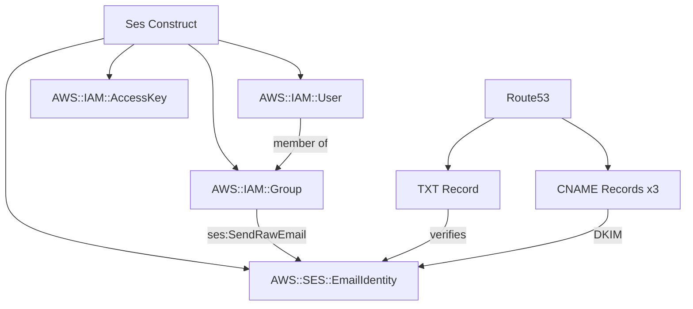

# @sevenpico/cdk-construct-ses

Provisions an AWS SES domain identity with optional Route53 DNS verification records, optional DKIM records, an IAM group with SES send permissions, and an optional IAM user for programmatic email sending using SevenPico's context system for consistent naming and tagging.

## Diagram

## SES Domain Identity with IAM Access

Use this construct when you need to set up email sending from a domain using AWS SES. It provisions the domain identity, handles DNS verification through Route53, and creates IAM resources for secure programmatic access.

How the deployed resources work:

1. **SES Email Identity** registers the domain with SES for email sending.
2. **Route53 TXT Record** (optional) proves domain ownership to SES for verification.
3. **Route53 CNAME Records** (optional) enable DKIM signing for email authentication.
4. **IAM Group** holds the SES send permissions policy.
5. **IAM User** provides programmatic access to send email via the SES API.
6. **IAM Access Key** enables API authentication for the IAM user.

Instantiate the construct with your SevenPico context. Optionally provide a Route53 zone ID for automatic DNS verification. The IAM group, user, and access key are created by default.

## Deployed Resources

- **AWS::SES::EmailIdentity** - The SES domain identity for email sending.
- **AWS::Route53::RecordSet** - (Optional) TXT record for domain verification and CNAME records for DKIM.
- **AWS::IAM::Group** - (Optional) IAM group with SES send permissions.
- **AWS::IAM::User** - (Optional) IAM user for programmatic email sending.
- **AWS::IAM::AccessKey** - (Optional) Access key for the IAM user.

## Usage

See the [examples](./examples) directory for complete usage examples.

- [Complete Example](./examples/complete)

## Inputs

| Name | Description | Type | Default | Required |
|------|-------------|------|---------|:--------:|
| `context` | SevenPico context for naming and tagging | `Context` | — | yes |
| `zoneId` | Route53 hosted zone ID for DNS verification | `string` | — | |
| `zoneName` | Route53 hosted zone name (required with zoneId) | `string` | — | |
| `verifyDomain` | Create Route53 TXT record for domain verification | `boolean` | `false` | |
| `verifyDkim` | Create Route53 CNAME records for DKIM verification | `boolean` | `false` | |
| `iamPermissions` | IAM permissions for the SES user/group | `string[]` | `['ses:SendRawEmail']` | |
| `iamAllowedResources` | Resource ARNs for the IAM policy | `string[]` | identity ARN | |
| `sesGroupEnabled` | Create an IAM group with SES send permissions | `boolean` | `true` | |
| `sesGroupName` | IAM group name override | `string` | `contextId-ses` | |
| `sesGroupPath` | IAM group path | `string` | `'/'` | |
| `sesUserEnabled` | Create an IAM user for programmatic SES access | `boolean` | `true` | |
| `createIamAccessKey` | Create IAM access keys for the user | `boolean` | `true` | |
| `forceDestroy` | Force destroy user | `boolean` | `false` | |
| `path` | IAM user path | `string` | `'/'` | |
| `inlinePolicies` | Inline policy JSON strings for the user | `string[]` | `[]` | |
| `policyArns` | Managed policy ARNs to attach to the user | `string[]` | `[]` | |
| `permissionsBoundary` | Permissions boundary ARN | `string` | — | |

## Outputs

| Name | Description | Type |
|------|-------------|------|
| `emailIdentity` | The SES domain identity | `ses.CfnEmailIdentity \| undefined` |
| `iamGroup` | IAM group with SES send permissions | `iam.Group \| undefined` |
| `iamUser` | IAM user for programmatic sending | `iam.User \| undefined` |
| `accessKey` | Access key for the IAM user | `iam.AccessKey \| undefined` |

## Special Considerations

- The construct uses `CfnEmailIdentity` (L1) because CDK's L2 SES constructs are limited and do not expose DKIM token attributes needed for DNS verification.
- The SES domain identity name is derived from `contextId(ctx)`. Use a context with a domain name as the name field (e.g., `name: 'example-com'`).
- Route53 verification requires both `zoneId` and `zoneName` to be provided along with `verifyDomain` and/or `verifyDkim`. CDK's `fromHostedZoneId` cannot resolve `zoneName`, so `fromHostedZoneAttributes` is used instead.
- The identity ARN for the IAM policy is constructed using `Arn.format` since `CfnEmailIdentity` does not expose an `attrArn` attribute.
- When context is disabled (`enabled: false`), all public properties are `undefined` and no resources are created.

## Roadmap

### v0.1.0

- [x] Initial implementation
- [x] BDD test coverage
- [x] Context-based naming and tagging

### v0.2.0

- [ ] MAIL FROM domain configuration
- [ ] Configuration set association

## License

Apache 2.0 — see [LICENSE](../../LICENSE).
