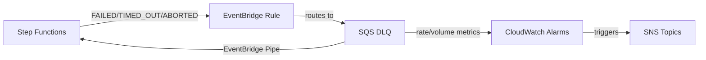

# @sevenpico/cdk-construct-sfn-error-notification

Monitors a standard Step Functions state machine for execution failures with automatic reprocessing. Provisions an SQS DLQ, EventBridge rule for failure capture, CloudWatch alarms, and an EventBridge Pipe that re-invokes the state machine.

## Diagram

## Standard Step Functions Error Monitoring

Use this construct when you need to monitor a standard (non-express) Step Functions state machine for failed executions. It captures FAILED, TIMED_OUT, and ABORTED execution events and routes them to a dead-letter queue for alerting and automatic reprocessing.

How the deployed resources work:

1. An EventBridge rule captures Step Functions execution status change events (FAILED, TIMED_OUT, ABORTED) for the target state machine
2. Failed execution events are routed to an SQS dead-letter queue
3. CloudWatch alarms monitor the DLQ for both growth rate and total volume of messages
4. When alarms trigger, they notify configured SNS topics for operator awareness
5. An EventBridge Pipe reads messages from the DLQ and re-invokes the state machine for automatic reprocessing

Configure the construct by providing the state machine ARN and SNS topic ARNs for alarm notifications. The construct handles all IAM permissions and EventBridge wiring automatically.

## Deployed Resources

- **SQS Queue** - Dead-letter queue that captures failed execution events
- **EventBridge Rule** - Captures FAILED, TIMED_OUT, and ABORTED execution events
- **CloudWatch Alarm (Rate)** - Monitors the rate of growth of messages in the DLQ
- **CloudWatch Alarm (Volume)** - Monitors the total number of visible messages in the DLQ
- **EventBridge Pipe** - Reads messages from the DLQ and re-invokes the state machine
- **CloudWatch Log Group** - Captures EventBridge Pipe execution logs
- **IAM Role** - Execution role for the EventBridge Pipe

## Usage

See the [examples](./examples) directory for complete usage examples.

- [Minimal](./examples/minimal)
- [Comprehensive](./examples/comprehensive)
- [Disabled](./examples/disabled)

## Inputs

| Name | Description | Type | Default | Required |
|------|-------------|------|---------|:--------:|
| `context` | SevenPico context for naming and tagging | `Context` | — | ✓ |
| `stateMachineArn` | ARN of the Step Functions state machine to monitor | `string` | — | ✓ |
| `rateAlarmSnsTopicArn` | ARN of the SNS topic for rate alarm | `string` | — | ✓ |
| `volumeAlarmSnsTopicArn` | ARN of the SNS topic for volume alarm | `string` | — | ✓ |
| `sqsKmsKeyArn` | KMS key ARN for SQS encryption | `string` | — | |
| `sqsQueueName` | SQS queue name override | `string` | `{context.id}-dlq` | |
| `sqsMessageRetentionSeconds` | SQS message retention in seconds | `number` | `604800` | |
| `sqsVisibilityTimeoutSeconds` | SQS visibility timeout in seconds | `number` | `2` | |
| `eventbridgeRuleName` | EventBridge rule name override | `string` | `{context.id}-failed` | |
| `alarmPeriodSeconds` | Alarm evaluation period in seconds | `number` | `60` | |
| `alarmDatapointsToAlarm` | Data points to trigger alarm | `number` | `2` | |
| `alarmEvaluationPeriods` | Number of evaluation periods | `number` | `2` | |
| `eventbridgePipeName` | EventBridge Pipe name override | `string` | `{context.id}-pipe` | |
| `eventbridgePipeBatchSize` | Batch size for the EventBridge Pipe | `number` | `1` | |
| `eventbridgePipeLogLevel` | Log level for the EventBridge Pipe | `string` | `'ERROR'` | |
| `cloudwatchLogRetentionDays` | CloudWatch log retention for pipe in days | `number` | `90` | |
| `targetStepFunctionInputTemplate` | Input template for the pipe target | `string` | `'<$.detail.input>'` | |
| `snsKmsKeyId` | KMS key ID for SNS topic encryption | `string` | — | |
| `rateAlarmName` | Custom rate alarm name | `string` | `{context.id}-dlq-rate` | |
| `volumeAlarmName` | Custom volume alarm name | `string` | `{context.id}-dlq-volume` | |

## Outputs

| Name | Description | Type |
|------|-------------|------|
| `deadLetterQueue` | DLQ for failed executions | `sqs.Queue \| undefined` |
| `rateAlarm` | Rate alarm on DLQ growth | `cw.Alarm \| undefined` |
| `volumeAlarm` | Volume alarm on DLQ depth | `cw.Alarm \| undefined` |
| `eventbridgeRule` | Rule capturing failed SFN executions | `events.Rule \| undefined` |
| `pipe` | Pipe re-routing DLQ messages to SFN | `pipes.CfnPipe \| undefined` |

## Special Considerations

- This construct monitors **standard** Step Functions state machines only. For Express workflows, use `@sevenpico/cdk-construct-express-sfn-error-notification`.
- The alarm defaults (2 datapoints over 2 periods) are stricter than the Lambda error notification variant (1/5), matching the source Terraform module behavior.
- The EventBridge Pipe uses `FIRE_AND_FORGET` invocation type for reprocessing.

## Roadmap

### v0.1.0

- [x] Initial implementation
- [x] BDD test coverage
- [x] Context-based naming and tagging

### v0.2.0

- [ ] Custom alarm threshold overrides
- [ ] Support for multiple state machines

## License

Apache 2.0 — see [LICENSE](../../LICENSE).
