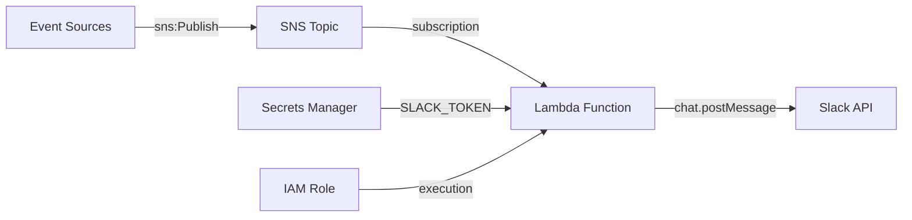

# @sevenpico/cdk-construct-slackbot

Provisions a Slackbot integration that receives notifications via SNS and posts them to Slack channels using a Lambda function. Reads the Slack bot token from AWS Secrets Manager.

## Diagram

## Slack Notification Pipeline

Use this construct when you need to send AWS event notifications to Slack channels. It provisions an SNS topic that receives notification events from any AWS service, a Python Lambda function that processes SNS messages and posts them to Slack via the Slack API, and IAM permissions for the Lambda to read the Slack bot token from Secrets Manager.

How the deployed resources work:

1. **SNS Topic** receives notification events from other AWS services or custom publishers.
2. **Lambda Function** is triggered by the SNS subscription, reads the Slack bot token from Secrets Manager, and posts the message to the configured Slack channel.
3. **IAM Role** grants the Lambda execution permissions including CloudWatch Logs access and Secrets Manager read access.
4. **CloudWatch Log Group** captures Lambda execution logs with configurable retention.

The Lambda source code (Python handler) is provided by the caller as a local asset path. The handler must be at `main.lambda_handler` and should read `SLACK_CHANNELS` and `SLACK_TOKEN_SECRET_ARN` from environment variables.

## Deployed Resources

- **AWS::SNS::Topic** - Receives notification events from AWS services or custom publishers.
- **AWS::SNS::Subscription** - Wires the SNS topic to the Lambda function.
- **AWS::Lambda::Function** - Python handler that posts SNS messages to Slack channels.
- **AWS::IAM::Role** - Lambda execution role with CloudWatch Logs and Secrets Manager permissions.
- **AWS::Logs::LogGroup** - CloudWatch log group for Lambda execution logs.

## Usage

See the [examples](./examples) directory for complete usage examples.

- [Complete Example](./examples/complete)

## Inputs

| Name | Description | Type | Default | Required |
|------|-------------|------|---------|:--------:|
| `context` | SevenPico context for naming and tagging | `Context` | — | ✓ |
| `slackChannels` | Map of attribute name to Slack channel ID | `Record<string, string>` | — | ✓ |
| `slackTokenSecretArn` | ARN of the Secrets Manager secret containing the Slack bot token | `string` | — | ✓ |
| `slackTokenSecretKmsKeyArn` | KMS key ARN for decrypting the Slack token secret | `string` | — | |
| `lambdaCodePath` | Path to local Lambda deployment package directory | `string` | `'./lambda'` | |
| `lambdaRuntime` | Lambda runtime | `string` | `'python3.9'` | |
| `cloudwatchLogExpirationDays` | CloudWatch log retention in days | `number` | `90` | |
| `snsPubPrincipals` | IAM principals allowed to publish to the SNS topic | `Record<string, string[]>` | — | |
| `snsSubPrincipals` | IAM principals allowed to subscribe to the SNS topic | `Record<string, string[]>` | — | |

## Outputs

| Name | Description | Type |
|------|-------------|------|
| `snsTopic` | The SNS topic that receives notifications | `sns.Topic \| undefined` |
| `lambdaFn` | The Lambda handler posting to Slack | `lambda.Function \| undefined` |
