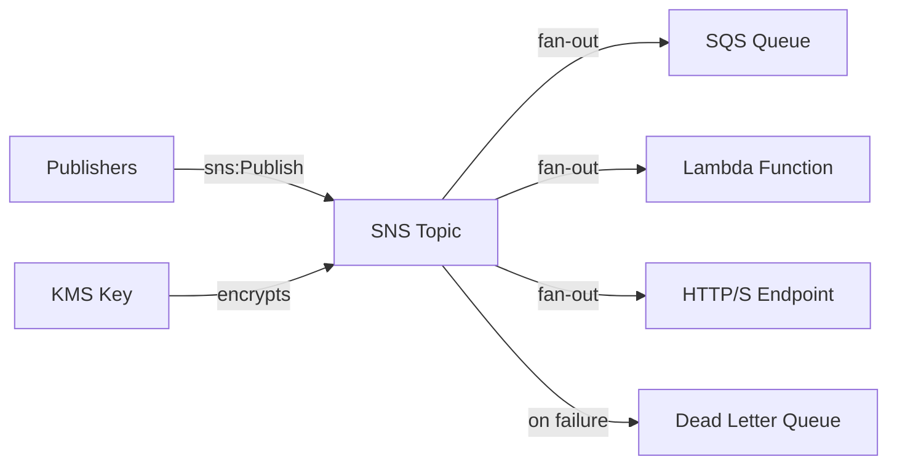

# @sevenpico/cdk-construct-sns

Provisions an SNS topic with optional subscriptions, dead-letter queue, encryption, and access policies. Creates standard or FIFO topics with fan-out to SQS, Lambda, HTTP/S, email, and SMS endpoints.

## Diagram

## Event Fan-Out with SNS

Use this construct when you need to broadcast events to multiple subscribers. SNS topics decouple publishers from consumers, enabling fan-out patterns where a single event triggers processing in multiple downstream services simultaneously.

How the deployed resources work:

1. **SNS Topic** receives published messages and fans them out to all active subscriptions.
2. **Subscriptions** deliver messages to SQS queues, Lambda functions, HTTP/S endpoints, email addresses, or SMS numbers.
3. **Dead Letter Queue** (optional) captures messages that fail delivery after retries.

Pass the `context` prop to get deterministic topic naming (e.g., `7p-prod-alerts`) and consistent tagging.

## Deployed Resources

- **AWS::SNS::Topic** - SNS topic (standard or FIFO) with optional KMS encryption.
- **AWS::SNS::Subscription** - One per subscriber configuration.
- **AWS::SQS::Queue** - Optional dead-letter queue for failed deliveries.

## Usage

See the [examples](./examples) directory for complete usage examples.

- [Complete Example](./examples/complete)

## Inputs

| Name | Description | Type | Default | Required |
|------|-------------|------|---------|:--------:|
| `context` | SevenPico context for naming and tagging | `Context` | — | ✓ |
| `encryptionEnabled` | Enable KMS encryption | `boolean` | `true` | |
| `kmsMasterKeyId` | KMS key ID or alias for SNS encryption | `string` | `alias/aws/sns` | |
| `fifoTopic` | Create FIFO topic | `boolean` | `false` | |
| `contentBasedDeduplication` | Content-based dedup (FIFO) | `boolean` | `false` | |
| `subscribers` | Map of subscriber name to config | `Record<string, SnsSubscriber>` | `{}` | |
| `allowedAwsServicesForPublish` | Service principals allowed to publish | `string[]` | `[]` | |
| `allowedIamArnsForPublish` | IAM ARNs allowed to publish | `string[]` | `[]` | |
| `snsTopicPolicyJson` | Custom topic policy JSON | `string` | — | |
| `sqsDlqEnabled` | Enable SQS dead-letter queue | `boolean` | `false` | |
| `sqsDlqMaxMessageSizeBytes` | DLQ max message size in bytes | `number` | `262144` | |
| `sqsDlqMessageRetentionSeconds` | DLQ message retention seconds | `number` | `1209600` | |
| `sqsDlqFifo` | Create FIFO DLQ | `boolean` | `false` | |
| `sqsQueueKmsMasterKeyId` | KMS key ID for DLQ | `string` | — | |
| `sqsQueueKmsDataKeyReusePeriodSeconds` | KMS data key reuse period for DLQ | `number` | `300` | |
| `deliveryPolicy` | Custom SNS delivery retry policy JSON | `string` | — | |
| `redrivePolicy` | Custom redrive policy JSON | `string` | — | |
| `redriveMaxReceiverCount` | Max receive count for redrive policy | `number` | `5` | |

## Outputs

| Name | Description | Type |
|------|-------------|------|
| `topic` | The SNS topic | `sns.Topic \| undefined` |
| `deadLetterQueue` | The dead-letter queue | `sqs.Queue \| undefined` |

## Special Considerations

- FIFO topics automatically append `.fifo` to the topic name.
- When `context.enabled` is `false`, no resources are created and all output properties are `undefined`.
- Subscriptions to SQS and Lambda endpoints require valid ARNs that exist in the same account/region.

## Roadmap

### v0.1.0

- [x] Initial implementation
- [x] BDD test coverage
- [x] Context-based naming and tagging

### v0.2.0

- [ ] Filter policy support for subscriptions
- [ ] Cross-account subscription support

## License

Apache 2.0 — see [LICENSE](../../LICENSE).
