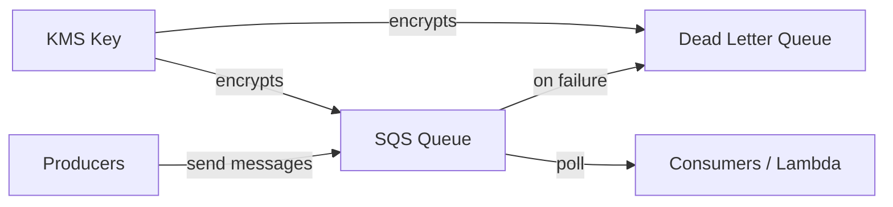

# @sevenpico/cdk-construct-sqs-queue

Provisions an SQS queue with optional dead-letter queue, encryption, and access policies. Creates standard or FIFO queues with configurable visibility timeout, retention, and delivery settings.

## Diagram

## Message Queue with Dead Letter Queue

Use this construct when you need a reliable message queue for decoupling producers and consumers. The optional dead-letter queue captures messages that fail processing after a configurable number of retries, preventing message loss and enabling error investigation.

How the deployed resources work:

1. **SQS Queue** receives messages from producers with configurable visibility timeout, retention period, and delivery delay.
2. **Dead Letter Queue** (optional) captures messages that exceed the max receive count, enabling retry analysis and error handling.
3. **KMS Encryption** (optional) encrypts messages at rest using either SQS-managed SSE or a customer-managed KMS key.

Pass the `context` prop to get deterministic queue naming (e.g., `7p-prod-orders`) and the DLQ name is derived automatically (e.g., `7p-prod-orders-dlq`).

## Deployed Resources

- **AWS::SQS::Queue** - Main SQS queue (standard or FIFO) with configurable settings.
- **AWS::SQS::Queue** - Optional dead-letter queue for failed message processing.

## Usage

See the [examples](./examples) directory for complete usage examples.

- [Complete Example](./examples/complete)

## Inputs

| Name | Description | Type | Default | Required |
|------|-------------|------|---------|:--------:|
| `context` | SevenPico context for naming and tagging | `Context` | — | ✓ |
| `visibilityTimeoutSeconds` | Visibility timeout in seconds | `number` | `30` | |
| `messageRetentionSeconds` | Message retention in seconds | `number` | `345600` | |
| `maxMessageSizeBytes` | Max message size in bytes | `number` | `262144` | |
| `delaySeconds` | Delivery delay in seconds | `number` | `0` | |
| `receiveWaitTimeSeconds` | Long-polling wait time in seconds | `number` | `0` | |
| `fifo` | Create a FIFO queue | `boolean` | `false` | |
| `contentBasedDeduplication` | Enable content-based deduplication (FIFO) | `boolean` | `false` | |
| `kmsMasterKeyId` | KMS key ID for encryption | `string` | — | |
| `sqsManagedSseEnabled` | Enable SQS-managed SSE | `boolean` | `true` | |
| `dlqEnabled` | Enable dead-letter queue | `boolean` | `false` | |
| `dlqNameSuffix` | DLQ name suffix | `string` | `dlq` | |
| `dlqMaxReceiveCount` | Max receive count before DLQ | `number` | `5` | |
| `dlqKmsMasterKeyId` | KMS key ID for DLQ | `string` | — | |
| `iamPolicyStatements` | Additional IAM policy statements | `SqsIamPolicyStatement[]` | `[]` | |

## Outputs

| Name | Description | Type |
|------|-------------|------|
| `queue` | The main SQS queue | `sqs.Queue \| undefined` |
| `deadLetterQueue` | The dead-letter queue | `sqs.Queue \| undefined` |

## Special Considerations

- FIFO queues automatically append `.fifo` to the queue name.
- The DLQ name is derived from the main queue's context ID with the suffix appended (e.g., `7p-prod-orders-dlq`).
- When `context.enabled` is `false`, no resources are created and both `queue` and `deadLetterQueue` are `undefined`.

## Roadmap

### v0.1.0

- [x] Initial implementation
- [x] BDD test coverage
- [x] Context-based naming and tagging

### v0.2.0

- [ ] SNS subscription integration
- [ ] Lambda event source mapping helper

## License

Apache 2.0 — see [LICENSE](../../LICENSE).
