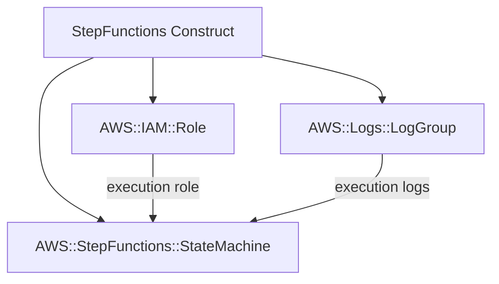

# @sevenpico/cdk-construct-step-functions

Provisions an AWS Step Functions state machine with a dedicated IAM execution role, optional CloudWatch logging, and optional X-Ray tracing. Creates all supporting resources (log group, IAM role with configurable trust policy) using SevenPico's context system for consistent naming and tagging.

## Diagram

## Orchestrating Serverless Workflows

Use this construct when you need to orchestrate multi-step serverless workflows with AWS Step Functions. It encapsulates the common pattern of creating a state machine alongside its execution role and logging infrastructure, ensuring all resources follow SevenPico naming and tagging conventions.

How the deployed resources work:

1. **IAM Role** is created with a trust policy allowing Step Functions to assume it, along with any additional managed or inline policies you specify.
2. **CloudWatch Log Group** captures execution logs from the state machine, with configurable retention and optional KMS encryption.
3. **Step Functions State Machine** executes your Amazon States Language definition, using the IAM role for permissions and the log group for observability.

Instantiate the construct with your state machine definition (Amazon States Language JSON object), a role description, and your SevenPico context. Override defaults for machine type (STANDARD/EXPRESS), logging level, tracing, and IAM configuration as needed.

## Deployed Resources

- **AWS::IAM::Role** - Execution role for the state machine with configurable trust policy, managed policies, and inline policies.
- **AWS::Logs::LogGroup** - CloudWatch log group for state machine execution logs (skipped if an existing log group ARN is provided).
- **AWS::StepFunctions::StateMachine** - The Step Functions state machine running your workflow definition.

## Usage

See the [examples](./examples) directory for complete usage examples.

- [Complete Example](./examples/complete)

## Inputs

| Name | Description | Type | Default | Required |
|------|-------------|------|---------|:--------:|
| `context` | SevenPico context for naming and tagging | `Context` | — | yes |
| `definition` | Amazon States Language definition object | `object` | — | yes |
| `roleDescription` | Description of the IAM execution role | `string` | — | yes |
| `type` | State machine type: 'STANDARD' or 'EXPRESS' | `string` | `'STANDARD'` | |
| `stateMachineName` | State machine name override | `string` | `contextId(ctx)` | |
| `tracingEnabled` | Enable X-Ray tracing | `boolean` | `false` | |
| `loggingConfiguration` | Logging configuration object | `StepFunctionsLoggingConfig` | — | |
| `existingLogGroupArn` | Use an existing CloudWatch log group ARN instead of creating one | `string` | — | |
| `logGroupName` | Log group name override | `string` | `/aws/states/{contextId}` | |
| `logGroupRetentionDays` | Log group retention in days | `number` | `90` | |
| `cloudwatchLogsKmsKeyArn` | KMS key ARN for log encryption | `string` | — | |
| `policyDocuments` | Additional IAM policy document JSON strings | `string[]` | — | |
| `managedPolicyArns` | Managed policy ARNs to attach to execution role | `string[]` | — | |
| `principals` | Principals allowed to assume the execution role | `Record<string, string[]>` | `{ Service: ['states.amazonaws.com'] }` | |
| `maxSessionDuration` | Max session duration in seconds | `number` | `3600` | |
| `permissionsBoundary` | Permissions boundary ARN | `string` | — | |
| `path` | IAM path | `string` | `'/'` | |
| `useFullname` | If true, use full context ID for role name | `boolean` | `true` | |

## Outputs

| Name | Description | Type |
|------|-------------|------|
| `stateMachine` | The Step Functions state machine | `sfn.StateMachine \| undefined` |
| `role` | The IAM execution role | `iam.Role \| undefined` |
| `logGroup` | CloudWatch log group (if created, not existing) | `logs.LogGroup \| undefined` |

## Special Considerations

- When `existingLogGroupArn` is provided, no new log group is created — the construct uses the existing one for logging configuration. The `logGroup` output will be `undefined` in this case.
- The execution role's trust policy is overridden via the CfnRole L1 escape hatch to support the `principals` prop. By default it trusts `states.amazonaws.com`.
- Log group retention uses a numeric cast to `logs.RetentionDays` enum — ensure the value matches a valid CDK retention period (e.g., 1, 3, 5, 7, 14, 30, 60, 90, 120, 150, 180, 365, 400, 545, 731, 1096, 1827, 2192, 2557, 2922, 3288, 3653).
- When context is disabled (`enabled: false`), all public properties are `undefined` and no resources are created.

## Roadmap

### v0.1.0

- [x] Initial implementation
- [x] BDD test coverage
- [x] Context-based naming and tagging

### v0.2.0

- [ ] Support for CDK Graph/Chain definition builders
- [ ] CloudWatch Alarms for failed executions

## License

Apache 2.0 — see [LICENSE](../../LICENSE).
