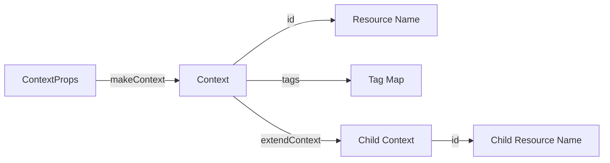

# @sevenpico/cdk-context

Provides a deterministic naming and tagging system for all SevenPico CDK constructs. Computes a normalized resource `id` and `tags` map from a set of label values (namespace, environment, stage, name, etc.) using the same algorithm as `terraform-null-context`.

## Diagram



## Context Chaining

The context system gives every SevenPico CDK construct a consistent, predictable name and set of tags derived from a small set of label values. A parent construct creates a `Context` and passes it to child constructs. Child constructs call `extendContext` to append attributes and derive a scoped name without repeating label values.

How the system works:

1. `makeContext(props)` normalizes labels, strips invalid characters, applies case transformations, and computes the resource `id` and `tags`.
2. `contextId(ctx)` returns the computed resource name (e.g. `7p-prod-api-queue`).
3. `contextTags(ctx)` returns a flat map of tags to apply to every AWS resource.
4. `extendContext(base, overrides)` merges overrides into the base context, appending `attributes` and re-computing `id` and `tags`.
5. `isEnabled(ctx)` returns `false` when `enabled: false` was set anywhere in the context chain, allowing constructs to suppress all resource creation without removing the call site.

Child resource name example:

```typescript
// Parent context id: '7p-prod-slackbot'
const dlqCtx = extendContext(props.context, { attributes: ['dlq'] });
// dlqCtx.id: '7p-prod-slackbot-dlq'
```

## Deployed Resources

This package contains no AWS resources. It is a pure TypeScript library with no CDK or AWS dependencies at runtime.

## Usage

See the [examples](./examples) directory for complete usage examples.

```typescript
import { makeContext, extendContext, contextId, contextTags, isEnabled } from '@sevenpico/cdk-context';

const ctx = makeContext({
  namespace: '7p',
  environment: 'prod',
  stage: 'api',
  name: 'queue',
});

console.log(ctx.id);            // '7p-prod-api-queue'
console.log(ctx.tags);          // { Namespace: '7p', Environment: 'prod', Stage: 'api', Name: '7p-prod-api-queue' }
console.log(isEnabled(ctx));    // true

const dlqCtx = extendContext(ctx, { attributes: ['dlq'] });
console.log(dlqCtx.id);         // '7p-prod-api-queue-dlq'
```

## Inputs

| Name | Description | Type | Default | Required |
|------|-------------|------|---------|:--------:|
| `namespace` | Organisation abbreviation, e.g. `'7p'` | `string` | `''` | |
| `tenant` | Customer identifier | `string` | `''` | |
| `environment` | Region or role, e.g. `'prod'`, `'uw2'` | `string` | `''` | |
| `stage` | Lifecycle stage, e.g. `'api'`, `'data'` | `string` | `''` | |
| `name` | Component name, e.g. `'queue'`, `'db'` | `string` | `''` | |
| `region` | AWS region identifier | `string` | `''` | |
| `project` | Project identifier | `string` | `''` | |
| `enabled` | When `false`, constructs skip all resource creation | `boolean` | `true` | |
| `delimiter` | Separator used when joining label values | `string` | `'-'` | |
| `attributes` | Additional suffixes appended to the end of the ID | `string[]` | `[]` | |
| `labelOrder` | Order in which labels are joined to form the ID | `string[]` | `['namespace', 'environment', 'stage', 'name', 'attributes']` | |
| `labelKeyCase` | Case applied to tag keys: `lower`, `title`, `upper` | `string` | `'title'` | |
| `labelValueCase` | Case applied to label values: `lower`, `upper`, `title`, `none` | `string` | `'lower'` | |
| `regexReplaceChars` | Regex of characters to strip from label values | `string` | `'[^-a-zA-Z0-9]'` | |
| `idLengthLimit` | Max ID length; `0` = unlimited. Exceeding appends MD5 suffix. | `number` | `0` | |
| `tags` | Additional tags passed through unchanged (override computed tags) | `Record<string, string>` | `{}` | |
| `additionalTagMap` | Extra key-value pairs added to all tags | `Record<string, string>` | `{}` | |
| `labelsAsTags` | Which labels are included as tags | `string[]` | `['namespace', 'environment', 'stage', 'name', 'tenant', 'attributes']` | |
| `descriptorFormats` | Custom descriptor format strings | `Record<string, string>` | `{}` | |
| `domainName` | Route53 zone domain name | `string` | `''` | |
| `dnsNameFormat` | DNS name format template | `string` | `'${name}.${domainName}'` | |

## Outputs (Context fields)

| Name | Description | Type |
|------|-------------|------|
| `id` | Computed resource name (after length limit) | `string` |
| `idFull` | Full computed ID before length limit is applied | `string` |
| `tags` | Merged tag map ready to apply to AWS resources | `Record<string, string>` |
| *(all inputs)* | Normalized values with defaults applied | *(see inputs)* |

## Special Considerations

- **`enabled` is sticky**: once set to `false` in a context chain, `extendContext` cannot re-enable it. This mirrors Terraform's `count = 0` semantics.
- **MD5 truncation**: when `idLengthLimit > 0` and the full ID exceeds the limit, the ID is truncated and a 5-character MD5 hex suffix is appended (format: `<truncated>-<hash>`). The suffix ensures uniqueness even when different long names share the same prefix.
- **JSII consumers**: use the `ContextFns` static class (`ContextFns.make`, `ContextFns.extend`, `ContextFns.id`, `ContextFns.tags`, `ContextFns.isEnabled`) when consuming this package from Python, Java, or .NET via JSII.

## Roadmap

### v0.1.0

- [x] Initial implementation
- [x] BDD test coverage
- [x] Full `terraform-null-context` label and tag parity

### v0.2.0

- [ ] `descriptorFormats` evaluation
- [ ] DNS name computation via `domainName` / `dnsNameFormat`

## License

Apache 2.0 — see [LICENSE](../../LICENSE).
