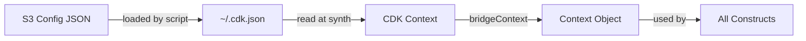

# @sevenpico/cdk-bridge

> **Agent Context**: Before implementing this spec, read [`spec/AGENT-CONTEXT.md`](./AGENT-CONTEXT.md) for the full project context, functional architecture pattern, JSII constraints, and README generation requirements.

## Dependencies
- `@sevenpico/cdk-context` — **must be implemented first**
- `constructs` ^10.0.0 (peer)

## Package
`@sevenpico/cdk-bridge`
Directory: `packages/cdk-bridge`

## Purpose
Reads per-environment-region platform configuration from the CDK Context and produces a `Context` object from `@sevenpico/cdk-context`. This is the integration point between SevenPico's Terraform platform outputs and CDK constructs.

---

## How It Works

1. A script (outside this package) loads a JSON config file per environment+region from S3 into `~/.cdk.json`
2. CDK reads `~/.cdk.json` at synth time and makes values available via `scope.node.tryGetContext(key)`
3. `bridgeContext(scope)` reads the context key `'sevenpico'`, validates it, and calls `makeContext()` from `@sevenpico/cdk-context`

---

## CDK Context Key

The bridge reads from the single CDK context key `'sevenpico'`. The full config object is stored under this key.

Example `~/.cdk.json`:
```json
{
  "context": {
    "sevenpico": {
      "namespace": "7p",
      "environment": "prod",
      "stage": "api",
      "region": "us-east-1",
      "tags": {
        "CostCenter": "platform"
      },
      "vpcId": "vpc-abc123",
      "accountId": "123456789012"
    }
  }
}
```

---

## BridgeConfig Interface (JSII-exported)

```typescript
export interface BridgeConfig {
  // Required core labels
  readonly namespace: string;
  readonly environment: string;
  readonly stage: string;

  // Optional core labels
  readonly tenant?: string;
  readonly region?: string;
  readonly project?: string;

  // Optional context overrides
  readonly delimiter?: string;
  readonly labelOrder?: string[];
  readonly labelKeyCase?: string;
  readonly labelValueCase?: string;
  readonly idLengthLimit?: number;
  readonly tags?: Record<string, string>;
  readonly additionalTagMap?: Record<string, string>;
  readonly labelsAsTags?: string[];

  // Platform outputs from Terraform (arbitrary additional keys)
  // Accessed via bridgeValue(scope, key)
  readonly [key: string]: unknown;
}
```

---

## Pure Functions

```typescript
// src/bridge-fns.ts

import { Construct } from 'constructs';
import { makeContext, Context, ContextProps } from '@sevenpico/cdk-context';

const CONTEXT_KEY = 'sevenpico';

/** Read the raw bridge config from CDK context. Throws if not found. */
export const readBridgeConfig = (scope: Construct): BridgeConfig => {
  const config = scope.node.tryGetContext(CONTEXT_KEY);
  if (!config || typeof config !== 'object') {
    throw new Error(
      `SevenPico CDK Bridge: context key '${CONTEXT_KEY}' not found or invalid. ` +
      `Run the bridge setup script to load the environment config into ~/.cdk.json.`
    );
  }
  return config as BridgeConfig;
};

/** Map BridgeConfig fields to ContextProps. */
export const bridgeConfigToContextProps = (config: BridgeConfig): ContextProps => ({
  namespace:        config.namespace,
  tenant:           config.tenant,
  environment:      config.environment,
  stage:            config.stage,
  region:           config.region,
  project:          config.project,
  delimiter:        config.delimiter,
  labelOrder:       config.labelOrder,
  labelKeyCase:     config.labelKeyCase,
  labelValueCase:   config.labelValueCase,
  idLengthLimit:    config.idLengthLimit,
  tags:             config.tags,
  additionalTagMap: config.additionalTagMap,
  labelsAsTags:     config.labelsAsTags,
});

/** Read bridge config and return a fully computed Context. */
export const bridgeContext = (scope: Construct): Context =>
  makeContext(bridgeConfigToContextProps(readBridgeConfig(scope)));

/** Read an arbitrary platform output value from the bridge config. */
export const bridgeValue = (scope: Construct, key: string): unknown =>
  readBridgeConfig(scope)[key];

/** Read an arbitrary platform output value as a string. Throws if missing or not a string. */
export const bridgeString = (scope: Construct, key: string): string => {
  const value = bridgeValue(scope, key);
  if (typeof value !== 'string') {
    throw new Error(`SevenPico CDK Bridge: key '${key}' is not a string (got ${typeof value})`);
  }
  return value;
};
```

---

## JSII Export (thin class wrapper)

```typescript
// src/index.ts

export { BridgeConfig } from './bridge-types';

export class CdkBridge {
  /** Read the bridge config and return a fully computed Context. */
  public static context(scope: Construct): Context {
    return bridgeContext(scope);
  }

  /** Read an arbitrary platform output value from the bridge config. */
  public static value(scope: Construct, key: string): unknown {
    return bridgeValue(scope, key);
  }

  /** Read an arbitrary platform output value as a string. */
  public static string(scope: Construct, key: string): string {
    return bridgeString(scope, key);
  }

  /** Read the raw bridge config object. */
  public static config(scope: Construct): BridgeConfig {
    return readBridgeConfig(scope);
  }
}

// TypeScript convenience exports
export { bridgeContext, bridgeValue, bridgeString, readBridgeConfig, bridgeConfigToContextProps } from './bridge-fns';
```

---

## File Structure

```
packages/cdk-bridge/
├── src/
│   ├── index.ts         # Exports BridgeConfig, CdkBridge class + standalone fns
│   ├── bridge-types.ts  # BridgeConfig interface
│   └── bridge-fns.ts    # Pure functions
└── test/
    └── bridge-fns.test.ts
```

---

## BDD Tests

### Feature: Context Loading

**Scenario: bridgeContext returns a valid Context from CDK context**
- **Given** a CDK `App` with context key `'sevenpico'` set to `{ namespace: '7p', stage: 'prod', name: 'app' }`
- **When** `bridgeContext(scope)` is called
- **Then** the returned `Context` has `id: '7p-prod-app'`

**Scenario: bridgeContext throws when sevenpico context is missing**
- **Given** a CDK `App` with no `'sevenpico'` context key
- **When** `bridgeContext(scope)` is called
- **Then** an error is thrown with a message indicating the missing key

**Scenario: bridgeContext returns disabled context when enabled is false**
- **Given** CDK context `{ namespace: '7p', name: 'app', enabled: false }`
- **When** `bridgeContext(scope)` is called
- **Then** `isEnabled(ctx)` returns `false`

### Feature: Context Extension

**Scenario: bridgeContext can be extended with extendContext**
- **Given** `bridgeContext(scope)` returns a context with `id: '7p-prod-app'`
- **When** `extendContext(ctx, { attributes: ['api'] })` is called
- **Then** the resulting context has `id: '7p-prod-app-api'`

### Feature: Value Reading

**Scenario: bridgeString returns string value from context**
- **Given** CDK context contains `{ namespace: '7p', customKey: 'value' }`
- **When** `bridgeString(scope, 'customKey')` is called
- **Then** the result is `'value'`

**Scenario: bridgeString returns default when key is absent**
- **Given** CDK context does not contain `'missingKey'`
- **When** `bridgeString(scope, 'missingKey', 'fallback')` is called
- **Then** the result is `'fallback'`

## README

Generate a `README.md` following the template in [`spec/AGENT-CONTEXT.md`](./AGENT-CONTEXT.md#readme-generation-requirement).

The Mermaid diagram should show the data flow:


