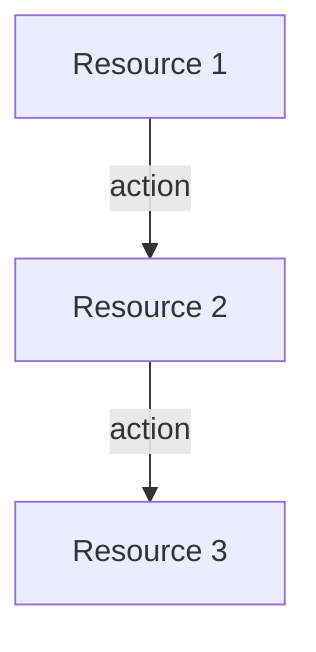

# Agent Context: SevenPico CDK Construct Library

**Read this file before implementing any spec in this directory.**

---

## What You Are Building

You are implementing a **CDK construct library** that replicates the functionality of SevenPico's public Terraform modules. Each spec file in this directory describes one CDK construct (one npm package) that is a TypeScript/CDK port of a corresponding Terraform module.

The end goal is that infrastructure engineers can use these CDK constructs to provision the same AWS resources — with the same names, tags, and conventions — that SevenPico's Terraform modules produce.

---

## Why SevenPico Uses a Context System

All SevenPico Terraform modules consume a `context` object from [`terraform-null-context`](https://github.com/SevenPico/terraform-null-context). This module implements a **deterministic naming and tagging system**:

- **Resource naming**: A resource `id` is computed by joining normalized label values (namespace, environment, stage, name, attributes) with a delimiter. Example: `7p-prod-api-queue`.
- **Tagging**: Tags are automatically derived from the same labels and applied consistently to every resource.
- **Context chaining**: Child modules receive the parent's context and can extend it (e.g., adding `attributes: ['dlq']` to derive a child name like `7p-prod-api-queue-dlq`).
- **Enabled flag**: Modules declare `enabled = false` to suppress all resource creation without removing the module call. This enables environment-agnostic infrastructure code.

Your CDK constructs must replicate this system exactly, using `@sevenpico/cdk-context` (the CDK port of `terraform-null-context`). **All constructs accept a `context: Context` prop and use it for naming, tagging, and the enabled check.**

---

## Repository Structure

```
packages/
  cdk-context/           # @sevenpico/cdk-context — the naming/tagging system (no AWS deps)
  cdk-bridge/            # @sevenpico/cdk-bridge — loads context from CDK context JSON
  cdk-construct-kms-key/ # @sevenpico/cdk-construct-kms-key
  cdk-construct-s3-bucket/
  ... (one package per construct)
spec/
  00-foundation.md       # Monorepo setup, tooling, conventions
  01-cdk-context.md      # Context system — READ THIS
  02-cdk-bridge.md       # CDK Bridge package
  AGENT-CONTEXT.md       # This file
  construct-*.md         # One spec per construct
```

**Read `spec/01-cdk-context.md` before implementing any construct.** It defines the `Context` type, `contextId()`, `contextTags()`, `isEnabled()`, and `extendContext()` that every construct uses.

---

## The Functional Architecture Pattern

Every construct package follows this strict split:

### 1. Pure Functions (`src/{name}-fns.ts`)

Contains all logic. Takes plain data, returns plain data. No side effects. No `new` calls (except for value-type CDK objects like `Duration`, `PolicyDocument`). Fully unit-testable without stacks or synthesizers.

```typescript
// Pure function — takes context + props, returns CDK prop objects
export const sqsQueueProps = (ctx: Context, props: SqsQueueProps): sqs.QueueProps => ({
  queueName:          contextId(ctx),
  visibilityTimeout:  Duration.seconds(props.visibilityTimeoutSeconds ?? 30),
  retentionPeriod:    Duration.days(props.messageRetentionDays ?? 4),
  encryption:         props.kmsKeyArn
                        ? sqs.QueueEncryption.KMS
                        : sqs.QueueEncryption.KMS_MANAGED,
});
```

### 2. Thin Construct Edge (`src/{name}.ts`)

Contains the CDK `Construct` class. Calls the pure functions, creates AWS resources, applies tags. No logic here — only imperative CDK calls.

```typescript
export class SqsQueue extends Construct {
  public readonly queue?: sqs.Queue;

  constructor(scope: Construct, id: string, props: SqsQueueProps) {
    super(scope, id);
    if (!isEnabled(props.context)) return;           // Enabled check — always first

    this.queue = new sqs.Queue(this, 'Queue', sqsQueueProps(props.context, props));

    Object.entries(contextTags(props.context))       // Apply context tags to construct
      .forEach(([k, v]) => Tags.of(this).add(k, v));
  }
}
```

### 3. Types (`src/{name}-types.ts` or inline in `src/{name}.ts`)

Props interfaces exported for JSII. All properties `readonly`. No function types, no union types, no generics in the JSII surface.

---

## JSII Constraints (Critical)

This library is compiled with **JSII** for multi-language publishing. Violating these rules causes build failures:

| Rule | Detail |
|------|--------|
| No standalone exported functions | Wrap in static-method classes for the JSII surface |
| No function types in public interfaces | `props.handler: Function` ❌ |
| No TypeScript union types | `string \| number` ❌ in public interfaces |
| No TypeScript generics | `Array<T>` ❌ in public interfaces — use `string[]` |
| All interface properties `readonly` | Required |
| All public types exported from `index.ts` | Required |
| No `any` in public API surface | Use `object` or specific types |

**Exception**: Pure functions in `-fns.ts` files are internal implementation and can use any TypeScript feature freely.

---

## Context Usage in Every Construct

Every construct:

1. Accepts `readonly context: Context` as first prop
2. Calls `if (!isEnabled(props.context)) return;` as the very first line of the constructor body
3. Uses `contextId(props.context)` to name resources
4. Uses `contextTags(props.context)` to tag resources via `Tags.of(this).add(k, v)`
5. Uses `extendContext(props.context, { attributes: ['suffix'] })` to derive child resource names

Child resource name example:
```typescript
// Parent context id: '7p-prod-slackbot'
const topicCtx = extendContext(props.context, { attributes: ['notifications'] });
// topicCtx.id: '7p-prod-slackbot-notifications'
```

---

## Tags Are Imperative in CDK

**Important CDK difference from Terraform**: Tags are NOT passed as props to CDK constructs. They are applied imperatively after resource creation:

```typescript
// WRONG — does not exist in CDK
new sqs.Queue(this, 'Q', { tags: contextTags(ctx) });

// CORRECT — CDK tag application
const queue = new sqs.Queue(this, 'Q', sqsQueueProps(ctx, props));
Object.entries(contextTags(ctx)).forEach(([k, v]) => Tags.of(this).add(k, v));
```

`Tags.of(this)` applies tags to the construct scope, which propagates to all child resources.

---

## The Enabled Pattern

When `context.enabled = false`, the constructor returns immediately after the early-exit check. All `public readonly` properties on the construct remain `undefined`. Callers must handle `undefined` — this is by design and mirrors how Terraform's `count = 0` works.

```typescript
// All public properties are typed with '| undefined' for this reason
public readonly queue?: sqs.Queue;  // undefined when disabled
```

---

## BDD Tests

Every construct spec includes a `## BDD Tests` section with Features and Scenarios using Given/When/Then format. Tests must be implemented using **jest-cucumber** (or equivalent) with a reporter that clearly outputs Given/When/Then in test results.

Each test synthesizes a CDK stack and uses `Template.fromStack()` assertions:

```typescript
import { App, Stack } from 'aws-cdk-lib';
import { Template } from 'aws-cdk-lib/assertions';

const app = new App();
const stack = new Stack(app, 'TestStack');
new SqsQueue(stack, 'SUT', { context, slackChannels: {...} });
const template = Template.fromStack(stack);
template.hasResourceProperties('AWS::SQS::Queue', { QueueName: '7p-prod-queue' });
```

Pure function tests use plain Jest (no stack needed):

```typescript
import { sqsQueueProps } from '../src/sqs-queue-fns';
expect(sqsQueueProps(ctx, props).queueName).toBe('7p-prod-queue');
```

See `spec/00-foundation.md` for full test runner configuration.

---

## Porting a Terraform Module

When implementing a construct from a spec:

1. **Read the source Terraform module** linked at the top of the spec to understand what resources it creates, what variables it exposes, and what defaults it uses.
2. **Map Terraform resources → CDK constructs**: `aws_sqs_queue` → `sqs.Queue`, etc.
3. **Map Terraform variables → Props interface fields**: Terraform `variable "visibility_timeout_seconds"` → `readonly visibilityTimeoutSeconds?: number`.
4. **Map Terraform defaults → TypeScript defaults**: Use `prop ?? defaultValue` in pure functions.
5. **Use `contextId(ctx)` wherever Terraform uses `module.this.id`** for naming.
6. **Use `contextTags(ctx)` wherever Terraform uses `module.this.tags`** for tagging.

---

## Source Terraform Modules

All source modules are public:
- SevenPico org: `https://github.com/SevenPico/terraform-aws-{name}`
- SevenPicoforks org: `https://github.com/SevenPicoforks/terraform-aws-{name}`

The specific module for each construct is linked in the spec's `## Source Terraform Module` section.

---

## README Generation Requirement

Every construct package must include a `README.md`. The README is generated alongside the implementation and must follow this template exactly.

### README Template

````markdown
# {Package Name}

{One sentence explaining why you would use this construct.} {One sentence describing what AWS resources it provisions.}

## Diagram



## {Use Case Title}

{Long description of why you would use this construct.}

How the deployed resources work:

1. {Resource 1} {does X}
2. {Resource 2} {does Y}
3. {Resource 3} {does Z}

{Long description of how to use the construct.}

## Deployed Resources

- **{Resource Type}** - {Concise description of what the resource does.}
- **{Resource Type}** - {Concise description of what the resource does.}

## Usage

See the [examples](./examples) directory for complete usage examples.

- [Complete Example](./examples/complete)

## Inputs

| Name | Description | Type | Default | Required |
|------|-------------|------|---------|:--------:|
| `context` | SevenPico context for naming and tagging | `Context` | — | ✓ |
| `{propName}` | {Description} | `{type}` | `{default}` | {✓ / } |

## Outputs

| Name | Description | Type |
|------|-------------|------|
| `{propName}` | {Description} | `{type} \| undefined` |

## Special Considerations

{Explain any special dependencies, KMS key handling, cross-account use cases, etc.}

## Roadmap

### v0.1.0

- [x] Initial implementation
- [x] BDD test coverage
- [x] Context-based naming and tagging

### v0.2.0

- [ ] {Planned feature}

## License

Apache 2.0 — see [LICENSE](../../LICENSE).
````

### README Mermaid Diagram Guidelines

- Show the **primary AWS resources** created by the construct and how they relate.
- Show data-flow arrows (e.g., SNS → Lambda, S3 → CloudFront).
- For simple constructs with a single resource, a single-node diagram is acceptable.
- Use `flowchart TD` (top-down) for multi-resource constructs.
- Use `flowchart LR` (left-right) for pipeline-style constructs.
- Label arrows with the action/relationship (e.g., `-->|subscribes to|`, `-->|triggers|`).

---

## Tooling

- **Monorepo**: AWS PDK `MonorepoTsProject` (projen-based)
- **Package type**: `AwsCdkConstructLibrary` per construct
- **CDK version**: `2.100.0`
- **JSII version**: `~5.4.0`
- **Test runner**: Jest (via projen defaults) + jest-cucumber for BDD
- **Language**: TypeScript strict mode

See `spec/00-foundation.md` for the full `.projenrc.ts` and build commands.
