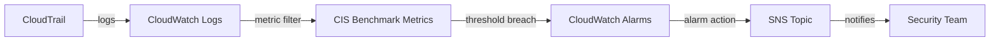

# @sevenpico/cdk-construct-cloudtrail-cloudwatch-alarms

> **Agent Context**: Before implementing this spec, read [`spec/AGENT-CONTEXT.md`](./AGENT-CONTEXT.md) for the full project context, functional architecture pattern, JSII constraints, and README generation requirements.

## Dependencies
- `@sevenpico/cdk-context` — **must be implemented first**
- `@sevenpico/cdk-construct-sns` — **must be implemented first**

## Package
`@sevenpico/cdk-construct-cloudtrail-cloudwatch-alarms`
Directory: `packages/cdk-construct-cloudtrail-cloudwatch-alarms`

## Source Terraform Module
https://github.com/SevenPico/terraform-aws-cloudtrail-cloudwatch-alarms

## Purpose
Creates a set of CloudWatch metric filters and alarms on a CloudTrail-connected CloudWatch Logs log group to alert on critical security events: root account usage, unauthorized API calls, MFA changes, CloudTrail configuration changes, console sign-in failures, IAM policy changes, VPC changes, and S3 bucket policy changes. Each alarm corresponds to a CIS Benchmark recommendation.

---

## CDK Imports
```typescript
import {
  aws_cloudwatch as cloudwatch,
  aws_cloudwatch_actions as cw_actions,
  aws_logs as logs,
  aws_sns as sns,
} from 'aws-cdk-lib';
```

## Props Interface (JSII-exported)

```typescript
import { Context } from '@sevenpico/cdk-context';

export interface CloudtrailCloudwatchAlarmsProps {
  readonly context: Context;

  /** Name of the CloudTrail CloudWatch Logs log group to watch. Required. */
  readonly logGroupName: string;

  /** ARN of the SNS topic that receives alarm notifications. Required. */
  readonly snsTopicArn: string;

  /**
   * CloudWatch metric namespace for all generated metrics.
   * Default: 'CISBenchmark'
   */
  readonly alarmNamespace?: string;

  /** Evaluation period in seconds for each alarm. Default: 300 */
  readonly alarmPeriodSeconds?: number;

  /** Number of evaluation periods before alarm triggers. Default: 1 */
  readonly alarmEvaluationPeriods?: number;

  /** Metric threshold that triggers the alarm. Default: 1 */
  readonly alarmThreshold?: number;

  /**
   * Subset of alarm IDs to enable. When omitted, all alarms are created.
   * Valid values:
   *   'unauthorized-api' | 'no-mfa-console' | 'root-usage' | 'iam-policy-changes' |
   *   'cloudtrail-changes' | 'console-failures' | 'kms-key-deletion' | 's3-bucket-policy' |
   *   'vpc-changes' | 'security-group-changes' | 'nacl-changes' |
   *   'network-gateway-changes' | 'route-table-changes' | 'organization-changes'
   */
  readonly enabledAlarms?: string[];
}
```

---

## Pure Functions (`src/cloudtrail-cloudwatch-alarms-fns.ts`)

```typescript
import {
  aws_cloudwatch as cloudwatch,
  aws_logs as logs,
  Duration,
} from 'aws-cdk-lib';
import { Context, contextId } from '@sevenpico/cdk-context';
import { CloudtrailCloudwatchAlarmsProps } from './cloudtrail-cloudwatch-alarms-types';

export interface AlarmDefinition {
  readonly id: string;
  readonly alarmName: string;
  readonly description: string;
  readonly filterPattern: string;
  readonly metricName: string;
}

export const alarmDefinitions = (): AlarmDefinition[] => [
  {
    id:            'unauthorized-api',
    alarmName:     'UnauthorizedApiCalls',
    description:   'Detects unauthorized API calls (AccessDenied / UnauthorizedOperation).',
    filterPattern: '{ ($.errorCode = "AccessDenied") || ($.errorCode = "UnauthorizedOperation") }',
    metricName:    'UnauthorizedApiCallCount',
  },
  {
    id:            'no-mfa-console',
    alarmName:     'NoMfaConsoleSignIn',
    description:   'Detects console sign-ins without MFA.',
    filterPattern: '{ ($.eventName = "ConsoleLogin") && ($.additionalEventData.MFAUsed != "Yes") }',
    metricName:    'NoMfaConsoleSignInCount',
  },
  {
    id:            'root-usage',
    alarmName:     'RootAccountUsage',
    description:   'Detects use of the root account.',
    filterPattern: '{ $.userIdentity.type = "Root" && $.userIdentity.invokedBy NOT EXISTS && $.eventType != "AwsServiceEvent" }',
    metricName:    'RootAccountUsageCount',
  },
  {
    id:            'iam-policy-changes',
    alarmName:     'IamPolicyChanges',
    description:   'Detects IAM policy create, update, or delete events.',
    filterPattern: '{ ($.eventName = DeleteGroupPolicy) || ($.eventName = DeleteRolePolicy) || ($.eventName = DeleteUserPolicy) || ($.eventName = PutGroupPolicy) || ($.eventName = PutRolePolicy) || ($.eventName = PutUserPolicy) || ($.eventName = CreatePolicy) || ($.eventName = DeletePolicy) || ($.eventName = CreatePolicyVersion) || ($.eventName = DeletePolicyVersion) || ($.eventName = SetDefaultPolicyVersion) || ($.eventName = AttachRolePolicy) || ($.eventName = DetachRolePolicy) || ($.eventName = AttachUserPolicy) || ($.eventName = DetachUserPolicy) || ($.eventName = AttachGroupPolicy) || ($.eventName = DetachGroupPolicy) }',
    metricName:    'IamPolicyChangeCount',
  },
  {
    id:            'cloudtrail-changes',
    alarmName:     'CloudTrailChanges',
    description:   'Detects CloudTrail configuration changes.',
    filterPattern: '{ ($.eventName = CreateTrail) || ($.eventName = UpdateTrail) || ($.eventName = DeleteTrail) || ($.eventName = StartLogging) || ($.eventName = StopLogging) }',
    metricName:    'CloudTrailChangeCount',
  },
  {
    id:            'console-failures',
    alarmName:     'ConsoleSignInFailures',
    description:   'Detects failed AWS Management Console sign-in attempts.',
    filterPattern: '{ ($.eventName = ConsoleLogin) && ($.errorMessage = "Failed authentication") }',
    metricName:    'ConsoleSignInFailureCount',
  },
  {
    id:            'kms-key-deletion',
    alarmName:     'KmsKeyDeletion',
    description:   'Detects KMS CMK disabling or scheduled deletion.',
    filterPattern: '{ ($.eventSource = kms.amazonaws.com) && (($.eventName = DisableKey) || ($.eventName = ScheduleKeyDeletion)) }',
    metricName:    'KmsKeyDeletionCount',
  },
  {
    id:            's3-bucket-policy',
    alarmName:     'S3BucketPolicyChanges',
    description:   'Detects S3 bucket policy changes.',
    filterPattern: '{ ($.eventSource = s3.amazonaws.com) && (($.eventName = PutBucketAcl) || ($.eventName = PutBucketPolicy) || ($.eventName = PutBucketCors) || ($.eventName = PutBucketLifecycle) || ($.eventName = PutBucketReplication) || ($.eventName = DeleteBucketPolicy) || ($.eventName = DeleteBucketCors) || ($.eventName = DeleteBucketLifecycle) || ($.eventName = DeleteBucketReplication)) }',
    metricName:    'S3BucketPolicyChangeCount',
  },
  {
    id:            'vpc-changes',
    alarmName:     'VpcChanges',
    description:   'Detects changes to VPC configuration.',
    filterPattern: '{ ($.eventName = CreateVpc) || ($.eventName = DeleteVpc) || ($.eventName = ModifyVpcAttribute) || ($.eventName = AcceptVpcPeeringConnection) || ($.eventName = CreateVpcPeeringConnection) || ($.eventName = DeleteVpcPeeringConnection) || ($.eventName = RejectVpcPeeringConnection) || ($.eventName = AttachClassicLinkVpc) || ($.eventName = DetachClassicLinkVpc) || ($.eventName = DisableVpcClassicLink) || ($.eventName = EnableVpcClassicLink) }',
    metricName:    'VpcChangeCount',
  },
  {
    id:            'security-group-changes',
    alarmName:     'SecurityGroupChanges',
    description:   'Detects security group create, update, or delete events.',
    filterPattern: '{ ($.eventName = AuthorizeSecurityGroupIngress) || ($.eventName = AuthorizeSecurityGroupEgress) || ($.eventName = RevokeSecurityGroupIngress) || ($.eventName = RevokeSecurityGroupEgress) || ($.eventName = CreateSecurityGroup) || ($.eventName = DeleteSecurityGroup) }',
    metricName:    'SecurityGroupChangeCount',
  },
  {
    id:            'nacl-changes',
    alarmName:     'NaclChanges',
    description:   'Detects network ACL create, update, or delete events.',
    filterPattern: '{ ($.eventName = CreateNetworkAcl) || ($.eventName = CreateNetworkAclEntry) || ($.eventName = DeleteNetworkAcl) || ($.eventName = DeleteNetworkAclEntry) || ($.eventName = ReplaceNetworkAclEntry) || ($.eventName = ReplaceNetworkAclAssociation) }',
    metricName:    'NaclChangeCount',
  },
  {
    id:            'network-gateway-changes',
    alarmName:     'NetworkGatewayChanges',
    description:   'Detects internet or customer gateway create or delete events.',
    filterPattern: '{ ($.eventName = CreateCustomerGateway) || ($.eventName = DeleteCustomerGateway) || ($.eventName = AttachInternetGateway) || ($.eventName = CreateInternetGateway) || ($.eventName = DeleteInternetGateway) || ($.eventName = DetachInternetGateway) }',
    metricName:    'NetworkGatewayChangeCount',
  },
  {
    id:            'route-table-changes',
    alarmName:     'RouteTableChanges',
    description:   'Detects route table create, update, or delete events.',
    filterPattern: '{ ($.eventName = CreateRoute) || ($.eventName = CreateRouteTable) || ($.eventName = ReplaceRoute) || ($.eventName = ReplaceRouteTableAssociation) || ($.eventName = DeleteRouteTable) || ($.eventName = DeleteRoute) || ($.eventName = DisassociateRouteTable) }',
    metricName:    'RouteTableChangeCount',
  },
  {
    id:            'organization-changes',
    alarmName:     'OrganizationChanges',
    description:   'Detects AWS Organizations configuration changes.',
    filterPattern: '{ ($.eventSource = organizations.amazonaws.com) && (($.eventName = AcceptHandshake) || ($.eventName = AttachPolicy) || ($.eventName = CreateAccount) || ($.eventName = CreateOrganizationalUnit) || ($.eventName = CreatePolicy) || ($.eventName = DeclineHandshake) || ($.eventName = DeleteOrganization) || ($.eventName = DeleteOrganizationalUnit) || ($.eventName = DeletePolicy) || ($.eventName = DetachPolicy) || ($.eventName = DisablePolicyType) || ($.eventName = EnablePolicyType) || ($.eventName = InviteAccountToOrganization) || ($.eventName = LeaveOrganization) || ($.eventName = MoveAccount) || ($.eventName = RemoveAccountFromOrganization) || ($.eventName = UpdateOrganizationalUnit) || ($.eventName = UpdatePolicy)) }',
    metricName:    'OrganizationChangeCount',
  },
];

export const metricFilterProps = (
  ctx: Context,
  logGroupName: string,
  def: AlarmDefinition,
  namespace: string,
): logs.MetricFilterProps => ({
  logGroup:     logs.LogGroup.fromLogGroupName(/* scope */ undefined as any, def.id, logGroupName),
  filterPattern: logs.FilterPattern.literal(def.filterPattern),
  metricNamespace: namespace,
  metricName:   def.metricName,
  metricValue:  '1',
  defaultValue: 0,
});

export const alarmProps = (
  ctx: Context,
  def: AlarmDefinition,
  metricNamespace: string,
  periodSeconds: number,
  evaluationPeriods: number,
  threshold: number,
): cloudwatch.AlarmProps => ({
  alarmName:         `${contextId(ctx)}-${def.alarmName}`,
  alarmDescription:  def.description,
  metric:            new cloudwatch.Metric({
    namespace:  metricNamespace,
    metricName: def.metricName,
    period:     Duration.seconds(periodSeconds),
    statistic:  'Sum',
  }),
  evaluationPeriods,
  threshold,
  comparisonOperator: cloudwatch.ComparisonOperator.GREATER_THAN_OR_EQUAL_TO_THRESHOLD,
  treatMissingData:   cloudwatch.TreatMissingData.NOT_BREACHING,
});
```

---

## Construct Class (`src/cloudtrail-cloudwatch-alarms.ts`)

```typescript
import { Construct } from 'constructs';
import { Tags } from 'aws-cdk-lib';
import {
  aws_cloudwatch as cloudwatch,
  aws_cloudwatch_actions as cw_actions,
  aws_logs as logs,
  aws_sns as sns,
} from 'aws-cdk-lib';
import { contextTags, isEnabled } from '@sevenpico/cdk-context';
import { CloudtrailCloudwatchAlarmsProps } from './cloudtrail-cloudwatch-alarms-types';
import {
  alarmDefinitions,
  alarmProps,
  AlarmDefinition,
} from './cloudtrail-cloudwatch-alarms-fns';

export class CloudtrailCloudwatchAlarms extends Construct {
  public readonly alarms?: cloudwatch.Alarm[];

  constructor(scope: Construct, id: string, props: CloudtrailCloudwatchAlarmsProps) {
    super(scope, id);
    if (!isEnabled(props.context)) return;

    const namespace       = props.alarmNamespace ?? 'CISBenchmark';
    const periodSeconds   = props.alarmPeriodSeconds ?? 300;
    const evalPeriods     = props.alarmEvaluationPeriods ?? 1;
    const threshold       = props.alarmThreshold ?? 1;
    const logGroup        = logs.LogGroup.fromLogGroupName(this, 'LogGroup', props.logGroupName);
    const snsTopic        = sns.Topic.fromTopicArn(this, 'AlarmTopic', props.snsTopicArn);
    const enabledSet      = props.enabledAlarms ? new Set(props.enabledAlarms) : null;

    const defs: AlarmDefinition[] = alarmDefinitions().filter(
      (def) => enabledSet === null || enabledSet.has(def.id),
    );

    this.alarms = defs.map((def) => {
      // Create metric filter on the log group
      new logs.MetricFilter(this, `Filter-${def.id}`, {
        logGroup,
        filterPattern:   logs.FilterPattern.literal(def.filterPattern),
        metricNamespace: namespace,
        metricName:      def.metricName,
        metricValue:     '1',
        defaultValue:    0,
      });

      // Create the CloudWatch alarm
      const alarm = new cloudwatch.Alarm(
        this,
        `Alarm-${def.id}`,
        alarmProps(props.context, def, namespace, periodSeconds, evalPeriods, threshold),
      );

      // Wire SNS action
      alarm.addAlarmAction(new cw_actions.SnsAction(snsTopic));

      return alarm;
    });

    Object.entries(contextTags(props.context)).forEach(([k, v]) =>
      Tags.of(this).add(k, v),
    );
  }
}
```

---

## Public Properties

| Property | Type | Description |
|----------|------|-------------|
| `alarms` | `cloudwatch.Alarm[] \| undefined` | All created CloudWatch alarms |

---

## Context Usage

| Context Field | Usage |
|---------------|-------|
| `context.id` | Prefix for each alarm name: `{contextId}-{AlarmName}` |
| `context.tags` | Applied to all resources |
| `context.enabled` | If false, no resources created |

---

## BDD Tests

### Feature: Alarm Creation

**Scenario: All alarms created by default when no enabledAlarms filter**
- **Given** no `enabledAlarms` prop
- **When** a `CloudtrailCloudwatchAlarms` construct is created
- **Then** 14 `AWS::CloudWatch::Alarm` resources exist in the stack
- **And** 14 `AWS::Logs::MetricFilter` resources exist in the stack

**Scenario: Only specified alarms created when enabledAlarms provided**
- **Given** `enabledAlarms: ['root-usage', 'unauthorized-api']`
- **When** a `CloudtrailCloudwatchAlarms` construct is created
- **Then** exactly 2 `AWS::CloudWatch::Alarm` resources exist in the stack
- **And** exactly 2 `AWS::Logs::MetricFilter` resources exist in the stack

### Feature: Alarm Actions

**Scenario: Each alarm has SNS action pointing to snsTopicArn**
- **Given** `snsTopicArn: 'arn:aws:sns:us-east-1:123456789012:security-alerts'`
- **When** a `CloudtrailCloudwatchAlarms` construct is created
- **Then** every `AWS::CloudWatch::Alarm` has an `AlarmActions` entry referencing that SNS ARN

### Feature: Namespace Default

**Scenario: Alarm namespace defaults to CISBenchmark**
- **Given** no `alarmNamespace` prop
- **When** a `CloudtrailCloudwatchAlarms` construct is created
- **Then** all metric filters have `MetricNamespace: 'CISBenchmark'`

### Feature: Filter Patterns

**Scenario: Root account usage alarm uses correct filter pattern**
- **Given** `enabledAlarms: ['root-usage']`
- **When** a `CloudtrailCloudwatchAlarms` construct is created
- **Then** the metric filter's `FilterPattern` includes `$.userIdentity.type = "Root"`

### Feature: Disabled Construct

**Scenario: No resources created when context is disabled**
- **Given** a context with `enabled: false`
- **When** a `CloudtrailCloudwatchAlarms` construct is created
- **Then** no `AWS::CloudWatch::Alarm` resources exist in the stack
- **And** no `AWS::Logs::MetricFilter` resources exist in the stack

## README

Generate a `README.md` following the template in [`spec/AGENT-CONTEXT.md`](./AGENT-CONTEXT.md#readme-generation-requirement).

The Mermaid diagram should show:


