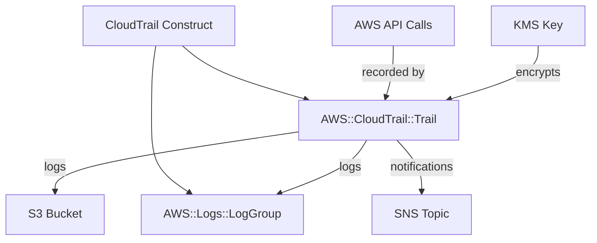

# @sevenpico/cdk-construct-cloudtrail

> **Agent Context**: Before implementing this spec, read [`spec/AGENT-CONTEXT.md`](./AGENT-CONTEXT.md) for the full project context, functional architecture pattern, JSII constraints, and README generation requirements.

## Dependencies
- `@sevenpico/cdk-context` — **must be implemented first**

## Package
`@sevenpico/cdk-construct-cloudtrail`
Directory: `packages/cdk-construct-cloudtrail`

## Source Terraform Module
https://github.com/SevenPico/terraform-aws-cloudtrail

## Purpose
Provisions an AWS CloudTrail trail that records API activity across an AWS account or organization. Stores audit logs in an S3 bucket, optionally sends events to CloudWatch Logs and SNS, supports KMS encryption, and configures event selectors for management and data events.

---

## CDK Imports
```typescript
import {
  aws_cloudtrail as cloudtrail,
  aws_s3 as s3,
  aws_logs as logs,
  aws_sns as sns,
  aws_kms as kms,
} from 'aws-cdk-lib';
```

## Props Interface (JSII-exported)

```typescript
import { Context } from '@sevenpico/cdk-context';

export interface CloudtrailDataEventSelector {
  /** AWS resource type. Example: 'AWS::S3::Object' | 'AWS::Lambda::Function' */
  readonly resourceType: string;
  /** List of resource ARNs to include. Use 'arn:aws:s3:::' for all S3 objects. */
  readonly resourceArns: string[];
}

export interface CloudtrailProps {
  readonly context: Context;

  /** S3 bucket name where trail logs are delivered. Required. */
  readonly s3BucketName: string;

  /** S3 key prefix for log files. Default: '' */
  readonly s3KeyPrefix?: string;

  /** Include events from global services such as IAM. Default: true */
  readonly includeGlobalServiceEvents?: boolean;

  /** Record events in all regions. Default: true */
  readonly isMultiRegionTrail?: boolean;

  /** Validate log file integrity using digest files. Default: true */
  readonly enableLogFileValidation?: boolean;

  /** Send trail events to a CloudWatch Logs log group. Default: false */
  readonly cloudWatchLogsEnabled?: boolean;

  /** CloudWatch Logs retention in days when log group is created. Default: 90 */
  readonly cloudWatchLogsRetentionDays?: number;

  /** SNS topic ARN for trail delivery notifications. */
  readonly snsTopicArn?: string;

  /** KMS key ARN used to encrypt log files. */
  readonly kmsKeyArn?: string;

  /** Enable CloudTrail Insights to detect unusual API activity. Default: false */
  readonly enableInsights?: boolean;

  /**
   * Management event selector.
   * 'ReadWrite' | 'Read' | 'Write' | 'None'. Default: 'ReadWrite'
   */
  readonly managementEvents?: string;

  /** Data event selectors for S3 objects or Lambda functions. */
  readonly dataEvents?: CloudtrailDataEventSelector[];
}
```

---

## Pure Functions (`src/cloudtrail-fns.ts`)

```typescript
import {
  aws_cloudtrail as cloudtrail,
  aws_s3 as s3,
  aws_logs as logs,
  aws_kms as kms,
  RemovalPolicy,
} from 'aws-cdk-lib';
import { Construct } from 'constructs';
import { Context, contextId } from '@sevenpico/cdk-context';
import { CloudtrailProps } from './cloudtrail-types';

export const trailName = (ctx: Context): string => contextId(ctx);

export const logGroupName = (ctx: Context): string =>
  `/aws/cloudtrail/${contextId(ctx)}`;

export const mapReadWriteType = (
  mode?: string,
): cloudtrail.ReadWriteType => {
  const map: Record<string, cloudtrail.ReadWriteType> = {
    ReadWrite: cloudtrail.ReadWriteType.ALL,
    Read:      cloudtrail.ReadWriteType.READ_ONLY,
    Write:     cloudtrail.ReadWriteType.WRITE_ONLY,
    None:      cloudtrail.ReadWriteType.NONE,
  };
  return map[mode ?? 'ReadWrite'] ?? cloudtrail.ReadWriteType.ALL;
};

export const logGroupProps = (
  ctx: Context,
  props: CloudtrailProps,
): logs.LogGroupProps => ({
  logGroupName:  logGroupName(ctx),
  retention:     (props.cloudWatchLogsRetentionDays ?? 90) as logs.RetentionDays,
  removalPolicy: RemovalPolicy.DESTROY,
});

export const cloudTrailProps = (
  scope: Construct,
  ctx: Context,
  props: CloudtrailProps,
  logGroup?: logs.LogGroup,
): cloudtrail.TrailProps => ({
  trailName:                 trailName(ctx),
  bucket:                    s3.Bucket.fromBucketName(scope, 'LogBucket', props.s3BucketName),
  s3KeyPrefix:               props.s3KeyPrefix ?? '',
  includeGlobalServiceEvents: props.includeGlobalServiceEvents ?? true,
  isMultiRegionTrail:        props.isMultiRegionTrail ?? true,
  enableFileValidation:      props.enableLogFileValidation ?? true,
  cloudWatchLogGroup:        logGroup,
  sendToCloudWatchLogs:      logGroup !== undefined,
  snsTopic:                  props.snsTopicArn
                               ? sns.Topic.fromTopicArn(scope, 'SnsTopic', props.snsTopicArn)
                               : undefined,
  encryptionKey:             props.kmsKeyArn
                               ? kms.Key.fromKeyArn(scope, 'KmsKey', props.kmsKeyArn)
                               : undefined,
  insightTypes:              props.enableInsights
                               ? [cloudtrail.InsightType.API_CALL_RATE, cloudtrail.InsightType.API_ERROR_RATE]
                               : undefined,
  managementEvents:          mapReadWriteType(props.managementEvents),
});
```

---

## Construct Class (`src/cloudtrail.ts`)

```typescript
import { Construct } from 'constructs';
import { Tags } from 'aws-cdk-lib';
import {
  aws_cloudtrail as cloudtrail,
  aws_logs as logs,
} from 'aws-cdk-lib';
import { contextTags, isEnabled } from '@sevenpico/cdk-context';
import { CloudtrailProps } from './cloudtrail-types';
import { cloudTrailProps, logGroupProps } from './cloudtrail-fns';

export class CloudTrail extends Construct {
  public readonly trail?: cloudtrail.Trail;
  public readonly logGroup?: logs.LogGroup;

  constructor(scope: Construct, id: string, props: CloudtrailProps) {
    super(scope, id);
    if (!isEnabled(props.context)) return;

    // Optionally create a CloudWatch Logs log group for trail events
    if (props.cloudWatchLogsEnabled) {
      this.logGroup = new logs.LogGroup(
        this,
        'LogGroup',
        logGroupProps(props.context, props),
      );
    }

    // Create the CloudTrail trail
    this.trail = new cloudtrail.Trail(
      this,
      'Trail',
      cloudTrailProps(this, props.context, props, this.logGroup),
    );

    // Add data event selectors
    (props.dataEvents ?? []).forEach((sel) => {
      this.trail!.addEventSelector(sel.resourceType as cloudtrail.DataResourceType, sel.resourceArns, {
        readWriteType: cloudtrail.ReadWriteType.ALL,
      });
    });

    Object.entries(contextTags(props.context)).forEach(([k, v]) =>
      Tags.of(this).add(k, v),
    );
  }
}
```

---

## Public Properties

| Property | Type | Description |
|----------|------|-------------|
| `trail` | `cloudtrail.Trail \| undefined` | The CloudTrail trail |
| `logGroup` | `logs.LogGroup \| undefined` | CloudWatch Logs log group (when `cloudWatchLogsEnabled`) |

---

## Context Usage

| Context Field | Usage |
|---------------|-------|
| `context.id` | Trail name and CloudWatch log group name |
| `context.tags` | Applied to all resources |
| `context.enabled` | If false, no resources created |

---

## BDD Tests

### Feature: Trail Naming

**Scenario: Trail created with context-based name**
- **Given** a context with namespace `7p`, stage `prod`, name `audit`
- **When** a `CloudTrail` construct is created
- **Then** an `AWS::CloudTrail::Trail` resource exists with `TrailName: '7p-prod-audit'`

### Feature: Trail Defaults

**Scenario: Multi-region trail enabled by default**
- **Given** no `isMultiRegionTrail` prop
- **When** a `CloudTrail` construct is created
- **Then** the trail has `IsMultiRegionTrail: true`

**Scenario: Log file validation enabled by default**
- **Given** no `enableLogFileValidation` prop
- **When** a `CloudTrail` construct is created
- **Then** the trail has `EnableLogFileValidation: true`

**Scenario: Global service events included by default**
- **Given** no `includeGlobalServiceEvents` prop
- **When** a `CloudTrail` construct is created
- **Then** the trail has `IncludeGlobalServiceEvents: true`

### Feature: CloudWatch Logs Integration

**Scenario: CloudWatch log group created when cloudWatchLogsEnabled is true**
- **Given** `cloudWatchLogsEnabled: true`
- **When** a `CloudTrail` construct is created
- **Then** an `AWS::Logs::LogGroup` resource exists
- **And** the trail's `CloudWatchLogsLogGroupArn` references that log group

**Scenario: No CloudWatch log group when cloudWatchLogsEnabled is false**
- **Given** no `cloudWatchLogsEnabled` prop (defaults to false)
- **When** a `CloudTrail` construct is created
- **Then** no `AWS::Logs::LogGroup` resources exist in the stack

### Feature: Data Event Selectors

**Scenario: Data event selector added when dataEvents provided**
- **Given** `dataEvents: [{ resourceType: 'AWS::S3::Object', resourceArns: ['arn:aws:s3:::'] }]`
- **When** a `CloudTrail` construct is created
- **Then** the trail has an `EventSelector` for S3 objects

### Feature: Disabled Construct

**Scenario: No resources created when context is disabled**
- **Given** a context with `enabled: false`
- **When** a `CloudTrail` construct is created
- **Then** no `AWS::CloudTrail::Trail` resources exist in the stack
- **And** no `AWS::Logs::LogGroup` resources exist in the stack

## README

Generate a `README.md` following the template in [`spec/AGENT-CONTEXT.md`](./AGENT-CONTEXT.md#readme-generation-requirement).

The Mermaid diagram should show:


