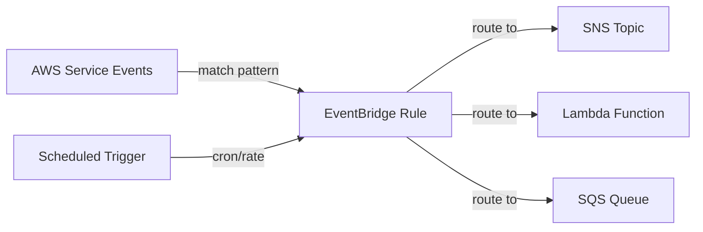

# @sevenpico/cdk-construct-cloudwatch-events

> **Agent Context**: Before implementing this spec, read [`spec/AGENT-CONTEXT.md`](./AGENT-CONTEXT.md) for the full project context, functional architecture pattern, JSII constraints, and README generation requirements.

## Dependencies
- `@sevenpico/cdk-context` — **must be implemented first**

## Package
`@sevenpico/cdk-construct-cloudwatch-events`
Directory: `packages/cdk-construct-cloudwatch-events`

## Source Terraform Module
https://github.com/SevenPico/terraform-aws-cloudwatch-events

## Purpose
Provisions CloudWatch (EventBridge) event rules that monitor AWS service events (CloudTrail-derived) and route them to targets such as SNS topics, Lambda functions, or SQS queues. Supports scheduled events (cron/rate expressions) and event pattern matching.

---

## CDK Imports
```typescript
import {
  aws_events as events,
  aws_events_targets as targets,
  aws_sns as sns,
  aws_lambda as lambda,
  aws_sqs as sqs,
} from 'aws-cdk-lib';
```

## Props Interface (JSII-exported)

```typescript
import { Context } from '@sevenpico/cdk-context';

export interface CloudwatchEventInputTransformer {
  /** Map of JSON path expressions to named variables used in the input template. */
  readonly inputPathsMap: Record<string, string>;
  /** Template string referencing the named variables from inputPathsMap. */
  readonly inputTemplate: string;
}

export interface CloudwatchEventTarget {
  /**
   * Target resource type.
   * 'sns' | 'lambda' | 'sqs'
   */
  readonly type: string;
  /** ARN of the target resource. */
  readonly arn: string;
  /** Optional input transformer to reshape the event payload before delivery. */
  readonly inputTransformer?: CloudwatchEventInputTransformer;
}

export interface CloudwatchEventRule {
  /**
   * Logical rule name appended to the context ID for the CloudFormation resource name.
   * Example: if context id is '7p-prod-monitor' and name is 'ec2-state', the rule
   * will be named '7p-prod-monitor-ec2-state'.
   */
  readonly name: string;
  /** Human-readable description for the event rule. */
  readonly description?: string;
  /**
   * Cron or rate schedule expression.
   * Example: 'rate(5 minutes)' or 'cron(0 12 * * ? *)'.
   * Mutually exclusive with eventPattern.
   */
  readonly schedule?: string;
  /**
   * EventBridge event pattern as a JSON string.
   * Example: '{"source":["aws.ec2"],"detail-type":["EC2 Instance State-change Notification"]}'
   * Mutually exclusive with schedule.
   */
  readonly eventPattern?: string;
  /** One or more targets to route matched events to. */
  readonly targets: CloudwatchEventTarget[];
}

export interface CloudwatchEventsProps {
  readonly context: Context;

  /** One or more event rules to create. Required. */
  readonly rules: CloudwatchEventRule[];
}
```

---

## Pure Functions (`src/cloudwatch-events-fns.ts`)

```typescript
import {
  aws_events as events,
  aws_events_targets as targets,
  aws_sns as sns,
  aws_lambda as lambda,
  aws_sqs as sqs,
} from 'aws-cdk-lib';
import { Construct } from 'constructs';
import { Context, contextId } from '@sevenpico/cdk-context';
import {
  CloudwatchEventRule,
  CloudwatchEventTarget,
} from './cloudwatch-events-types';

export const ruleName = (ctx: Context, rule: CloudwatchEventRule): string =>
  `${contextId(ctx)}-${rule.name}`;

export const ruleProps = (
  ctx: Context,
  rule: CloudwatchEventRule,
): events.RuleProps => {
  const props: events.RuleProps = {
    ruleName:    ruleName(ctx, rule),
    description: rule.description,
    enabled:     true,
  };

  if (rule.schedule) {
    return {
      ...props,
      schedule: events.Schedule.expression(rule.schedule),
    };
  }

  if (rule.eventPattern) {
    return {
      ...props,
      eventPattern: JSON.parse(rule.eventPattern) as events.EventPattern,
    };
  }

  return props;
};

export const buildTarget = (
  scope: Construct,
  targetId: string,
  targetCfg: CloudwatchEventTarget,
): events.IRuleTarget => {
  const inputTransformer = targetCfg.inputTransformer
    ? new events.InputTransformation(
        events.RuleTargetInput.fromObject(
          Object.fromEntries(
            Object.entries(targetCfg.inputTransformer.inputPathsMap).map(
              ([k, v]) => [k, events.EventField.fromPath(v)],
            ),
          ),
        ),
      )
    : undefined;

  switch (targetCfg.type) {
    case 'sns':
      return new targets.SnsTopic(
        sns.Topic.fromTopicArn(scope, `SnsTopic-${targetId}`, targetCfg.arn),
        inputTransformer ? { message: events.RuleTargetInput.fromText(targetCfg.inputTransformer!.inputTemplate) } : {},
      );
    case 'lambda':
      return new targets.LambdaFunction(
        lambda.Function.fromFunctionArn(scope, `LambdaFn-${targetId}`, targetCfg.arn),
        inputTransformer ? { event: events.RuleTargetInput.fromText(targetCfg.inputTransformer!.inputTemplate) } : {},
      );
    case 'sqs':
      return new targets.SqsQueue(
        sqs.Queue.fromQueueArn(scope, `SqsQueue-${targetId}`, targetCfg.arn),
        inputTransformer ? { message: events.RuleTargetInput.fromText(targetCfg.inputTransformer!.inputTemplate) } : {},
      );
    default:
      throw new Error(`Unsupported CloudwatchEventTarget type: ${targetCfg.type}`);
  }
};
```

---

## Construct Class (`src/cloudwatch-events.ts`)

```typescript
import { Construct } from 'constructs';
import { Tags } from 'aws-cdk-lib';
import { aws_events as events } from 'aws-cdk-lib';
import { contextTags, isEnabled } from '@sevenpico/cdk-context';
import { CloudwatchEventsProps } from './cloudwatch-events-types';
import { ruleProps, buildTarget } from './cloudwatch-events-fns';

export class CloudwatchEvents extends Construct {
  public readonly rules?: events.Rule[];

  constructor(scope: Construct, id: string, props: CloudwatchEventsProps) {
    super(scope, id);
    if (!isEnabled(props.context)) return;

    this.rules = props.rules.map((ruleCfg) => {
      const rule = new events.Rule(
        this,
        `Rule-${ruleCfg.name}`,
        ruleProps(props.context, ruleCfg),
      );

      ruleCfg.targets.forEach((targetCfg, index) => {
        const targetId = `${ruleCfg.name}-${index}`;
        rule.addTarget(buildTarget(this, targetId, targetCfg));
      });

      return rule;
    });

    Object.entries(contextTags(props.context)).forEach(([k, v]) =>
      Tags.of(this).add(k, v),
    );
  }
}
```

---

## Public Properties

| Property | Type | Description |
|----------|------|-------------|
| `rules` | `events.Rule[] \| undefined` | All created EventBridge rules |

---

## Context Usage

| Context Field | Usage |
|---------------|-------|
| `context.id` | Prefix for each rule name: `{contextId}-{rule.name}` |
| `context.tags` | Applied to all resources |
| `context.enabled` | If false, no resources created |

---

## BDD Tests

### Feature: Rule Naming

**Scenario: Rule created with context-derived name**
- **Given** a context with namespace `7p`, stage `prod`, name `monitor`
- **And** a rule with `name: 'ec2-state'`
- **When** a `CloudwatchEvents` construct is created
- **Then** an `AWS::Events::Rule` resource exists with `Name: '7p-prod-monitor-ec2-state'`

### Feature: Scheduled Rules

**Scenario: Scheduled rule created from rate expression**
- **Given** a rule with `schedule: 'rate(5 minutes)'` and no `eventPattern`
- **When** a `CloudwatchEvents` construct is created
- **Then** the `AWS::Events::Rule` has `ScheduleExpression: 'rate(5 minutes)'`

### Feature: Targets

**Scenario: SNS target added to rule when type is sns**
- **Given** a rule with `targets: [{ type: 'sns', arn: 'arn:aws:sns:us-east-1:123456789012:my-topic' }]`
- **When** a `CloudwatchEvents` construct is created
- **Then** the rule's `Targets` array contains an entry with `Arn` referencing the SNS topic ARN

**Scenario: Lambda target added to rule when type is lambda**
- **Given** a rule with `targets: [{ type: 'lambda', arn: 'arn:aws:lambda:us-east-1:123456789012:function:my-fn' }]`
- **When** a `CloudwatchEvents` construct is created
- **Then** the rule's `Targets` array contains an entry referencing the Lambda function ARN

### Feature: Multiple Rules

**Scenario: Multiple rules created when multiple rule configs provided**
- **Given** `rules` containing two rule configs
- **When** a `CloudwatchEvents` construct is created
- **Then** two `AWS::Events::Rule` resources exist in the stack

### Feature: Disabled Construct

**Scenario: No resources created when context is disabled**
- **Given** a context with `enabled: false`
- **When** a `CloudwatchEvents` construct is created
- **Then** no `AWS::Events::Rule` resources exist in the stack

## README

Generate a `README.md` following the template in [`spec/AGENT-CONTEXT.md`](./AGENT-CONTEXT.md#readme-generation-requirement).

The Mermaid diagram should show:


