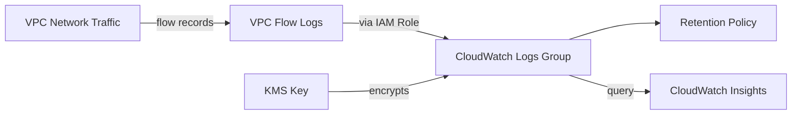

# @sevenpico/cdk-construct-cloudwatch-flow-logs

> **Agent Context**: Before implementing this spec, read [`spec/AGENT-CONTEXT.md`](./AGENT-CONTEXT.md) for the full project context, functional architecture pattern, JSII constraints, and README generation requirements.

## Dependencies
- `@sevenpico/cdk-context` — **must be implemented first**

## Package
`@sevenpico/cdk-construct-cloudwatch-flow-logs`
Directory: `packages/cdk-construct-cloudwatch-flow-logs`

## Source Terraform Module
https://github.com/SevenPico/terraform-aws-cloudwatch-flow-logs

## Purpose
Provisions VPC Flow Logs that capture network traffic metadata (source/destination IPs, ports, protocol, action, bytes) and send it to a CloudWatch Logs log group. Creates the required IAM role allowing VPC Flow Logs to write to CloudWatch Logs.

---

## CDK Imports
```typescript
import {
  aws_ec2 as ec2,
  aws_logs as logs,
  aws_iam as iam,
} from 'aws-cdk-lib';
```

## Props Interface (JSII-exported)

```typescript
import { Context } from '@sevenpico/cdk-context';

export interface CloudwatchFlowLogsProps {
  readonly context: Context;

  /** ID of the VPC to capture flow logs for. Required. */
  readonly vpcId: string;

  /**
   * Which traffic to capture.
   * 'ALL' | 'ACCEPT' | 'REJECT'. Default: 'ALL'
   */
  readonly trafficType?: string;

  /** CloudWatch Logs log group retention in days. Default: 365 */
  readonly cloudwatchLogRetentionDays?: number;

  /** ARN of a KMS key used to encrypt the CloudWatch Logs log group. */
  readonly logGroupKmsKeyArn?: string;
}
```

---

## Pure Functions (`src/cloudwatch-flow-logs-fns.ts`)

```typescript
import {
  aws_ec2 as ec2,
  aws_logs as logs,
  aws_iam as iam,
  RemovalPolicy,
} from 'aws-cdk-lib';
import { Construct } from 'constructs';
import { Context, contextId } from '@sevenpico/cdk-context';
import { CloudwatchFlowLogsProps } from './cloudwatch-flow-logs-types';

export const logGroupName = (ctx: Context): string =>
  `/aws/vpc/flowlogs/${contextId(ctx)}`;

export const flowLogRoleName = (ctx: Context): string =>
  `${contextId(ctx)}-flow-logs-role`;

export const flowLogsPolicyStatement = (): iam.PolicyStatement =>
  new iam.PolicyStatement({
    effect:    iam.Effect.ALLOW,
    actions: [
      'logs:CreateLogGroup',
      'logs:CreateLogStream',
      'logs:PutLogEvents',
      'logs:DescribeLogGroups',
      'logs:DescribeLogStreams',
    ],
    resources: ['*'],
  });

export const logGroupProps = (
  ctx: Context,
  props: CloudwatchFlowLogsProps,
): logs.LogGroupProps => ({
  logGroupName:  logGroupName(ctx),
  retention:     (props.cloudwatchLogRetentionDays ?? 365) as logs.RetentionDays,
  removalPolicy: RemovalPolicy.DESTROY,
});

export const mapTrafficType = (trafficType?: string): ec2.FlowLogTrafficType => {
  const map: Record<string, ec2.FlowLogTrafficType> = {
    ALL:    ec2.FlowLogTrafficType.ALL,
    ACCEPT: ec2.FlowLogTrafficType.ACCEPT,
    REJECT: ec2.FlowLogTrafficType.REJECT,
  };
  return map[trafficType ?? 'ALL'] ?? ec2.FlowLogTrafficType.ALL;
};

export const flowLogProps = (
  scope: Construct,
  ctx: Context,
  props: CloudwatchFlowLogsProps,
  logGroup: logs.LogGroup,
  role: iam.Role,
): ec2.FlowLogProps => ({
  resourceType:        ec2.FlowLogResourceType.fromVpc(
    ec2.Vpc.fromLookup(scope, 'Vpc', { vpcId: props.vpcId }),
  ),
  trafficType:         mapTrafficType(props.trafficType),
  destination:         ec2.FlowLogDestination.toCloudWatchLogs(logGroup, role),
});
```

---

## Construct Class (`src/cloudwatch-flow-logs.ts`)

```typescript
import { Construct } from 'constructs';
import { Tags } from 'aws-cdk-lib';
import {
  aws_ec2 as ec2,
  aws_logs as logs,
  aws_iam as iam,
} from 'aws-cdk-lib';
import { contextTags, isEnabled } from '@sevenpico/cdk-context';
import { CloudwatchFlowLogsProps } from './cloudwatch-flow-logs-types';
import {
  logGroupProps,
  flowLogRoleName,
  flowLogsPolicyStatement,
  flowLogProps,
} from './cloudwatch-flow-logs-fns';

export class CloudwatchFlowLogs extends Construct {
  public readonly logGroup?: logs.LogGroup;
  public readonly flowLog?: ec2.FlowLog;
  public readonly role?: iam.Role;

  constructor(scope: Construct, id: string, props: CloudwatchFlowLogsProps) {
    super(scope, id);
    if (!isEnabled(props.context)) return;

    // Create the CloudWatch Logs log group
    const encryptionKey = props.logGroupKmsKeyArn
      ? (await import('aws-cdk-lib')).aws_kms.Key.fromKeyArn(this, 'KmsKey', props.logGroupKmsKeyArn)
      : undefined;

    this.logGroup = new logs.LogGroup(this, 'LogGroup', {
      ...logGroupProps(props.context, props),
      encryptionKey,
    });

    // Create the IAM role that allows VPC Flow Logs to write to CloudWatch Logs
    this.role = new iam.Role(this, 'Role', {
      roleName:  flowLogRoleName(props.context),
      assumedBy: new iam.ServicePrincipal('vpc-flow-logs.amazonaws.com'),
    });
    this.role.addToPolicy(flowLogsPolicyStatement());

    // Create the VPC Flow Log
    this.flowLog = new ec2.FlowLog(this, 'FlowLog', flowLogProps(this, props.context, props, this.logGroup, this.role));

    Object.entries(contextTags(props.context)).forEach(([k, v]) =>
      Tags.of(this).add(k, v),
    );
  }
}
```

> **Note on KMS import**: The construct body shows an inline import pattern for illustration. In the actual implementation, `aws_kms` should be imported at the top of the file alongside the other CDK imports and `Key.fromKeyArn` called directly.

---

## Public Properties

| Property | Type | Description |
|----------|------|-------------|
| `logGroup` | `logs.LogGroup \| undefined` | The CloudWatch Logs log group receiving flow records |
| `flowLog` | `ec2.FlowLog \| undefined` | The VPC Flow Log resource |
| `role` | `iam.Role \| undefined` | The IAM role granting VPC Flow Logs write access to CloudWatch Logs |

---

## Context Usage

| Context Field | Usage |
|---------------|-------|
| `context.id` | Log group name: `/aws/vpc/flowlogs/{contextId}` and IAM role name: `{contextId}-flow-logs-role` |
| `context.tags` | Applied to all resources |
| `context.enabled` | If false, no resources created |

---

## BDD Tests

### Feature: Log Group

**Scenario: Log group created with VPC-derived name**
- **Given** a context with namespace `7p`, stage `prod`, name `network`
- **When** a `CloudwatchFlowLogs` construct is created
- **Then** an `AWS::Logs::LogGroup` resource exists with `LogGroupName: '/aws/vpc/flowlogs/7p-prod-network'`

**Scenario: Log retention defaults to 365 days**
- **Given** no `cloudwatchLogRetentionDays` prop
- **When** a `CloudwatchFlowLogs` construct is created
- **Then** the log group has `RetentionInDays: 365`

**Scenario: KMS encryption applied to log group when logGroupKmsKeyArn provided**
- **Given** `logGroupKmsKeyArn: 'arn:aws:kms:us-east-1:123456789012:key/abc'`
- **When** a `CloudwatchFlowLogs` construct is created
- **Then** the log group has `KmsKeyId` set to that key ARN

### Feature: Flow Log

**Scenario: Flow log created for specified VPC ID**
- **Given** `vpcId: 'vpc-0123456789abcdef0'`
- **When** a `CloudwatchFlowLogs` construct is created
- **Then** an `AWS::EC2::FlowLog` resource exists referencing that VPC ID

**Scenario: Traffic type defaults to ALL**
- **Given** no `trafficType` prop
- **When** a `CloudwatchFlowLogs` construct is created
- **Then** the flow log has `TrafficType: 'ALL'`

### Feature: IAM Role

**Scenario: IAM role created with CloudWatch Logs permissions**
- **Given** a valid context and `vpcId`
- **When** a `CloudwatchFlowLogs` construct is created
- **Then** an `AWS::IAM::Role` resource exists with trust policy allowing `vpc-flow-logs.amazonaws.com`
- **And** the role policy includes `logs:PutLogEvents` on `'*'`

### Feature: Disabled Construct

**Scenario: No resources created when context is disabled**
- **Given** a context with `enabled: false`
- **When** a `CloudwatchFlowLogs` construct is created
- **Then** no `AWS::Logs::LogGroup` resources exist in the stack
- **And** no `AWS::EC2::FlowLog` resources exist in the stack
- **And** no `AWS::IAM::Role` resources exist in the stack

## README

Generate a `README.md` following the template in [`spec/AGENT-CONTEXT.md`](./AGENT-CONTEXT.md#readme-generation-requirement).

The Mermaid diagram should show:


