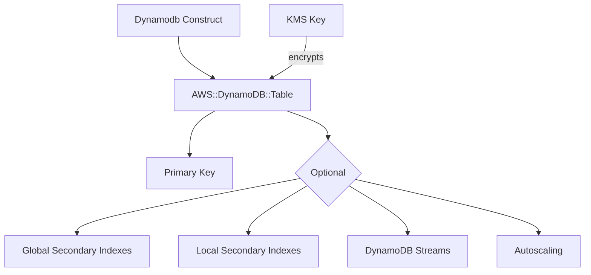

# @sevenpico/cdk-construct-dynamodb

> **Agent Context**: Before implementing this spec, read [`spec/AGENT-CONTEXT.md`](./AGENT-CONTEXT.md) for the full project context, functional architecture pattern, JSII constraints, and README generation requirements.

## Dependencies
- `@sevenpico/cdk-context` — **must be implemented first**

## Package
`@sevenpico/cdk-construct-dynamodb`
Directory: `packages/cdk-construct-dynamodb`

## Source Terraform Module
https://github.com/SevenPicoforks/terraform-aws-dynamodb

## Purpose
Provisions a DynamoDB table with configurable billing mode, GSIs, LSIs, TTL, DynamoDB Streams, server-side encryption, point-in-time recovery, autoscaling, and optional cross-region replicas.

---

## CDK Imports
```typescript
import {
  aws_dynamodb as dynamodb,
  aws_applicationautoscaling as autoscaling,
  aws_kms as kms,
} from 'aws-cdk-lib';
```

## Props Interface (JSII-exported)

```typescript
import { Context } from '@sevenpico/cdk-context';

export interface DynamodbAttribute {
  readonly name: string;
  readonly type: string;   // 'S' | 'N' | 'B'
}

export interface DynamodbGsi {
  readonly name: string;
  readonly hashKey: string;
  readonly rangeKey?: string;
  readonly projectionType: string;   // 'ALL' | 'KEYS_ONLY' | 'INCLUDE'
  readonly nonKeyAttributes?: string[];
  readonly readCapacity?: number;
  readonly writeCapacity?: number;
}

export interface DynamodbLsi {
  readonly name: string;
  readonly rangeKey: string;
  readonly projectionType: string;
  readonly nonKeyAttributes?: string[];
}

export interface DynamodbReplicaConfig {
  readonly region: string;
  readonly kmsKeyArn?: string;
  readonly pointInTimeRecovery?: boolean;
  readonly propagateTags?: boolean;
}

export interface DynamodbProps {
  readonly context: Context;

  /** Hash key attribute name. Required. */
  readonly hashKey: string;

  /** Hash key type. 'S' | 'N' | 'B'. Default: 'S' */
  readonly hashKeyType?: string;

  /** Range key attribute name */
  readonly rangeKey?: string;

  /** Range key type. Default: 'S' */
  readonly rangeKeyType?: string;

  /** Billing mode. 'PROVISIONED' | 'PAY_PER_REQUEST'. Default: 'PROVISIONED' */
  readonly billingMode?: string;

  /** Read capacity units (PROVISIONED only). Default: 5 */
  readonly readCapacity?: number;

  /** Write capacity units (PROVISIONED only). Default: 5 */
  readonly writeCapacity?: number;

  /** Enable autoscaling (PROVISIONED only). Default: false */
  readonly enableAutoscaler?: boolean;

  readonly autoscaleReadMin?: number;    // Default: 5
  readonly autoscaleReadMax?: number;    // Default: 20
  readonly autoscaleWriteMin?: number;   // Default: 5
  readonly autoscaleWriteMax?: number;   // Default: 20
  readonly autoscaleReadTarget?: number; // Default: 50 (percent)
  readonly autoscaleWriteTarget?: number; // Default: 50 (percent)

  /** Enable server-side encryption. Default: true */
  readonly enableEncryption?: boolean;

  /** KMS key ARN for encryption (custom CMK) */
  readonly kmsKeyArn?: string;

  /** Enable point-in-time recovery. Default: true */
  readonly enablePointInTimeRecovery?: boolean;

  /** Enable DynamoDB Streams. Default: false */
  readonly enableStreams?: boolean;

  /** Stream view type. 'NEW_IMAGE' | 'OLD_IMAGE' | 'NEW_AND_OLD_IMAGES' | 'KEYS_ONLY' */
  readonly streamViewType?: string;

  /** Enable TTL. Default: true */
  readonly ttlEnabled?: boolean;

  /** TTL attribute name. Default: 'Expires' */
  readonly ttlAttribute?: string;

  /** Table class. 'STANDARD' | 'STANDARD_INFREQUENT_ACCESS'. Default: 'STANDARD' */
  readonly tableClass?: string;

  /** Additional non-key attributes to define */
  readonly dynamodbAttributes?: DynamodbAttribute[];

  /** Global Secondary Indexes */
  readonly globalSecondaryIndexes?: DynamodbGsi[];

  /** Local Secondary Indexes */
  readonly localSecondaryIndexes?: DynamodbLsi[];

  /** Cross-region replicas */
  readonly replicas?: DynamodbReplicaConfig[];
}
```

---

## Pure Functions (`src/dynamodb-fns.ts`)

```typescript
import { aws_dynamodb as dynamodb } from 'aws-cdk-lib';
import { Context, contextId } from '@sevenpico/cdk-context';

export const mapAttrType = (t: string): dynamodb.AttributeType => {
  const map: Record<string, dynamodb.AttributeType> = {
    S: dynamodb.AttributeType.STRING,
    N: dynamodb.AttributeType.NUMBER,
    B: dynamodb.AttributeType.BINARY,
  };
  return map[t] ?? dynamodb.AttributeType.STRING;
};

export const mapBillingMode = (mode?: string): dynamodb.BillingMode =>
  mode === 'PAY_PER_REQUEST'
    ? dynamodb.BillingMode.PAY_PER_REQUEST
    : dynamodb.BillingMode.PROVISIONED;

export const mapStreamViewType = (v?: string): dynamodb.StreamViewType | undefined => {
  if (!v) return undefined;
  const map: Record<string, dynamodb.StreamViewType> = {
    NEW_IMAGE:           dynamodb.StreamViewType.NEW_IMAGE,
    OLD_IMAGE:           dynamodb.StreamViewType.OLD_IMAGE,
    NEW_AND_OLD_IMAGES:  dynamodb.StreamViewType.NEW_AND_OLD_IMAGES,
    KEYS_ONLY:           dynamodb.StreamViewType.KEYS_ONLY,
  };
  return map[v];
};

export const mapTableClass = (c?: string): dynamodb.TableClass =>
  c === 'STANDARD_INFREQUENT_ACCESS'
    ? dynamodb.TableClass.STANDARD_INFREQUENT_ACCESS
    : dynamodb.TableClass.STANDARD;

export const mapProjectionType = (p: string): dynamodb.ProjectionType => {
  const map: Record<string, dynamodb.ProjectionType> = {
    ALL:       dynamodb.ProjectionType.ALL,
    KEYS_ONLY: dynamodb.ProjectionType.KEYS_ONLY,
    INCLUDE:   dynamodb.ProjectionType.INCLUDE,
  };
  return map[p] ?? dynamodb.ProjectionType.ALL;
};

export const tableProps = (ctx: Context, props: DynamodbProps): dynamodb.TableProps => ({
  tableName:              contextId(ctx),
  partitionKey:           { name: props.hashKey, type: mapAttrType(props.hashKeyType ?? 'S') },
  sortKey:                props.rangeKey
                            ? { name: props.rangeKey, type: mapAttrType(props.rangeKeyType ?? 'S') }
                            : undefined,
  billingMode:            mapBillingMode(props.billingMode),
  readCapacity:           mapBillingMode(props.billingMode) === dynamodb.BillingMode.PROVISIONED
                            ? (props.readCapacity ?? 5) : undefined,
  writeCapacity:          mapBillingMode(props.billingMode) === dynamodb.BillingMode.PROVISIONED
                            ? (props.writeCapacity ?? 5) : undefined,
  encryption:             props.kmsKeyArn
                            ? dynamodb.TableEncryption.CUSTOMER_MANAGED
                            : (props.enableEncryption !== false
                                ? dynamodb.TableEncryption.AWS_MANAGED
                                : dynamodb.TableEncryption.DEFAULT),
  pointInTimeRecovery:    props.enablePointInTimeRecovery ?? true,
  stream:                 props.enableStreams
                            ? mapStreamViewType(props.streamViewType)
                            : undefined,
  timeToLiveAttribute:    props.ttlEnabled !== false ? (props.ttlAttribute ?? 'Expires') : undefined,
  tableClass:             mapTableClass(props.tableClass),
  replicationRegions:     (props.replicas ?? []).map(r => r.region),
  removalPolicy:          RemovalPolicy.RETAIN,
});
```

---

## Construct Class (`src/dynamodb.ts`)

```typescript
export class Dynamodb extends Construct {
  public readonly table?: dynamodb.Table;

  constructor(scope: Construct, id: string, props: DynamodbProps) {
    super(scope, id);
    if (!isEnabled(props.context)) return;

    const encKey = props.kmsKeyArn
      ? kms.Key.fromKeyArn(this, 'Key', props.kmsKeyArn)
      : undefined;

    this.table = new dynamodb.Table(this, 'Table', {
      ...tableProps(props.context, props),
      encryptionKey: encKey,
    });

    // Global Secondary Indexes
    (props.globalSecondaryIndexes ?? []).forEach(gsi => {
      this.table!.addGlobalSecondaryIndex({
        indexName:        gsi.name,
        partitionKey:     { name: gsi.hashKey, type: mapAttrType(gsi.rangeKey ? 'S' : 'S') },
        sortKey:          gsi.rangeKey ? { name: gsi.rangeKey, type: dynamodb.AttributeType.STRING } : undefined,
        projectionType:   mapProjectionType(gsi.projectionType),
        nonKeyAttributes: gsi.nonKeyAttributes,
        readCapacity:     gsi.readCapacity,
        writeCapacity:    gsi.writeCapacity,
      });
    });

    // Local Secondary Indexes
    (props.localSecondaryIndexes ?? []).forEach(lsi => {
      this.table!.addLocalSecondaryIndex({
        indexName:        lsi.name,
        sortKey:          { name: lsi.rangeKey, type: dynamodb.AttributeType.STRING },
        projectionType:   mapProjectionType(lsi.projectionType),
        nonKeyAttributes: lsi.nonKeyAttributes,
      });
    });

    // Autoscaling (PROVISIONED mode only)
    if (props.enableAutoscaler && mapBillingMode(props.billingMode) === dynamodb.BillingMode.PROVISIONED) {
      const readScaling = this.table.autoScaleReadCapacity({
        minCapacity: props.autoscaleReadMin ?? 5,
        maxCapacity: props.autoscaleReadMax ?? 20,
      });
      readScaling.scaleOnUtilization({ targetUtilizationPercent: props.autoscaleReadTarget ?? 50 });

      const writeScaling = this.table.autoScaleWriteCapacity({
        minCapacity: props.autoscaleWriteMin ?? 5,
        maxCapacity: props.autoscaleWriteMax ?? 20,
      });
      writeScaling.scaleOnUtilization({ targetUtilizationPercent: props.autoscaleWriteTarget ?? 50 });
    }

    Object.entries(contextTags(props.context)).forEach(([k, v]) => Tags.of(this).add(k, v));
  }
}
```

---

## Public Properties

| Property | Type | Description |
|----------|------|-------------|
| `table` | `dynamodb.Table \| undefined` | The DynamoDB table |

---

## Context Usage

| Context Field | Usage |
|---------------|-------|
| `context.id` | Table name |
| `context.tags` | Applied to the table |
| `context.enabled` | If false, no resources created |

---

## BDD Tests

### Feature: Table Naming

**Scenario: Table uses context ID as name**
- **Given** a context with namespace `7p`, stage `prod`, name `orders`
- **When** a `Dynamodb` construct is created with `hashKey: 'id'`
- **Then** the table name is `7p-prod-orders`

### Feature: Billing Mode

**Scenario: Provisioned billing with 5 read/write capacity by default**
- **Given** no `billingMode` prop
- **When** a `Dynamodb` construct is created
- **Then** the billing mode is `PROVISIONED` with read capacity `5` and write capacity `5`

**Scenario: PAY_PER_REQUEST mode has no capacity units**
- **Given** `billingMode: 'PAY_PER_REQUEST'`
- **When** a `Dynamodb` construct is created
- **Then** no read or write capacity units are set

### Feature: Default Settings

**Scenario: Point-in-time recovery enabled by default**
- **Given** no `enablePointInTimeRecovery` prop
- **When** a `Dynamodb` construct is created
- **Then** point-in-time recovery is enabled

**Scenario: TTL enabled with Expires attribute by default**
- **Given** no `ttlEnabled` or `ttlAttribute` props
- **When** a `Dynamodb` construct is created
- **Then** TTL is enabled on the `Expires` attribute

**Scenario: Encryption enabled by default**
- **Given** no `enableEncryption` prop
- **When** a `Dynamodb` construct is created
- **Then** the table uses AWS-managed encryption

### Feature: Secondary Indexes

**Scenario: GSI added to table when globalSecondaryIndexes provided**
- **Given** a `globalSecondaryIndexes` with one GSI config
- **When** a `Dynamodb` construct is created
- **Then** the table has one global secondary index

### Feature: Disabled Construct

**Scenario: No resources created when context is disabled**
- **Given** a context with `enabled: false`
- **When** a `Dynamodb` construct is created
- **Then** no `AWS::DynamoDB::Table` resources exist in the stack

## README

Generate a `README.md` following the template in [`spec/AGENT-CONTEXT.md`](./AGENT-CONTEXT.md#readme-generation-requirement).

The Mermaid diagram should show:


