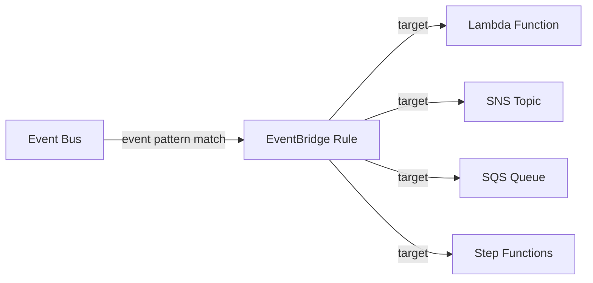

# @sevenpico/cdk-construct-eventbridge-rule

> **Agent Context**: Before implementing this spec, read [`spec/AGENT-CONTEXT.md`](./AGENT-CONTEXT.md) for the full project context, functional architecture pattern, JSII constraints, and README generation requirements.

## Dependencies
- `@sevenpico/cdk-context` — **must be implemented first**

## Package
`@sevenpico/cdk-construct-eventbridge-rule`
Directory: `packages/cdk-construct-eventbridge-rule`

## Source Terraform Module
https://github.com/SevenPico/terraform-aws-events

## Purpose
Provisions a single Amazon EventBridge rule with one target. Supports cross-bus routing (source and target bus), optional IAM role for target invocation, and optional custom target ID.

---

## CDK Imports
```typescript
import {
  aws_events as events,
  aws_events_targets as targets,
  aws_iam as iam,
} from 'aws-cdk-lib';
```

## Props Interface (JSII-exported)

```typescript
import { Context } from '@sevenpico/cdk-context';

export interface EventbridgeRuleProps {
  readonly context: Context;

  /** Rule description */
  readonly description?: string;

  /**
   * Event pattern as a plain object (will be JSON-serialized).
   * Required — defines what events this rule matches.
   * Example: { source: ['aws.s3'], detailType: ['Object Created'] }
   */
  readonly eventPattern: object;

  /** Whether the rule is enabled. Default: true */
  readonly ruleEnabled?: boolean;

  /** ARN of the rule target resource. Required. */
  readonly targetArn: string;

  /** Unique target ID. Default: derived from context.id */
  readonly targetId?: string;

  /** IAM role ARN for invoking the target */
  readonly targetRoleArn?: string;

  /** Source event bus name or ARN. Default: default event bus */
  readonly sourceEventBusName?: string;

  /** Target event bus ARN (for cross-bus routing) */
  readonly targetEventBusArn?: string;
}
```

---

## Pure Functions (`src/eventbridge-rule-fns.ts`)

```typescript
import { aws_events as events } from 'aws-cdk-lib';
import { Context, contextId } from '@sevenpico/cdk-context';

export const ruleName = (ctx: Context): string => contextId(ctx);

export const targetId = (ctx: Context, props: EventbridgeRuleProps): string =>
  props.targetId ?? `${contextId(ctx)}-target`;

export const eventbridgeRuleProps = (
  ctx: Context,
  props: EventbridgeRuleProps,
  eventBus?: events.IEventBus
): events.RuleProps => ({
  ruleName:     ruleName(ctx),
  description:  props.description,
  enabled:      props.ruleEnabled ?? true,
  eventBus,
  eventPattern: props.eventPattern as events.EventPattern,
});
```

---

## Construct Class (`src/eventbridge-rule.ts`)

```typescript
export class EventbridgeRule extends Construct {
  public readonly rule?: events.Rule;

  constructor(scope: Construct, id: string, props: EventbridgeRuleProps) {
    super(scope, id);
    if (!isEnabled(props.context)) return;

    // Source event bus (optional — defaults to default bus)
    const eventBus = props.sourceEventBusName
      ? events.EventBus.fromEventBusName(this, 'SourceBus', props.sourceEventBusName)
      : undefined;

    this.rule = new events.Rule(this, 'Rule',
      eventbridgeRuleProps(props.context, props, eventBus)
    );

    // Build target
    const targetRole = props.targetRoleArn
      ? iam.Role.fromRoleArn(this, 'TargetRole', props.targetRoleArn)
      : undefined;

    if (props.targetEventBusArn) {
      // Cross-bus target
      const targetBus = events.EventBus.fromEventBusArn(this, 'TargetBus', props.targetEventBusArn);
      this.rule.addTarget(new targets.EventBus(targetBus));
    } else {
      // Generic ARN target via CfnRule escape hatch
      const cfnRule = this.rule.node.defaultChild as events.CfnRule;
      cfnRule.targets = [{
        arn:     props.targetArn,
        id:      targetId(props.context, props),
        roleArn: props.targetRoleArn,
      }];
    }

    Object.entries(contextTags(props.context)).forEach(([k, v]) => Tags.of(this).add(k, v));
  }
}
```

> **Note on target types:** The Terraform module accepts any target ARN. CDK's L2 targets are typed (SQS, Lambda, SNS, etc.). For maximum fidelity, use the `CfnRule.targets` escape hatch to set the raw target ARN, which supports all target types without requiring typed wrappers. Callers needing L2 target features should extend or wrap this construct.

---

## Public Properties

| Property | Type | Description |
|----------|------|-------------|
| `rule` | `events.Rule \| undefined` | The EventBridge rule |

---

## Context Usage

| Context Field | Usage |
|---------------|-------|
| `context.id` | Rule name and default target ID |
| `context.tags` | Applied to the rule |
| `context.enabled` | If false, no resources created |

---

## BDD Tests

### Feature: Rule Naming

**Scenario: Rule uses context ID as name**
- **Given** a context with namespace `7p`, stage `prod`, name `s3events`
- **When** an `EventbridgeRule` is created
- **Then** the EventBridge rule name is `7p-prod-s3events`

### Feature: Rule Configuration

**Scenario: Rule is enabled by default**
- **Given** no `ruleEnabled` prop
- **When** an `EventbridgeRule` is created
- **Then** the rule state is `ENABLED`

**Scenario: Rule can be disabled via prop**
- **Given** `ruleEnabled: false`
- **When** an `EventbridgeRule` is created
- **Then** the rule state is `DISABLED`

**Scenario: Event pattern is applied to the rule**
- **Given** `eventPattern: { source: ['aws.s3'] }`
- **When** an `EventbridgeRule` is created
- **Then** the rule event pattern includes `source: ['aws.s3']`

**Scenario: Target ID defaults to context ID + suffix**
- **Given** a context with id `7p-prod-s3events` and no `targetId` prop
- **When** an `EventbridgeRule` is created
- **Then** the rule target ID is `7p-prod-s3events-target`

### Feature: Disabled Construct

**Scenario: No resources created when context is disabled**
- **Given** a context with `enabled: false`
- **When** an `EventbridgeRule` is created
- **Then** no `AWS::Events::Rule` resources exist in the stack

## README

Generate a `README.md` following the template in [`spec/AGENT-CONTEXT.md`](./AGENT-CONTEXT.md#readme-generation-requirement).

The Mermaid diagram should show:


