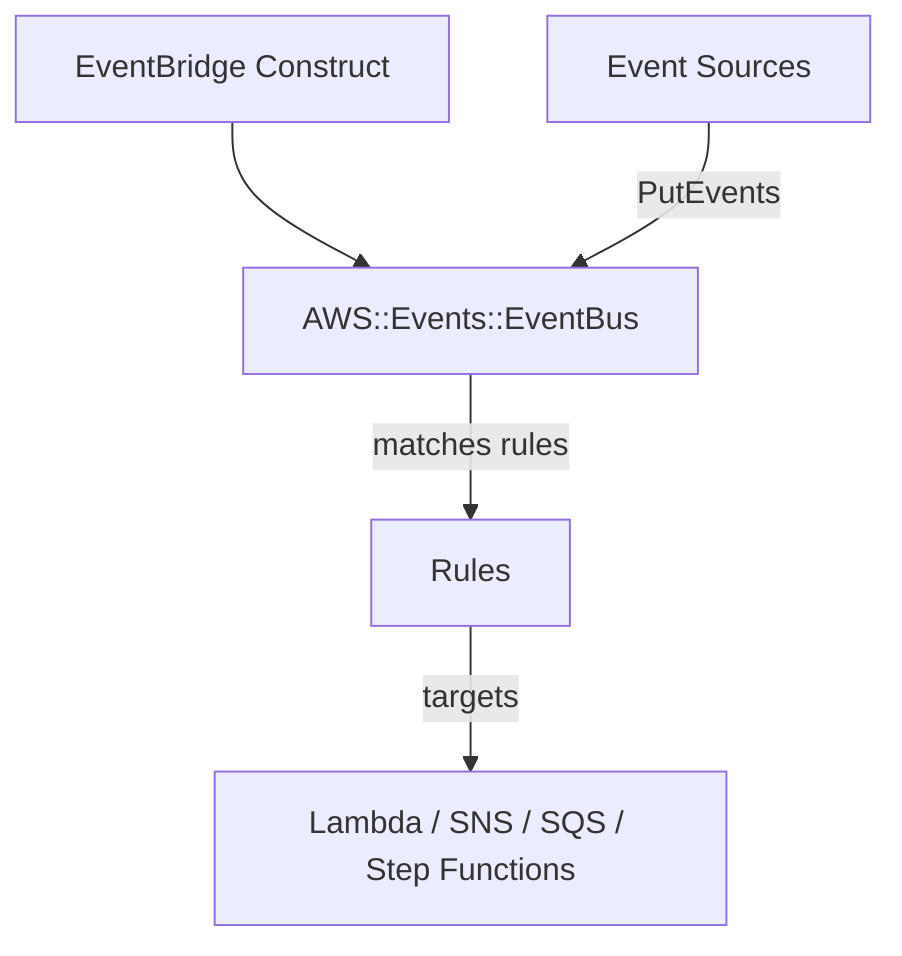

# @sevenpico/cdk-construct-eventbridge

> **Agent Context**: Before implementing this spec, read [`spec/AGENT-CONTEXT.md`](./AGENT-CONTEXT.md) for the full project context, functional architecture pattern, JSII constraints, and README generation requirements.

## Dependencies
- `@sevenpico/cdk-context` — **must be implemented first**

## Package
`@sevenpico/cdk-construct-eventbridge`
Directory: `packages/cdk-construct-eventbridge`

## Source Terraform Module
https://github.com/SevenPico/terraform-aws-eventbus

## Purpose
Provisions a custom Amazon EventBridge event bus with an optional resource-based policy and optional KMS encryption.

---

## CDK Imports
```typescript
import { aws_events as events, aws_kms as kms, aws_iam as iam } from 'aws-cdk-lib';
```

## Props Interface (JSII-exported)

```typescript
import { Context } from '@sevenpico/cdk-context';

export interface EventbridgeProps {
  readonly context: Context;

  /** Event bus name override. Default: context.id */
  readonly eventBusName?: string;

  /** KMS key identifier (ARN or alias) for event bus encryption */
  readonly kmsKeyIdentifier?: string;

  /** Partner event source name (for partner event buses) */
  readonly eventSourceName?: string;

  /** Event bus resource policy as JSON string */
  readonly policyDocument?: string;
}
```

---

## Pure Functions (`src/eventbridge-fns.ts`)

```typescript
import { aws_events as events } from 'aws-cdk-lib';
import { Context, contextId } from '@sevenpico/cdk-context';

export const eventBusName = (ctx: Context, props: EventbridgeProps): string =>
  props.eventBusName ?? contextId(ctx);

export const eventBusProps = (ctx: Context, props: EventbridgeProps): events.EventBusProps => ({
  eventBusName:   eventBusName(ctx, props),
  // eventSourceName for partner buses
  ...(props.eventSourceName ? { eventSourceName: props.eventSourceName } : {}),
});
```

---

## Construct Class (`src/eventbridge.ts`)

```typescript
export class Eventbridge extends Construct {
  public readonly eventBus?: events.EventBus;

  constructor(scope: Construct, id: string, props: EventbridgeProps) {
    super(scope, id);
    if (!isEnabled(props.context)) return;

    this.eventBus = new events.EventBus(this, 'EventBus', eventBusProps(props.context, props));

    // KMS encryption via CfnEventBus escape hatch (CDK L2 does not expose kmsKeyIdentifier directly)
    if (props.kmsKeyIdentifier) {
      const cfnBus = this.eventBus.node.defaultChild as events.CfnEventBus;
      cfnBus.kmsKeyIdentifier = props.kmsKeyIdentifier;
    }

    // Resource-based policy
    if (props.policyDocument) {
      new events.CfnEventBusPolicy(this, 'Policy', {
        eventBusName:   this.eventBus.eventBusName,
        statementId:    `${contextId(props.context)}-policy`,
        statement:      JSON.parse(props.policyDocument),
      });
    }

    Object.entries(contextTags(props.context)).forEach(([k, v]) => Tags.of(this).add(k, v));
  }
}
```

---

## Public Properties

| Property | Type | Description |
|----------|------|-------------|
| `eventBus` | `events.EventBus \| undefined` | The custom event bus |

---

## Context Usage

| Context Field | Usage |
|---------------|-------|
| `context.id` | Event bus name (default) |
| `context.tags` | Applied to the event bus |
| `context.enabled` | If false, no resources created |

---

## BDD Tests

### Feature: Event Bus Naming

**Scenario: Event bus uses context ID as name by default**
- **Given** a context with namespace `7p`, stage `prod`, name `platform`
- **When** an `Eventbridge` construct is created
- **Then** the event bus name is `7p-prod-platform`

**Scenario: Custom name overrides context ID**
- **Given** `eventBusName: 'my-bus'`
- **When** an `Eventbridge` construct is created
- **Then** the event bus name is `my-bus`

### Feature: Event Bus Policy

**Scenario: Resource policy attached when policyDocument provided**
- **Given** a `policyDocument` JSON string with valid IAM statements
- **When** an `Eventbridge` construct is created
- **Then** a `AWS::Events::EventBusPolicy` resource exists

**Scenario: No policy resource when policyDocument not provided**
- **Given** no `policyDocument` prop
- **When** an `Eventbridge` construct is created
- **Then** no `AWS::Events::EventBusPolicy` resource exists

### Feature: Disabled Construct

**Scenario: No resources created when context is disabled**
- **Given** a context with `enabled: false`
- **When** an `Eventbridge` construct is created
- **Then** no `AWS::Events::EventBus` resources exist in the stack

## README

Generate a `README.md` following the template in [`spec/AGENT-CONTEXT.md`](./AGENT-CONTEXT.md#readme-generation-requirement).

The Mermaid diagram should show:


