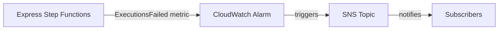

# @sevenpico/cdk-construct-express-sfn-error-notification

> **Agent Context**: Before implementing this spec, read [`spec/AGENT-CONTEXT.md`](./AGENT-CONTEXT.md) for the full project context, functional architecture pattern, JSII constraints, and README generation requirements.

## Dependencies
- `@sevenpico/cdk-context` — **must be implemented first**
- `@sevenpico/cdk-construct-sqs-queue` — **must be implemented first**

## Package
`@sevenpico/cdk-construct-express-sfn-error-notification`
Directory: `packages/cdk-construct-express-sfn-error-notification`

## Source Terraform Module
https://github.com/SevenPico/terraform-aws-express-step-function-error-notification

## Purpose
Monitors **multiple** EXPRESS Step Functions state machines for failures. For each monitored state machine, provisions a dedicated DLQ, rate alarm, volume alarm, EventBridge Pipe for reprocessing, and a log group. EXPRESS state machines log failures to CloudWatch Logs rather than emitting EventBridge events — the pipe reads directly from the DLQ populated by the state machine's own dead-letter configuration.

Key difference from `sfn-error-notification`: map-based, monitors multiple state machines at once; uses lighter alarm thresholds (1 datapoint / 5 periods) appropriate for high-frequency EXPRESS workflows.

---

## CDK Imports
```typescript
import {
  aws_cloudwatch as cw,
  aws_cloudwatch_actions as cw_actions,
  aws_sqs as sqs,
  aws_iam as iam,
  aws_logs as logs,
  aws_pipes as pipes,
  aws_sns as sns,
  Duration,
} from 'aws-cdk-lib';
```

## Props Interface (JSII-exported)

```typescript
import { Context } from '@sevenpico/cdk-context';

export interface ExpressSfnTarget {
  /** ARN of the EXPRESS state machine */
  readonly arn: string;
  /** CloudWatch log group name for the state machine (used for log-based monitoring) */
  readonly logGroupName?: string;
  /** SQS queue name override for this machine's DLQ */
  readonly sqsQueueName?: string;
  /** Rate alarm name override */
  readonly rateAlarmName?: string;
  /** Volume alarm name override */
  readonly volumeAlarmName?: string;
}

export interface SqsKmsConfig {
  readonly keyId: string;
  readonly keyArn: string;
}

export interface ExpressSfnErrorNotificationProps {
  readonly context: Context;

  /**
   * Map of logical name to state machine configuration.
   * Each entry creates a full set of monitoring resources for that state machine.
   * Required — must have at least one entry.
   */
  readonly stepFunctions: Record<string, ExpressSfnTarget>;

  /** ARN of the SNS topic for all rate alarms. Required. */
  readonly rateAlarmSnsTopicArn: string;

  /** ARN of the SNS topic for all volume alarms. Required. */
  readonly volumeAlarmSnsTopicArn: string;

  /** SQS message retention in seconds. Default: 604800 (7 days) */
  readonly sqsMessageRetentionSeconds?: number;

  /** SQS visibility timeout in seconds. Default: 30 (higher than standard SFN) */
  readonly sqsVisibilityTimeoutSeconds?: number;

  /** Alarm evaluation period in seconds. Default: 60 */
  readonly alarmPeriodSeconds?: number;

  /** Data points to alarm. Default: 1 */
  readonly alarmDatapointsToAlarm?: number;

  /** Evaluation periods. Default: 5 */
  readonly alarmEvaluationPeriods?: number;

  /** Batch size for all pipes. Default: 1 */
  readonly eventbridgePipeBatchSize?: number;

  /** Log level for all pipes. Default: 'ERROR' */
  readonly eventbridgePipeLogLevel?: string;

  /** CloudWatch log retention for pipes in days. Default: 90 */
  readonly cloudwatchLogRetentionDays?: number;

  /** Input template for all pipe targets. Default: '<$.detail.input>' */
  readonly targetStepFunctionInputTemplate?: string;

  /** KMS encryption config for all DLQs */
  readonly sqsKmsConfig?: SqsKmsConfig;
}
```

---

## Pure Functions (`src/express-sfn-error-notification-fns.ts`)

```typescript
/** Per-machine DLQ context: append machine logical name + 'dlq' to base context */
export const machineDlqContext = (ctx: Context, machineKey: string): Context =>
  extendContext(ctx, { attributes: [machineKey, 'dlq'] });

/** Per-machine pipe name */
export const machinePipeName = (ctx: Context, machineKey: string): string =>
  `${contextId(extendContext(ctx, { attributes: [machineKey] }))}-pipe`;

export const machineRateAlarmName = (ctx: Context, key: string, target: ExpressSfnTarget): string =>
  target.rateAlarmName ?? `${contextId(extendContext(ctx, { attributes: [key] }))}-dlq-rate`;

export const machineVolumeAlarmName = (ctx: Context, key: string, target: ExpressSfnTarget): string =>
  target.volumeAlarmName ?? `${contextId(extendContext(ctx, { attributes: [key] }))}-dlq-volume`;

/** Rate alarm defaults for EXPRESS: 1 datapoint / 5 periods (lighter than STANDARD 2/2) */
export const expressRateAlarmProps = (
  ctx: Context,
  props: ExpressSfnErrorNotificationProps,
  key: string,
  target: ExpressSfnTarget,
  queue: sqs.IQueue
): cw.AlarmProps => ({
  alarmName:          machineRateAlarmName(ctx, key, target),
  metric:             new cw.MathExpression({
    expression:   'RATE(m1)',
    usingMetrics: { m1: queue.metricApproximateNumberOfMessagesVisible() },
    period:       Duration.seconds(props.alarmPeriodSeconds ?? 60),
  }),
  threshold:          0,
  comparisonOperator: cw.ComparisonOperator.GREATER_THAN_THRESHOLD,
  datapointsToAlarm:  props.alarmDatapointsToAlarm ?? 1,
  evaluationPeriods:  props.alarmEvaluationPeriods ?? 5,
  treatMissingData:   cw.TreatMissingData.NOT_BREACHING,
});

export const expressVolumeAlarmProps = (
  ctx: Context,
  props: ExpressSfnErrorNotificationProps,
  key: string,
  target: ExpressSfnTarget,
  queue: sqs.IQueue
): cw.AlarmProps => ({
  alarmName:          machineVolumeAlarmName(ctx, key, target),
  metric:             queue.metricApproximateNumberOfMessagesVisible({
    period: Duration.seconds(props.alarmPeriodSeconds ?? 60),
  }),
  threshold:          0,
  comparisonOperator: cw.ComparisonOperator.GREATER_THAN_THRESHOLD,
  datapointsToAlarm:  props.alarmDatapointsToAlarm ?? 1,
  evaluationPeriods:  props.alarmEvaluationPeriods ?? 5,
  treatMissingData:   cw.TreatMissingData.NOT_BREACHING,
});
```

---

## Construct Class (`src/express-sfn-error-notification.ts`)

```typescript
export class ExpressSfnErrorNotification extends Construct {
  /** Map of logical name → DLQ */
  public readonly deadLetterQueues: Record<string, sqs.Queue> = {};
  /** Map of logical name → rate alarm */
  public readonly rateAlarms: Record<string, cw.Alarm> = {};
  /** Map of logical name → volume alarm */
  public readonly volumeAlarms: Record<string, cw.Alarm> = {};
  /** Map of logical name → EventBridge Pipe */
  public readonly pipes: Record<string, pipes.CfnPipe> = {};

  constructor(scope: Construct, id: string, props: ExpressSfnErrorNotificationProps) {
    super(scope, id);
    if (!isEnabled(props.context)) return;

    const rateTopic = sns.Topic.fromTopicArn(this, 'RateTopic', props.rateAlarmSnsTopicArn);
    const volumeTopic = sns.Topic.fromTopicArn(this, 'VolumeTopic', props.volumeAlarmSnsTopicArn);

    Object.entries(props.stepFunctions).forEach(([key, target]) => {
      const dCtx = machineDlqContext(props.context, key);

      // DLQ
      const dlq = new sqs.Queue(this, `Dlq-${key}`, {
        queueName:         target.sqsQueueName ?? contextId(dCtx),
        retentionPeriod:   Duration.seconds(props.sqsMessageRetentionSeconds ?? 604800),
        visibilityTimeout: Duration.seconds(props.sqsVisibilityTimeoutSeconds ?? 30),
        encryptionMasterKey: props.sqsKmsConfig
          ? kms.Key.fromKeyArn(this, `DlqKey-${key}`, props.sqsKmsConfig.keyArn)
          : undefined,
      });
      this.deadLetterQueues[key] = dlq;

      // Alarms
      const rateAlarm = new cw.Alarm(this, `RateAlarm-${key}`,
        expressRateAlarmProps(props.context, props, key, target, dlq)
      );
      rateAlarm.addAlarmAction(new cw_actions.SnsAction(rateTopic));
      this.rateAlarms[key] = rateAlarm;

      const volumeAlarm = new cw.Alarm(this, `VolumeAlarm-${key}`,
        expressVolumeAlarmProps(props.context, props, key, target, dlq)
      );
      volumeAlarm.addAlarmAction(new cw_actions.SnsAction(volumeTopic));
      this.volumeAlarms[key] = volumeAlarm;

      // Pipe
      const pipeRole = new iam.Role(this, `PipeRole-${key}`, {
        assumedBy: new iam.ServicePrincipal('pipes.amazonaws.com'),
      });
      dlq.grantConsumeMessages(pipeRole);
      pipeRole.addToPolicy(new iam.PolicyStatement({
        actions:   ['states:StartExecution'],
        resources: [target.arn],
      }));

      const pipeLogGroup = new logs.LogGroup(this, `PipeLogGroup-${key}`, {
        logGroupName:  `/aws/pipes/${machinePipeName(props.context, key)}`,
        retention:     (props.cloudwatchLogRetentionDays ?? 90) as logs.RetentionDays,
        removalPolicy: RemovalPolicy.DESTROY,
      });

      this.pipes[key] = new pipes.CfnPipe(this, `Pipe-${key}`, {
        name:             machinePipeName(props.context, key),
        roleArn:          pipeRole.roleArn,
        source:           dlq.queueArn,
        target:           target.arn,
        sourceParameters: { sqsQueueParameters: { batchSize: props.eventbridgePipeBatchSize ?? 1 } },
        targetParameters: {
          stepFunctionStateMachineParameters: { invocationType: 'FIRE_AND_FORGET' },
          inputTemplate: props.targetStepFunctionInputTemplate ?? '<$.detail.input>',
        },
        logConfiguration: {
          cloudwatchLogsLogDestination: { logGroupArn: pipeLogGroup.logGroupArn },
          level: props.eventbridgePipeLogLevel ?? 'ERROR',
        },
      });
    });

    Object.entries(contextTags(props.context)).forEach(([k, v]) => Tags.of(this).add(k, v));
  }
}
```

---

## Public Properties

| Property | Type | Description |
|----------|------|-------------|
| `deadLetterQueues` | `Record<string, sqs.Queue>` | DLQs keyed by logical name |
| `rateAlarms` | `Record<string, cw.Alarm>` | Rate alarms keyed by logical name |
| `volumeAlarms` | `Record<string, cw.Alarm>` | Volume alarms keyed by logical name |
| `pipes` | `Record<string, pipes.CfnPipe>` | Pipes keyed by logical name |

---

## Context Usage

| Context Field | Usage |
|---------------|-------|
| `context.id` | Base for per-machine resource names |
| Per-machine DLQ context | `extendContext(ctx, { attributes: [key, 'dlq'] })` |
| `context.tags` | Applied to all resources |
| `context.enabled` | If false, no resources created |

---

## BDD Tests

### Feature: Per-Machine Resource Creation

**Scenario: One DLQ created per step function**
- **Given** a context and `stepFunctions` map with two entries: `orderProcessor` and `paymentProcessor`
- **When** an `ExpressSfnErrorNotification` is created
- **Then** two SQS queues are created in the stack

**Scenario: DLQ names include machine key**
- **Given** a context with namespace `7p`, stage `prod`, name `monitor`
- **And** a `stepFunctions` entry with key `orders`
- **When** an `ExpressSfnErrorNotification` is created
- **Then** the DLQ name is `7p-prod-monitor-orders-dlq`

**Scenario: One pipe created per step function**
- **Given** a `stepFunctions` map with two entries
- **When** an `ExpressSfnErrorNotification` is created
- **Then** two `AWS::Pipes::Pipe` resources exist

### Feature: Express Alarm Defaults

**Scenario: Alarms use lighter thresholds (1 datapoint / 5 periods)**
- **Given** a valid context with no alarm config
- **When** an `ExpressSfnErrorNotification` is created
- **Then** all alarms have `datapointsToAlarm: 1` and `evaluationPeriods: 5`

**Scenario: Express alarms use 30-second visibility timeout (vs 2s for standard)**
- **Given** no `sqsVisibilityTimeoutSeconds` override
- **When** an `ExpressSfnErrorNotification` is created
- **Then** all DLQs have visibility timeout of 30 seconds

### Feature: Disabled Construct

**Scenario: No resources created when context is disabled**
- **Given** a context with `enabled: false`
- **When** an `ExpressSfnErrorNotification` is created
- **Then** no resources of any type exist in the stack

## README

Generate a `README.md` following the template in [`spec/AGENT-CONTEXT.md`](./AGENT-CONTEXT.md#readme-generation-requirement).

The Mermaid diagram should show:


