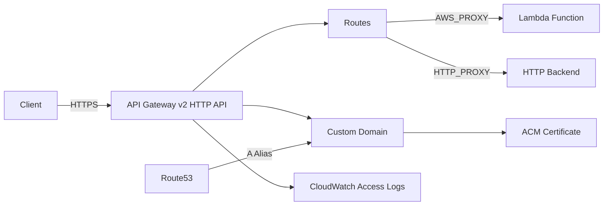

# @sevenpico/cdk-construct-http-api-gateway

> **Agent Context**: Before implementing this spec, read [`spec/AGENT-CONTEXT.md`](./AGENT-CONTEXT.md) for the full project context, functional architecture pattern, JSII constraints, and README generation requirements.

## Dependencies
- `@sevenpico/cdk-context` — **must be implemented first**

## Package
`@sevenpico/cdk-construct-http-api-gateway`
Directory: `packages/cdk-construct-http-api-gateway`

## Source Terraform Module
https://github.com/SevenPico/terraform-aws-http-api-gateway

## Purpose
Provisions an Amazon API Gateway v2 HTTP API with configurable routes, integrations, authorizers, VPC links, optional custom domain (ACM + Route53), optional CORS, and CloudWatch access logging.

---

## CDK Imports
```typescript
import {
  aws_apigatewayv2 as apigwv2,
  aws_apigatewayv2_integrations as integrations,
  aws_apigatewayv2_authorizers as authorizers,
  aws_logs as logs,
  aws_route53 as route53,
  aws_route53_targets as route53_targets,
  aws_certificatemanager as acm,
  aws_ec2 as ec2,
} from 'aws-cdk-lib';
```

## Props Interface (JSII-exported)

```typescript
import { Context } from '@sevenpico/cdk-context';

export interface HttpApiRoute {
  /** Route key, e.g. 'GET /items' or '$default' */
  readonly routeKey: string;
  /** Logical key referencing an entry in `integrations` */
  readonly integrationKey: string;
  /** Logical key referencing an entry in `authorizers` (optional) */
  readonly authorizerKey?: string;
  readonly operationName?: string;
}

export interface HttpApiIntegration {
  /** Integration type: 'AWS_PROXY' | 'HTTP_PROXY' | 'MOCK' */
  readonly type: string;
  /** Integration URI (Lambda ARN, HTTP URL, etc.) */
  readonly uri?: string;
  /** IAM role ARN for integration credentials */
  readonly credentialsArn?: string;
  /** HTTP method for proxy integrations */
  readonly method?: string;
  /** Payload format version */
  readonly payloadFormatVersion?: string;
}

export interface HttpApiAuthorizer {
  /** Authorizer type: 'JWT' | 'LAMBDA' | 'NONE' */
  readonly type: string;
  /** JWT issuer URL */
  readonly jwtIssuer?: string;
  /** JWT audience list */
  readonly jwtAudience?: string[];
  /** Lambda authorizer function ARN */
  readonly lambdaArn?: string;
  /** Lambda authorizer identity sources */
  readonly identitySources?: string[];
}

export interface HttpApiVpcLink {
  readonly vpcId: string;
  readonly subnetIds: string[];
  readonly securityGroupIds?: string[];
}

export interface HttpApiCorsConfig {
  readonly allowOrigins?: string[];
  readonly allowMethods?: string[];
  readonly allowHeaders?: string[];
  readonly exposeHeaders?: string[];
  readonly maxAge?: number;
  readonly allowCredentials?: boolean;
}

export interface HttpApiGatewayProps {
  readonly context: Context;

  /** API description */
  readonly description?: string;

  /** Disable default `execute-api` endpoint. Default: true */
  readonly disableExecuteApiEndpoint?: boolean;

  /** API version string. Default: '0.0.1' */
  readonly apiVersion?: string;

  /** CORS configuration */
  readonly corsConfiguration?: HttpApiCorsConfig;

  /** Route definitions. Key: logical name. Value: route config. */
  readonly routes?: Record<string, HttpApiRoute>;

  /** Integration definitions. Key: logical name. Value: integration config. */
  readonly integrations?: Record<string, HttpApiIntegration>;

  /** Authorizer definitions. Key: logical name. Value: authorizer config. */
  readonly authorizers?: Record<string, HttpApiAuthorizer>;

  /** VPC link definitions. Key: logical name. Value: VPC link config. */
  readonly vpcLinks?: Record<string, HttpApiVpcLink>;

  /** Custom domain name (requires acmCertificateArn) */
  readonly dnsName?: string;

  /** Route53 zone IDs for DNS alias records */
  readonly route53ZoneIds?: string[];

  /** ACM certificate ARN for custom domain */
  readonly acmCertificateArn?: string;

  /** Enable auto-deploy on changes. Default: false */
  readonly enableAutoDeploy?: boolean;

  /** Stage variables */
  readonly stageVariables?: Record<string, string>;

  /** Enable CloudWatch access logging. Default: true */
  readonly accessLoggingEnabled?: boolean;

  /** Access log format string */
  readonly accessLogFormat?: string;

  /** CloudWatch log retention in days. Default: 7 */
  readonly cloudwatchLogsRetentionDays?: number;
}
```

---

## Pure Functions (`src/http-api-gateway-fns.ts`)

```typescript
export const apiName = (ctx: Context, props: HttpApiGatewayProps): string => contextId(ctx);

export const corsConfig = (cors?: HttpApiCorsConfig): apigwv2.CorsPreflightOptions | undefined => {
  if (!cors) return undefined;
  return {
    allowOrigins:     cors.allowOrigins,
    allowMethods:     (cors.allowMethods ?? []).map(m =>
      apigwv2.CorsHttpMethod[m as keyof typeof apigwv2.CorsHttpMethod]
    ),
    allowHeaders:     cors.allowHeaders,
    exposeHeaders:    cors.exposeHeaders,
    maxAge:           cors.maxAge ? Duration.seconds(cors.maxAge) : undefined,
    allowCredentials: cors.allowCredentials,
  };
};

export const defaultAccessLogFormat = (): string =>
  JSON.stringify({
    requestId:     '$context.requestId',
    sourceIp:      '$context.identity.sourceIp',
    httpMethod:    '$context.httpMethod',
    routeKey:      '$context.routeKey',
    status:        '$context.status',
    protocol:      '$context.protocol',
    responseLength: '$context.responseLength',
    error:         '$context.error.message',
  });
```

---

## Construct Class (`src/http-api-gateway.ts`)

```typescript
export class HttpApiGateway extends Construct {
  public readonly api?: apigwv2.HttpApi;
  public readonly logGroup?: logs.LogGroup;
  public readonly customDomain?: apigwv2.DomainName;

  constructor(scope: Construct, id: string, props: HttpApiGatewayProps) {
    super(scope, id);
    if (!isEnabled(props.context)) return;

    // Access log group
    let logGroup: logs.LogGroup | undefined;
    if (props.accessLoggingEnabled !== false) {
      logGroup = new logs.LogGroup(this, 'AccessLogs', {
        logGroupName:  `/aws/apigateway/${contextId(props.context)}`,
        retention:     (props.cloudwatchLogsRetentionDays ?? 7) as logs.RetentionDays,
        removalPolicy: RemovalPolicy.DESTROY,
      });
      this.logGroup = logGroup;
    }

    // VPC links
    const vpcLinkMap: Record<string, apigwv2.VpcLink> = {};
    Object.entries(props.vpcLinks ?? {}).forEach(([key, vlCfg]) => {
      const vpc = ec2.Vpc.fromLookup(this, `VpcLinkVpc-${key}`, { vpcId: vlCfg.vpcId });
      const subnets = vlCfg.subnetIds.map((sid, i) =>
        ec2.Subnet.fromSubnetId(this, `VpcLinkSubnet-${key}-${i}`, sid)
      );
      vpcLinkMap[key] = new apigwv2.VpcLink(this, `VpcLink-${key}`, {
        vpc,
        subnets: { subnets },
      });
    });

    // HTTP API
    this.api = new apigwv2.HttpApi(this, 'Api', {
      apiName:                contextId(props.context),
      description:            props.description,
      disableExecuteApiEndpoint: props.disableExecuteApiEndpoint ?? true,
      corsPreflight:          corsConfig(props.corsConfiguration),
      defaultStage: {
        autoDeploy: props.enableAutoDeploy ?? false,
        stageVariables: props.stageVariables,
        throttle: undefined,
      },
    });

    // Integrations
    const integrationMap: Record<string, apigwv2.HttpRouteIntegration> = {};
    Object.entries(props.integrations ?? {}).forEach(([key, intCfg]) => {
      if (intCfg.type === 'AWS_PROXY' && intCfg.uri) {
        const fn = lambda.Function.fromFunctionArn(this, `IntFn-${key}`, intCfg.uri);
        integrationMap[key] = new integrations.HttpLambdaIntegration(`LambdaInt-${key}`, fn, {
          payloadFormatVersion: intCfg.payloadFormatVersion === '1.0'
            ? apigwv2.PayloadFormatVersion.VERSION_1_0
            : apigwv2.PayloadFormatVersion.VERSION_2_0,
        });
      } else if ((intCfg.type === 'HTTP_PROXY' || intCfg.type === 'HTTP') && intCfg.uri) {
        integrationMap[key] = new integrations.HttpUrlIntegration(`UrlInt-${key}`, intCfg.uri);
      }
    });

    // Routes
    Object.entries(props.routes ?? {}).forEach(([, routeCfg]) => {
      const integration = integrationMap[routeCfg.integrationKey];
      if (!integration) return;
      this.api!.addRoutes({
        path:        routeCfg.routeKey.split(' ')[1] ?? '/',
        methods:     [mapHttpMethod(routeCfg.routeKey.split(' ')[0])],
        integration,
      });
    });

    // Custom domain
    if (props.dnsName && props.acmCertificateArn) {
      const cert = acm.Certificate.fromCertificateArn(this, 'Cert', props.acmCertificateArn);
      this.customDomain = new apigwv2.DomainName(this, 'Domain', {
        domainName: props.dnsName,
        certificate: cert,
      });
      new apigwv2.ApiMapping(this, 'Mapping', {
        api:        this.api,
        domainName: this.customDomain,
      });

      // Route53 alias records
      (props.route53ZoneIds ?? []).forEach((zoneId, i) => {
        const zone = route53.HostedZone.fromHostedZoneId(this, `Zone${i}`, zoneId);
        new route53.ARecord(this, `DnsAlias${i}`, {
          zone,
          recordName: props.dnsName,
          target: route53.RecordTarget.fromAlias(
            new route53_targets.ApiGatewayv2DomainProperties(
              this.customDomain!.regionalDomainName,
              this.customDomain!.regionalHostedZoneId
            )
          ),
        });
      });
    }

    // Apply access log settings to default stage
    if (logGroup) {
      const stage = this.api.defaultStage?.node.defaultChild as apigwv2.CfnStage;
      if (stage) {
        stage.accessLogSettings = {
          destinationArn: logGroup.logGroupArn,
          format: props.accessLogFormat ?? defaultAccessLogFormat(),
        };
      }
    }

    Object.entries(contextTags(props.context)).forEach(([k, v]) => Tags.of(this).add(k, v));
  }
}

const mapHttpMethod = (m: string): apigwv2.HttpMethod => {
  const map: Record<string, apigwv2.HttpMethod> = {
    GET: apigwv2.HttpMethod.GET, POST: apigwv2.HttpMethod.POST,
    PUT: apigwv2.HttpMethod.PUT, DELETE: apigwv2.HttpMethod.DELETE,
    PATCH: apigwv2.HttpMethod.PATCH, HEAD: apigwv2.HttpMethod.HEAD,
    OPTIONS: apigwv2.HttpMethod.OPTIONS, ANY: apigwv2.HttpMethod.ANY,
  };
  return map[m] ?? apigwv2.HttpMethod.ANY;
};
```

---

## Public Properties

| Property | Type | Description |
|----------|------|-------------|
| `api` | `apigwv2.HttpApi \| undefined` | The HTTP API |
| `logGroup` | `logs.LogGroup \| undefined` | Access log group |
| `customDomain` | `apigwv2.DomainName \| undefined` | Custom domain (if configured) |

---

## Context Usage

| Context Field | Usage |
|---------------|-------|
| `context.id` | API name and log group name |
| `context.tags` | Applied to API resources |
| `context.enabled` | If false, no resources created |

---

## BDD Tests

### Feature: API Naming

**Scenario: API name uses context ID**
- **Given** a context with namespace `7p`, stage `prod`, name `api`
- **When** an `HttpApiGateway` is created
- **Then** the HTTP API name is `7p-prod-api`

### Feature: Access Logging

**Scenario: Access log group created by default**
- **Given** no `accessLoggingEnabled` prop
- **When** an `HttpApiGateway` is created
- **Then** a CloudWatch log group exists at `/aws/apigateway/{context.id}`

**Scenario: No access log group when disabled**
- **Given** `accessLoggingEnabled: false`
- **When** an `HttpApiGateway` is created
- **Then** no `AWS::Logs::LogGroup` resource exists for the API

### Feature: Custom Domain

**Scenario: Custom domain mapping created when dnsName and cert provided**
- **Given** `dnsName: 'api.example.com'` and `acmCertificateArn`
- **When** an `HttpApiGateway` is created
- **Then** an `AWS::ApiGatewayV2::DomainName` resource exists
- **And** an `AWS::ApiGatewayV2::ApiMapping` resource exists

### Feature: Disabled Construct

**Scenario: No resources created when context is disabled**
- **Given** a context with `enabled: false`
- **When** an `HttpApiGateway` is created
- **Then** no `AWS::ApiGatewayV2::Api` resources exist in the stack

## README

Generate a `README.md` following the template in [`spec/AGENT-CONTEXT.md`](./AGENT-CONTEXT.md#readme-generation-requirement).

The Mermaid diagram should show:


