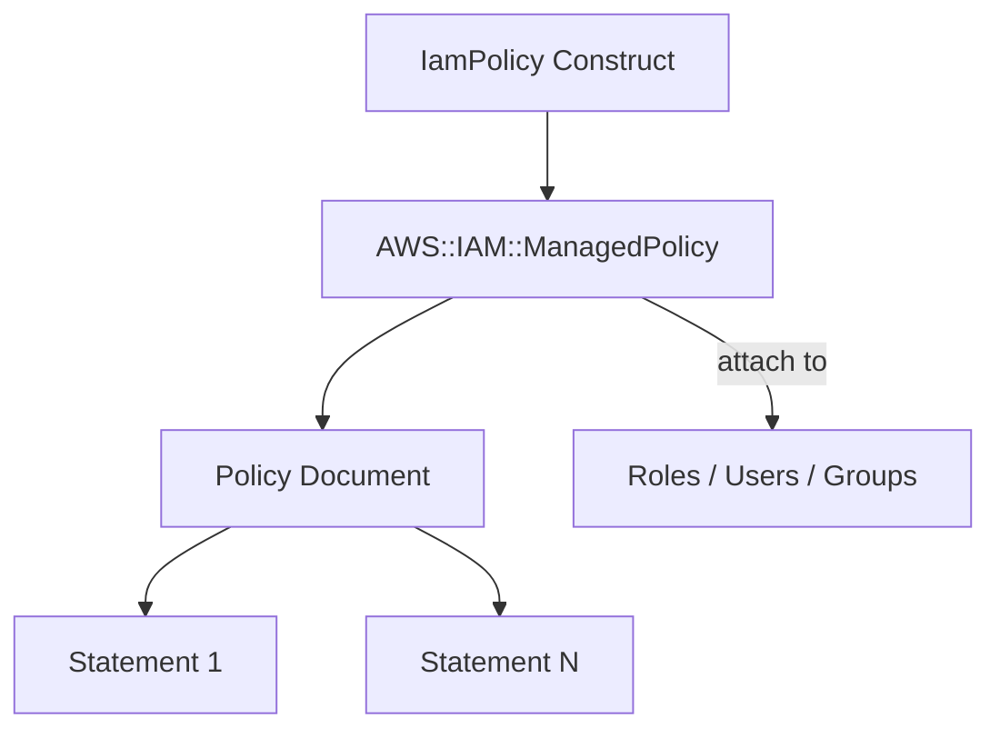

# @sevenpico/cdk-construct-iam-policy

> **Agent Context**: Before implementing this spec, read [`spec/AGENT-CONTEXT.md`](./AGENT-CONTEXT.md) for the full project context, functional architecture pattern, JSII constraints, and README generation requirements.

## Dependencies
- `@sevenpico/cdk-context` — **must be implemented first**

## Package
`@sevenpico/cdk-construct-iam-policy`
Directory: `packages/cdk-construct-iam-policy`

## Source Terraform Module
https://github.com/SevenPicoforks/terraform-aws-iam-policy

## Purpose
Produces an IAM policy document from a map of policy statements and optionally provisions it as a managed IAM policy in AWS. Supports merging multiple source documents, override documents, and fetching a policy from a remote URL.

---

## CDK Imports
```typescript
import { aws_iam as iam } from 'aws-cdk-lib';
```

## Props Interface (JSII-exported)

```typescript
import { Context } from '@sevenpico/cdk-context';

export interface IamPolicyStatement {
  readonly sid?: string;
  readonly effect?: string;           // 'Allow' | 'Deny'. Default: 'Allow'
  readonly actions?: string[];
  readonly notActions?: string[];
  readonly resources?: string[];
  readonly notResources?: string[];
  readonly principals?: Record<string, string[]>;
  readonly notPrincipals?: Record<string, string[]>;
  readonly conditions?: Record<string, Record<string, string[]>>;
}

export interface IamPolicyProps {
  readonly context: Context;

  /**
   * Map of SID to policy statement definition.
   * Used to construct the policy document.
   */
  readonly policyStatements?: Record<string, IamPolicyStatement>;

  /** List of IAM policy document JSON strings to use as source documents */
  readonly sourcePolicyDocuments?: string[];

  /**
   * List of IAM policy document JSON strings that override source documents
   * when statement SIDs match.
   */
  readonly overridePolicyDocuments?: string[];

  /** Policy description */
  readonly description?: string;

  /**
   * If true, creates the IAM managed policy resource in AWS.
   * If false, only the policy document JSON is available via the `json` property.
   * Default: false
   */
  readonly iamPolicyEnabled?: boolean;

  /** Policy document ID */
  readonly iamPolicyId?: string;

  /**
   * URL to fetch an IAM policy JSON document from.
   * The fetched document is used as the source document.
   * NOTE: URL fetching must be done outside this construct; pass the fetched JSON via sourcePolicyDocuments.
   */
  readonly sourceJsonUrl?: string;
}
```

---

## Pure Functions (`src/iam-policy-fns.ts`)

```typescript
import { aws_iam as iam } from 'aws-cdk-lib';
import { Context, contextId } from '@sevenpico/cdk-context';

export const buildPolicyStatement = (sid: string, stmt: IamPolicyStatement): iam.PolicyStatement => {
  const s = new iam.PolicyStatement({
    sid,
    effect: stmt.effect === 'Deny' ? iam.Effect.DENY : iam.Effect.ALLOW,
    actions:      stmt.actions,
    notActions:   stmt.notActions,
    resources:    stmt.resources,
    notResources: stmt.notResources,
  });

  Object.entries(stmt.principals ?? {}).forEach(([type, ids]) => {
    ids.forEach(id => s.addPrincipals(buildPrincipal(type, id)));
  });

  Object.entries(stmt.notPrincipals ?? {}).forEach(([type, ids]) => {
    ids.forEach(id => s.addNotPrincipals(buildPrincipal(type, id)));
  });

  Object.entries(stmt.conditions ?? {}).forEach(([test, vars]) => {
    Object.entries(vars).forEach(([variable, values]) => {
      s.addCondition(test, { [variable]: values });
    });
  });

  return s;
};

export const buildPolicyDocument = (props: IamPolicyProps): iam.PolicyDocument => {
  const statementStatements = Object.entries(props.policyStatements ?? {})
    .map(([sid, stmt]) => buildPolicyStatement(sid, stmt));

  const sourceStatements = (props.sourcePolicyDocuments ?? [])
    .flatMap(doc => iam.PolicyDocument.fromJson(JSON.parse(doc)).statements);

  const overrideStatements = (props.overridePolicyDocuments ?? [])
    .flatMap(doc => iam.PolicyDocument.fromJson(JSON.parse(doc)).statements);

  const allStatements = mergeStatements(
    [...sourceStatements, ...statementStatements],
    overrideStatements
  );

  return new iam.PolicyDocument({
    assignSids: !!(props.iamPolicyId),
    statements: allStatements,
  });
};

/**
 * Merge override statements into source statements by SID.
 * Overrides replace source statements with matching SIDs; others are appended.
 */
export const mergeStatements = (
  source: iam.PolicyStatement[],
  overrides: iam.PolicyStatement[]
): iam.PolicyStatement[] => {
  const overrideSids = new Set(overrides.map(s => s.sid).filter(Boolean));
  return [
    ...source.filter(s => !overrideSids.has(s.sid ?? '')),
    ...overrides,
  ];
};

export const managedPolicyProps = (ctx: Context, props: IamPolicyProps, doc: iam.PolicyDocument): iam.ManagedPolicyProps => ({
  managedPolicyName: contextId(ctx),
  description:       props.description,
  document:          doc,
});

const buildPrincipal = (type: string, id: string): iam.IPrincipal => {
  switch (type) {
    case 'Service':   return new iam.ServicePrincipal(id);
    case 'AWS':       return new iam.ArnPrincipal(id);
    case 'Federated': return new iam.FederatedPrincipal(id, {});
    default:          return new iam.ArnPrincipal(id);
  }
};
```

---

## Construct Class (`src/iam-policy.ts`)

```typescript
export class IamPolicy extends Construct {
  /** The computed IAM policy document as a JSON string. Always available (even when iamPolicyEnabled = false). */
  public readonly json: string;

  /** The created IAM managed policy. Only available when iamPolicyEnabled = true and context.enabled = true. */
  public readonly policy?: iam.ManagedPolicy;

  constructor(scope: Construct, id: string, props: IamPolicyProps) {
    super(scope, id);

    // Policy document is always computed (even when disabled)
    const doc = buildPolicyDocument(props);
    this.json = JSON.stringify(doc.toJSON());

    if (!isEnabled(props.context)) return;
    if (!props.iamPolicyEnabled) return;

    this.policy = new iam.ManagedPolicy(this, 'Policy', managedPolicyProps(props.context, props, doc));

    Object.entries(contextTags(props.context)).forEach(([k, v]) => Tags.of(this).add(k, v));
  }
}
```

---

## Public Properties

| Property | Type | Description |
|----------|------|-------------|
| `json` | `string` | Policy document as JSON string. Always computed. |
| `policy` | `iam.ManagedPolicy \| undefined` | Created managed policy (only when `iamPolicyEnabled = true` and enabled) |

---

## Context Usage

| Context Field | Usage |
|---------------|-------|
| `context.id` | Managed policy name |
| `context.tags` | Applied to managed policy resource |
| `context.enabled` | If false, managed policy not created (but `json` is still computed) |

---

## Notes on `sourceJsonUrl`

The Terraform module fetches policies from URLs via `data.http`. In CDK, HTTP fetches cannot happen at synth time in a pure function. The recommended approach:
- Fetch the JSON externally (e.g., in the CDK app before instantiating the construct)
- Pass the fetched JSON string via `sourcePolicyDocuments`
- Document `sourceJsonUrl` in the props interface as a hint to callers only (not used internally)

---

## BDD Tests

### Feature: Policy Naming

**Scenario: Policy name uses context ID**
- **Given** a context with namespace `7p`, stage `prod`, name `s3-read`
- **When** an `IamPolicy` construct is created
- **Then** an `AWS::IAM::ManagedPolicy` resource exists with `ManagedPolicyName: '7p-prod-s3-read'`

### Feature: Policy Statements

**Scenario: Policy statements added to managed policy**
- **Given** `statements: [{ actions: ['s3:GetObject'], resources: ['*'], effect: 'Allow' }]`
- **When** an `IamPolicy` construct is created
- **Then** the managed policy document contains the specified statement

**Scenario: Multiple statements combined in policy**
- **Given** two policy statement objects
- **When** an `IamPolicy` construct is created
- **Then** the managed policy document contains both statements

### Feature: Tagging

**Scenario: Context tags applied to policy**
- **Given** a context with tags
- **When** an `IamPolicy` construct is created
- **Then** the IAM managed policy has those tags

### Feature: Disabled Construct

**Scenario: No resources created when context is disabled**
- **Given** a context with `enabled: false`
- **When** an `IamPolicy` construct is created
- **Then** no `AWS::IAM::ManagedPolicy` resources exist in the stack

## README

Generate a `README.md` following the template in [`spec/AGENT-CONTEXT.md`](./AGENT-CONTEXT.md#readme-generation-requirement).

The Mermaid diagram should show:


