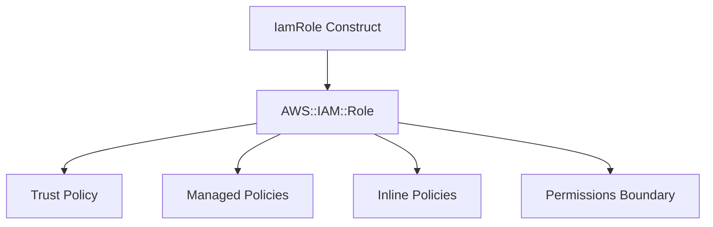

# @sevenpico/cdk-construct-iam-role

> **Agent Context**: Before implementing this spec, read [`spec/AGENT-CONTEXT.md`](./AGENT-CONTEXT.md) for the full project context, functional architecture pattern, JSII constraints, and README generation requirements.

## Dependencies
- `@sevenpico/cdk-context` — **must be implemented first**

## Package
`@sevenpico/cdk-construct-iam-role`
Directory: `packages/cdk-construct-iam-role`

## Source Terraform Module
https://github.com/SevenPicoforks/terraform-aws-iam-role

## Purpose
Provisions an IAM Role with configurable trust policy (principals), inline policies, managed policy attachments, optional permissions boundary, and optional EC2 instance profile.

---

## CDK Imports
```typescript
import { aws_iam as iam } from 'aws-cdk-lib';
```

## Props Interface (JSII-exported)

```typescript
import { Context } from '@sevenpico/cdk-context';

export interface IamPrincipalConfig {
  /** Principal type: 'Service' | 'AWS' | 'Federated' */
  readonly type: string;
  /** List of ARNs or service identifiers */
  readonly identifiers: string[];
}

export interface IamAssumeRoleCondition {
  readonly test: string;
  readonly variable: string;
  readonly values: string[];
}

export interface IamRoleProps {
  readonly context: Context;

  /** Description of the IAM role. Required. */
  readonly roleDescription: string;

  /**
   * Map of principal type to list of identifiers for the trust policy.
   * Key: principal type ('Service', 'AWS', 'Federated')
   * Value: list of identifiers
   * Example: { Service: ['lambda.amazonaws.com'] }
   */
  readonly principals?: Record<string, string[]>;

  /** Custom assume role policy document JSON. Overrides principals if provided. */
  readonly assumeRolePolicyDocumentOverride?: string;

  /** List of IAM policy document JSON strings to merge into the role policy */
  readonly policyDocuments?: string[];

  /** Description of the inline policy created from policyDocuments */
  readonly policyDescription?: string;

  /** Set of managed policy ARNs to attach to the role */
  readonly managedPolicyArns?: string[];

  /** Maximum session duration in seconds. Default: 3600 */
  readonly maxSessionDuration?: number;

  /** ARN of permissions boundary policy */
  readonly permissionsBoundary?: string;

  /** IAM path. Default: '/' */
  readonly path?: string;

  /** If true, use full context ID as role name. If false, use context.name. Default: true */
  readonly useFullname?: boolean;

  /** Actions allowed in the assume role policy. Default: ['sts:AssumeRole', 'sts:TagSession'] */
  readonly assumeRoleActions?: string[];

  /** Conditions for the assume role policy */
  readonly assumeRoleConditions?: IamAssumeRoleCondition[];

  /** Create an EC2 instance profile for this role. Default: false */
  readonly instanceProfileEnabled?: boolean;

  /**
   * Map of inline policy name to JSON policy document string.
   * Allows multiple named inline policies.
   */
  readonly inlinePolicies?: Record<string, string>;

  /** Whether to include tags on IAM roles and policies. Default: true */
  readonly tagsEnabled?: boolean;
}
```

---

## Pure Functions (`src/iam-role-fns.ts`)

```typescript
import { aws_iam as iam } from 'aws-cdk-lib';
import { Context, contextId } from '@sevenpico/cdk-context';

export const roleName = (ctx: Context, props: IamRoleProps): string =>
  (props.useFullname ?? true) ? contextId(ctx) : ctx.name;

export const buildTrustPolicy = (props: IamRoleProps): iam.PolicyDocument => {
  if (props.assumeRolePolicyDocumentOverride) {
    return iam.PolicyDocument.fromJson(JSON.parse(props.assumeRolePolicyDocumentOverride));
  }

  const principals = Object.entries(props.principals ?? {}).flatMap(([type, ids]) =>
    ids.map(id => buildIamPrincipal(type, id))
  );

  const statement = new iam.PolicyStatement({
    actions: props.assumeRoleActions ?? ['sts:AssumeRole', 'sts:TagSession'],
    principals,
  });

  (props.assumeRoleConditions ?? []).forEach(c =>
    statement.addCondition(c.test, { [c.variable]: c.values })
  );

  return new iam.PolicyDocument({ statements: [statement] });
};

export const buildIamPrincipal = (type: string, identifier: string): iam.IPrincipal => {
  switch (type) {
    case 'Service':   return new iam.ServicePrincipal(identifier);
    case 'AWS':       return new iam.ArnPrincipal(identifier);
    case 'Federated': return new iam.FederatedPrincipal(identifier, {});
    default:          return new iam.ArnPrincipal(identifier);
  }
};

export const mergePolicyDocuments = (docs: string[]): iam.PolicyDocument | undefined => {
  if (!docs || docs.length === 0) return undefined;
  const statements = docs.flatMap(doc =>
    iam.PolicyDocument.fromJson(JSON.parse(doc)).statements
  );
  return new iam.PolicyDocument({ statements });
};

export const iamRoleProps = (ctx: Context, props: IamRoleProps): iam.RoleProps => ({
  roleName:             roleName(ctx, props),
  description:          props.roleDescription,
  assumedBy:            new iam.CompositePrincipal(
    ...buildTrustPolicy(props).statements[0]?.principals ?? [new iam.AccountRootPrincipal()]
  ),
  // NOTE: managedPolicies and inlinePolicies attached imperatively in constructor
  maxSessionDuration:   Duration.seconds(props.maxSessionDuration ?? 3600),
  permissionsBoundary:  props.permissionsBoundary
    ? iam.ManagedPolicy.fromManagedPolicyArn(/* scope */, 'Boundary', props.permissionsBoundary)
    : undefined,
  path:                 props.path ?? '/',
});
```

> **Note:** The trust policy must be applied via `role.assumeRolePolicy?.addStatements()` after creation since CDK's `RoleProps.assumedBy` requires a single principal. Use `buildTrustPolicy` to produce the document and apply it via escape hatch or the role's `assumeRolePolicy` property.

---

## Construct Class (`src/iam-role.ts`)

```typescript
export class IamRole extends Construct {
  public readonly role?: iam.Role;
  public readonly instanceProfile?: iam.CfnInstanceProfile;

  constructor(scope: Construct, id: string, props: IamRoleProps) {
    super(scope, id);
    if (!isEnabled(props.context)) return;

    // Build trust policy
    const trustPolicy = buildTrustPolicy(props);

    // Create role with a single placeholder principal, then replace with full trust policy
    this.role = new iam.Role(this, 'Role', {
      roleName:    roleName(props.context, props),
      description: props.roleDescription,
      assumedBy:   new iam.AccountRootPrincipal(),  // placeholder
      maxSessionDuration: Duration.seconds(props.maxSessionDuration ?? 3600),
      permissionsBoundary: props.permissionsBoundary
        ? iam.ManagedPolicy.fromManagedPolicyArn(this, 'Boundary', props.permissionsBoundary)
        : undefined,
      path: props.path ?? '/',
    });

    // Replace assume role policy with full trust document
    const cfnRole = this.role.node.defaultChild as iam.CfnRole;
    cfnRole.assumeRolePolicyDocument = trustPolicy.toJSON();

    // Attach managed policies
    (props.managedPolicyArns ?? []).forEach((arn, i) =>
      this.role!.addManagedPolicy(iam.ManagedPolicy.fromManagedPolicyArn(this, `Managed${i}`, arn))
    );

    // Merge policyDocuments into a single inline policy
    const mergedDoc = mergePolicyDocuments(props.policyDocuments ?? []);
    if (mergedDoc) {
      this.role.attachInlinePolicy(new iam.Policy(this, 'Policy', {
        document:    mergedDoc,
        policyName:  `${contextId(props.context)}-policy`,
      }));
    }

    // Additional named inline policies
    Object.entries(props.inlinePolicies ?? {}).forEach(([name, doc]) => {
      this.role!.attachInlinePolicy(new iam.Policy(this, `InlinePolicy-${name}`, {
        document:   iam.PolicyDocument.fromJson(JSON.parse(doc)),
        policyName: name,
      }));
    });

    // EC2 instance profile
    if (props.instanceProfileEnabled) {
      this.instanceProfile = new iam.CfnInstanceProfile(this, 'InstanceProfile', {
        roles: [this.role.roleName],
        instanceProfileName: contextId(props.context),
      });
    }

    if (props.tagsEnabled !== false) {
      Object.entries(contextTags(props.context)).forEach(([k, v]) => Tags.of(this).add(k, v));
    }
  }
}
```

---

## Public Properties

| Property | Type | Description |
|----------|------|-------------|
| `role` | `iam.Role \| undefined` | The IAM role |
| `instanceProfile` | `iam.CfnInstanceProfile \| undefined` | EC2 instance profile (if enabled) |

---

## Context Usage

| Context Field | Usage |
|---------------|-------|
| `context.id` | Role name (when `useFullname = true`) and policy name |
| `context.name` | Role name (when `useFullname = false`) |
| `context.tags` | Applied when `tagsEnabled = true` (default) |
| `context.enabled` | If false, no resources created |

---

## BDD Tests

### Feature: Role Naming

**Scenario: Role name uses context ID**
- **Given** a context with namespace `7p`, stage `prod`, name `lambda`
- **When** an `IamRole` construct is created
- **Then** an `AWS::IAM::Role` resource exists with `RoleName: '7p-prod-lambda'`

### Feature: Trust Policy

**Scenario: Lambda service principal in assume role policy**
- **Given** `assumedBy: [{ type: 'Service', identifier: 'lambda.amazonaws.com' }]`
- **When** an `IamRole` construct is created
- **Then** the role's trust policy allows `lambda.amazonaws.com` to assume it

**Scenario: AWS account principal in assume role policy**
- **Given** `assumedBy: [{ type: 'AWS', identifier: 'arn:aws:iam::123456789:root' }]`
- **When** an `IamRole` construct is created
- **Then** the role's trust policy allows the specified account ARN

### Feature: Managed Policies

**Scenario: Managed policy attached when policyArns provided**
- **Given** `policyArns: ['arn:aws:iam::aws:policy/ReadOnlyAccess']`
- **When** an `IamRole` construct is created
- **Then** the role has the managed policy attached

### Feature: Inline Policies

**Scenario: Inline policy added when inlinePolicies provided**
- **Given** a valid inline policy JSON document
- **When** an `IamRole` construct is created
- **Then** an inline policy is attached to the role

### Feature: Tagging

**Scenario: Context tags applied to role**
- **Given** a context with tags
- **When** an `IamRole` construct is created
- **Then** the IAM role has those tags

### Feature: Disabled Construct

**Scenario: No resources created when context is disabled**
- **Given** a context with `enabled: false`
- **When** an `IamRole` construct is created
- **Then** no `AWS::IAM::Role` resources exist in the stack

## README

Generate a `README.md` following the template in [`spec/AGENT-CONTEXT.md`](./AGENT-CONTEXT.md#readme-generation-requirement).

The Mermaid diagram should show:


