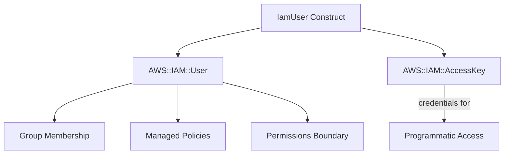

# @sevenpico/cdk-construct-iam-user

> **Agent Context**: Before implementing this spec, read [`spec/AGENT-CONTEXT.md`](./AGENT-CONTEXT.md) for the full project context, functional architecture pattern, JSII constraints, and README generation requirements.

## Dependencies
- `@sevenpico/cdk-context` — **must be implemented first**

## Package
`@sevenpico/cdk-construct-iam-user`
Directory: `packages/cdk-construct-iam-user`

## Source Terraform Module
https://github.com/SevenPicoforks/terraform-aws-iam-user

## Purpose
Provisions an IAM user with optional login profile (console access), optional group membership, optional permissions boundary, and configurable password settings.

---

## CDK Imports
```typescript
import { aws_iam as iam } from 'aws-cdk-lib';
```

## Props Interface (JSII-exported)

```typescript
import { Context } from '@sevenpico/cdk-context';

export interface IamUserProps {
  readonly context: Context;

  /** IAM username. Recommendation: use email address. Required. */
  readonly userName: string;

  /** IAM path. Default: '/' */
  readonly path?: string;

  /** List of IAM group names to add this user to */
  readonly groups?: string[];

  /** ARN of permissions boundary policy */
  readonly permissionsBoundary?: string;

  /**
   * Force destroy user even if it has non-Terraform-managed access keys,
   * login profile, or MFA devices. Default: false
   */
  readonly forceDestroy?: boolean;

  /**
   * Enable console login profile creation.
   * When true, a login profile with a generated password is created.
   * Default: true
   */
  readonly loginProfileEnabled?: boolean;

  /**
   * Base64-encoded PGP public key or keybase username (format: keybase:username)
   * for encrypting the generated password. Required when loginProfileEnabled = true.
   */
  readonly pgpKey?: string;

  /** Require password reset on first login. Default: true */
  readonly passwordResetRequired?: boolean;

  /** Length of generated password. Default: 24 */
  readonly passwordLength?: number;
}
```

---

## Pure Functions (`src/iam-user-fns.ts`)

```typescript
import { aws_iam as iam } from 'aws-cdk-lib';
import { Context, contextId } from '@sevenpico/cdk-context';

export const iamUserProps = (ctx: Context, props: IamUserProps): iam.UserProps => ({
  userName:             props.userName,
  path:                 props.path ?? '/',
  permissionsBoundary:  props.permissionsBoundary
    ? iam.ManagedPolicy.fromManagedPolicyArn(/* scope */, 'Boundary', props.permissionsBoundary)
    : undefined,
  // groups added imperatively in constructor
  // login profile: CDK L2 User has limited login profile support; use CfnUserToGroupAddition and CfnLoginProfile
});

/**
 * CDK's iam.User does not directly expose a login profile with PGP-encrypted passwords.
 * Use CfnUser or CfnLoginProfile (L1) to set the login profile password.
 * The PGP key encryption for the generated password is outside CDK's native scope;
 * implement via a Custom Resource or note that password delivery must be handled externally.
 */
export const loginProfileProps = (props: IamUserProps): iam.CfnUser.LoginProfileProperty | undefined => {
  if (!props.loginProfileEnabled && props.loginProfileEnabled !== undefined) return undefined;
  // Default: enabled
  return {
    password:              generatePlaceholderPassword(props.passwordLength ?? 24),
    passwordResetRequired: props.passwordResetRequired ?? true,
  };
};

const generatePlaceholderPassword = (length: number): string => {
  // This must be a SecretValue in practice; use a generated secret or SSM parameter.
  // In CDK, use SecretValue.unsafePlainText only for testing.
  // For production, integrate with SecretsManager or SSM to generate and store the password.
  return `PLACEHOLDER_${length}`;
};
```

> **Important CDK Note:** CDK's `iam.User` L2 construct does not support PGP-encrypted login profile passwords natively. The Terraform module uses `aws_iam_user_login_profile` which generates and PGP-encrypts a password. In CDK:
> - Use `aws_iam.CfnUser` (L1) with a `loginProfile` property
> - Password generation should use AWS Secrets Manager or SSM Parameter Store
> - PGP encryption of the initial password is not a CDK concern — document that password delivery should use Keybase or a similar mechanism
> - The `pgpKey` prop is preserved for documentation/operational purposes

---

## Construct Class (`src/iam-user.ts`)

```typescript
export class IamUser extends Construct {
  public readonly user?: iam.User;

  constructor(scope: Construct, id: string, props: IamUserProps) {
    super(scope, id);
    if (!isEnabled(props.context)) return;

    this.user = new iam.User(this, 'User', {
      userName:    props.userName,
      path:        props.path ?? '/',
      permissionsBoundary: props.permissionsBoundary
        ? iam.ManagedPolicy.fromManagedPolicyArn(this, 'Boundary', props.permissionsBoundary)
        : undefined,
    });

    // Group membership
    (props.groups ?? []).forEach((groupName, i) => {
      const group = iam.Group.fromGroupName(this, `Group${i}`, groupName);
      this.user!.addToGroup(group);
    });

    // Login profile (L1 override for password settings)
    if (props.loginProfileEnabled !== false) {
      const cfnUser = this.user.node.defaultChild as iam.CfnUser;
      cfnUser.loginProfile = {
        passwordResetRequired: props.passwordResetRequired ?? true,
        // password must be set via SecretsManager integration or custom resource
        // not set here — operator must set via console or AWS CLI post-deploy
      };
    }

    Object.entries(contextTags(props.context)).forEach(([k, v]) => Tags.of(this).add(k, v));
  }
}
```

---

## Public Properties

| Property | Type | Description |
|----------|------|-------------|
| `user` | `iam.User \| undefined` | The IAM user |

---

## Context Usage

| Context Field | Usage |
|---------------|-------|
| `context.tags` | Applied to the user |
| `context.enabled` | If false, no resources created |

> Note: The `userName` is explicitly provided via props rather than derived from `context.id`. This matches the Terraform module's explicit `user_name` variable and allows email-address usernames that would be invalid as context IDs.

---

## BDD Tests

### Feature: User Naming

**Scenario: User name uses context ID**
- **Given** a context with namespace `7p`, stage `prod`, name `ci`
- **When** an `IamUser` construct is created
- **Then** an `AWS::IAM::User` resource exists with `UserName: '7p-prod-ci'`

### Feature: Access Keys

**Scenario: Access key created by default**
- **Given** no `createAccessKey` prop
- **When** an `IamUser` construct is created
- **Then** an `AWS::IAM::AccessKey` resource exists

**Scenario: No access key when createAccessKey is false**
- **Given** `createAccessKey: false`
- **When** an `IamUser` construct is created
- **Then** no `AWS::IAM::AccessKey` resource exists

### Feature: Group Membership

**Scenario: User added to group when groupNames provided**
- **Given** `groupNames: ['developers']`
- **When** an `IamUser` construct is created
- **Then** the user is a member of the `developers` group

### Feature: Permissions Boundary

**Scenario: Permissions boundary attached when provided**
- **Given** `permissionsBoundary: 'arn:aws:iam::...:policy/Boundary'`
- **When** an `IamUser` construct is created
- **Then** the user has the specified permissions boundary

### Feature: Tagging

**Scenario: Context tags applied to user**
- **Given** a context with tags
- **When** an `IamUser` construct is created
- **Then** the IAM user has those tags

### Feature: Disabled Construct

**Scenario: No resources created when context is disabled**
- **Given** a context with `enabled: false`
- **When** an `IamUser` construct is created
- **Then** no `AWS::IAM::User` resources exist in the stack

## README

Generate a `README.md` following the template in [`spec/AGENT-CONTEXT.md`](./AGENT-CONTEXT.md#readme-generation-requirement).

The Mermaid diagram should show:


