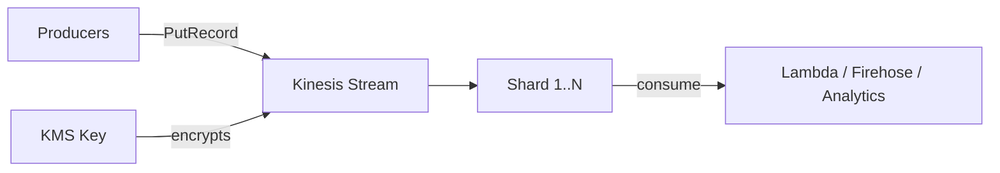

# @sevenpico/cdk-construct-kinesis-stream

> **Agent Context**: Before implementing this spec, read [`spec/AGENT-CONTEXT.md`](./AGENT-CONTEXT.md) for the full project context, functional architecture pattern, JSII constraints, and README generation requirements.

## Dependencies
- `@sevenpico/cdk-context` — **must be implemented first**

## Package
`@sevenpico/cdk-construct-kinesis-stream`
Directory: `packages/cdk-construct-kinesis-stream`

## Source Terraform Module
https://github.com/SevenPico/terraform-aws-kinesis-stream

## Purpose
Provisions an AWS Kinesis Data Stream with configurable capacity mode (PROVISIONED or ON_DEMAND), encryption, shard-level CloudWatch metrics, and optional registered consumers.

---

## CDK Imports
```typescript
import { aws_kinesis as kinesis, aws_kms as kms } from 'aws-cdk-lib';
```

## Props Interface (JSII-exported)

```typescript
import { Context } from '@sevenpico/cdk-context';

export interface KinesisStreamProps {
  readonly context: Context;

  /** Number of shards. Ignored in ON_DEMAND mode. Default: 1 */
  readonly shardCount?: number;

  /** Data retention in hours (24–168). Default: 24 */
  readonly retentionPeriodHours?: number;

  /** Shard-level CloudWatch metrics to enable. Default: ['IncomingBytes', 'OutgoingBytes'] */
  readonly shardLevelMetrics?: string[];

  /** Deregister consumers before stream deletion. Default: true */
  readonly enforceConsumerDeletion?: boolean;

  /** Encryption type. 'KMS' | 'NONE'. Default: 'KMS' */
  readonly encryptionType?: string;

  /** KMS key ID or alias. Default: 'alias/aws/kinesis' */
  readonly kmsKeyId?: string;

  /** Stream capacity mode. 'PROVISIONED' | 'ON_DEMAND'. Default: 'PROVISIONED' */
  readonly streamMode?: string;

  /** Number of registered stream consumers to create. Default: 0 */
  readonly consumerCount?: number;
}
```

---

## Pure Functions (`src/kinesis-stream-fns.ts`)

```typescript
import { aws_kinesis as kinesis, Duration } from 'aws-cdk-lib';
import { Context, contextId } from '@sevenpico/cdk-context';

export const streamMode = (props: KinesisStreamProps): kinesis.StreamMode =>
  props.streamMode === 'ON_DEMAND'
    ? kinesis.StreamMode.ON_DEMAND
    : kinesis.StreamMode.PROVISIONED;

export const streamEncryption = (props: KinesisStreamProps): kinesis.StreamEncryption =>
  props.encryptionType === 'NONE'
    ? kinesis.StreamEncryption.UNENCRYPTED
    : kinesis.StreamEncryption.KMS;

export const kinesisStreamProps = (ctx: Context, props: KinesisStreamProps): kinesis.StreamProps => ({
  streamName:         contextId(ctx),
  shardCount:         streamMode(props) === kinesis.StreamMode.PROVISIONED
                        ? (props.shardCount ?? 1)
                        : undefined,
  streamMode:         streamMode(props),
  retentionPeriod:    Duration.hours(props.retentionPeriodHours ?? 24),
  encryption:         streamEncryption(props),
  // encryptionKey: resolved in constructor
});

export const shardLevelMetrics = (props: KinesisStreamProps): kinesis.MetricsWithDefaultValues[] =>
  (props.shardLevelMetrics ?? ['IncomingBytes', 'OutgoingBytes'])
    .map(m => mapShardMetric(m))
    .filter(Boolean) as kinesis.MetricsWithDefaultValues[];

const mapShardMetric = (m: string): kinesis.MetricsWithDefaultValues | undefined => {
  const map: Record<string, kinesis.MetricsWithDefaultValues> = {
    IncomingBytes:          kinesis.MetricsWithDefaultValues.INCOMING_BYTES,
    OutgoingBytes:          kinesis.MetricsWithDefaultValues.OUTGOING_BYTES,
    IncomingRecords:        kinesis.MetricsWithDefaultValues.INCOMING_RECORDS,
    OutgoingRecords:        kinesis.MetricsWithDefaultValues.OUTGOING_RECORDS,
    WriteProvisionedThroughputExceeded: kinesis.MetricsWithDefaultValues.WRITE_PROVISIONED_THROUGHPUT_EXCEEDED,
    ReadProvisionedThroughputExceeded:  kinesis.MetricsWithDefaultValues.READ_PROVISIONED_THROUGHPUT_EXCEEDED,
    IteratorAgeMilliseconds: kinesis.MetricsWithDefaultValues.ITERATOR_AGE_MILLISECONDS,
  };
  return map[m];
};
```

---

## Construct Class (`src/kinesis-stream.ts`)

```typescript
export class KinesisStream extends Construct {
  public readonly stream?: kinesis.Stream;

  constructor(scope: Construct, id: string, props: KinesisStreamProps) {
    super(scope, id);
    if (!isEnabled(props.context)) return;

    const encKey = props.encryptionType !== 'NONE'
      ? kms.Key.fromLookup(this, 'Key', {
          aliasName: (props.kmsKeyId ?? 'alias/aws/kinesis').replace('alias/', ''),
        })
      : undefined;

    this.stream = new kinesis.Stream(this, 'Stream', {
      ...kinesisStreamProps(props.context, props),
      encryptionKey: encKey,
    });

    // Shard-level metrics
    shardLevelMetrics(props).forEach(m =>
      (this.stream!.node.defaultChild as kinesis.CfnStream)
        // Apply via escape hatch if needed for enhanced metrics
    );

    // Registered consumers
    for (let i = 0; i < (props.consumerCount ?? 0); i++) {
      new kinesis.CfnStreamConsumer(this, `Consumer${i}`, {
        streamArn:     this.stream.streamArn,
        consumerName:  `${contextId(props.context)}-consumer-${i}`,
      });
    }

    Object.entries(contextTags(props.context)).forEach(([k, v]) => Tags.of(this).add(k, v));
  }
}
```

---

## Public Properties

| Property | Type | Description |
|----------|------|-------------|
| `stream` | `kinesis.Stream \| undefined` | The Kinesis stream |

---

## Context Usage

| Context Field | Usage |
|---------------|-------|
| `context.id` | Stream name and consumer names |
| `context.tags` | Applied to the stream |
| `context.enabled` | If false, no resources created |

---

## BDD Tests

### Feature: Stream Naming

**Scenario: Stream uses context ID as name**
- **Given** a context with namespace `7p`, stage `prod`, name `events`
- **When** a `KinesisStream` is created
- **Then** the Kinesis stream name is `7p-prod-events`

### Feature: Stream Mode

**Scenario: Provisioned mode with 1 shard by default**
- **Given** a context with no `streamMode` prop
- **When** a `KinesisStream` is created
- **Then** the stream mode is `PROVISIONED` with shard count `1`

**Scenario: ON_DEMAND mode ignores shard count**
- **Given** `streamMode: 'ON_DEMAND'` and `shardCount: 10`
- **When** a `KinesisStream` is created
- **Then** the stream mode is `ON_DEMAND` and no shard count is set

### Feature: Encryption

**Scenario: KMS encryption enabled by default**
- **Given** a context with no `encryptionType` prop
- **When** a `KinesisStream` is created
- **Then** the stream encryption type is `KMS`

**Scenario: No encryption when NONE specified**
- **Given** `encryptionType: 'NONE'`
- **When** a `KinesisStream` is created
- **Then** the stream has no KMS encryption

### Feature: Consumers

**Scenario: Registered consumers created when consumerCount > 0**
- **Given** `consumerCount: 2`
- **When** a `KinesisStream` is created
- **Then** two `AWS::Kinesis::StreamConsumer` resources exist

### Feature: Disabled Construct

**Scenario: No resources created when context is disabled**
- **Given** a context with `enabled: false`
- **When** a `KinesisStream` is created
- **Then** no `AWS::Kinesis::Stream` resources exist in the stack

## README

Generate a `README.md` following the template in [`spec/AGENT-CONTEXT.md`](./AGENT-CONTEXT.md#readme-generation-requirement).

The Mermaid diagram should show:


