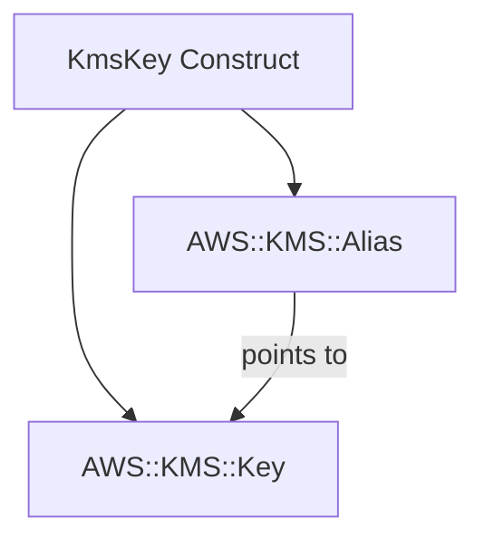

# @sevenpico/cdk-construct-kms-key

> **Agent Context**: Before implementing this spec, read [`spec/AGENT-CONTEXT.md`](./AGENT-CONTEXT.md) for the full project context, functional architecture pattern, JSII constraints, and README generation requirements.

## Dependencies
- `@sevenpico/cdk-context` — **must be implemented first**

## Package
`@sevenpico/cdk-construct-kms-key`
Directory: `packages/cdk-construct-kms-key`

## Source Terraform Module
https://github.com/SevenPicoforks/terraform-aws-kms-key

## Purpose
Provisions a KMS Customer Master Key with an alias. The alias defaults to `alias/{context.id}` if not explicitly provided.

---

## CDK Imports
```typescript
import { aws_kms as kms, RemovalPolicy } from 'aws-cdk-lib';
```

## Props Interface (JSII-exported)

```typescript
import { Context } from '@sevenpico/cdk-context';

export interface KmsKeyProps {
  readonly context: Context;

  /** Description shown in the AWS console. Default: context.id */
  readonly description?: string;

  /** Alias name. Must start with 'alias/'. Default: 'alias/{context.id}' */
  readonly alias?: string;

  /** Days before key is deleted after destroy. Min 7, max 30. Default: 10 */
  readonly pendingWindowInDays?: number;

  /** Enable automatic annual key rotation. Default: true */
  readonly enableKeyRotation?: boolean;

  /** Key policy JSON document. Default: AWS-managed default policy */
  readonly policy?: string;

  /** Key usage. Default: 'ENCRYPT_DECRYPT' */
  readonly keyUsage?: string;

  /** Key spec. Default: 'SYMMETRIC_DEFAULT' */
  readonly keySpec?: string;

  /** Create a multi-region primary key. Default: false */
  readonly multiRegion?: boolean;
}
```

---

## Pure Functions (`src/kms-key-fns.ts`)

```typescript
import { aws_kms as kms } from 'aws-cdk-lib';
import { Context, contextId } from '@sevenpico/cdk-context';
import { KmsKeyProps } from './kms-key-types';

export const kmsKeyProps = (ctx: Context, props: KmsKeyProps): kms.KeyProps => ({
  description:          props.description ?? contextId(ctx),
  enableKeyRotation:    props.enableKeyRotation ?? true,
  pendingWindow:        cdk.Duration.days(props.pendingWindowInDays ?? 10),
  policy:               props.policy ? PolicyDocument.fromJson(JSON.parse(props.policy)) : undefined,
  keyUsage:             (props.keyUsage as kms.KeyUsage) ?? kms.KeyUsage.ENCRYPT_DECRYPT,
  keySpec:              (props.keySpec as kms.KeySpec) ?? kms.KeySpec.SYMMETRIC_DEFAULT,
  multiRegion:          props.multiRegion ?? false,
  removalPolicy:        RemovalPolicy.RETAIN,
});

export const kmsAliasName = (ctx: Context, props: KmsKeyProps): string =>
  props.alias ?? `alias/${contextId(ctx)}`;
```

---

## Construct Class (`src/kms-key.ts`)

```typescript
import { Construct } from 'constructs';
import { Tags } from 'aws-cdk-lib';
import { aws_kms as kms } from 'aws-cdk-lib';
import { Context, contextTags, isEnabled } from '@sevenpico/cdk-context';
import { kmsKeyProps, kmsAliasName } from './kms-key-fns';

export class KmsKey extends Construct {
  public readonly key?: kms.Key;
  public readonly alias?: kms.Alias;

  constructor(scope: Construct, id: string, props: KmsKeyProps) {
    super(scope, id);
    if (!isEnabled(props.context)) return;

    this.key = new kms.Key(this, 'Key', kmsKeyProps(props.context, props));
    this.alias = new kms.Alias(this, 'Alias', {
      aliasName:   kmsAliasName(props.context, props),
      targetKey:   this.key,
    });

    Object.entries(contextTags(props.context)).forEach(([k, v]) => Tags.of(this).add(k, v));
  }
}
```

---

## Public Properties

| Property | Type | Description |
|----------|------|-------------|
| `key` | `kms.Key \| undefined` | The KMS key. Undefined when disabled. |
| `alias` | `kms.Alias \| undefined` | The KMS alias. Undefined when disabled. |

---

## Outputs via Properties

Callers access `construct.key.keyArn`, `construct.key.keyId`, `construct.alias.aliasName`, `construct.alias.aliasArn`.

---

## Context Usage

| Context Field | Usage |
|---------------|-------|
| `context.id` | Key description (default) and alias name: `alias/{id}` |
| `context.tags` | Applied to both key and alias via `Tags.of()` |
| `context.enabled` | If false, no resources are created |

---

## BDD Tests

### Feature: Key Naming

**Scenario: Alias defaults to context ID**
- **Given** a context with namespace `7p`, stage `prod`, name `secrets`
- **When** a `KmsKey` construct is created with no `alias` prop
- **Then** a KMS alias `alias/7p-prod-secrets` exists

**Scenario: Custom alias overrides default**
- **Given** `alias: 'alias/my-custom-key'`
- **When** a `KmsKey` construct is created
- **Then** the KMS alias is `alias/my-custom-key`

### Feature: Key Defaults

**Scenario: Key rotation enabled by default**
- **Given** no `enableKeyRotation` prop
- **When** a `KmsKey` construct is created
- **Then** the KMS key has key rotation enabled

**Scenario: Pending window defaults to 10 days**
- **Given** no `pendingWindowInDays` prop
- **When** a `KmsKey` construct is created
- **Then** the pending deletion window is 10 days

**Scenario: Removal policy is RETAIN**
- **Given** a valid context
- **When** a `KmsKey` construct is created
- **Then** the KMS key has `DeletionPolicy: Retain`

### Feature: Tagging

**Scenario: Context tags applied to key**
- **Given** a context with `tags: { Env: 'prod' }`
- **When** a `KmsKey` construct is created
- **Then** the KMS key resource has the tag `Env: prod`

### Feature: Disabled Construct

**Scenario: No resources created when context is disabled**
- **Given** a context with `enabled: false`
- **When** a `KmsKey` construct is created
- **Then** no `AWS::KMS::Key` resources exist in the stack
- **And** no `AWS::KMS::Alias` resources exist in the stack

## README

Generate a `README.md` following the template in [`spec/AGENT-CONTEXT.md`](./AGENT-CONTEXT.md#readme-generation-requirement).

The Mermaid diagram should show:


