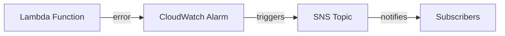

# @sevenpico/cdk-construct-lambda-error-notification

> **Agent Context**: Before implementing this spec, read [`spec/AGENT-CONTEXT.md`](./AGENT-CONTEXT.md) for the full project context, functional architecture pattern, JSII constraints, and README generation requirements.

## Dependencies
- `@sevenpico/cdk-context` — **must be implemented first**
- `@sevenpico/cdk-construct-sqs-queue` — **must be implemented first**

## Package
`@sevenpico/cdk-construct-lambda-error-notification`
Directory: `packages/cdk-construct-lambda-error-notification`

## Source Terraform Module
https://github.com/SevenPico/terraform-aws-lambda-error-notification

## Purpose
Monitors a Lambda function for errors by provisioning a dead-letter SQS queue, two CloudWatch alarms (rate-based and volume-based), and an EventBridge Pipe that automatically re-routes failed messages from the DLQ back to the Lambda for reprocessing.

---

## CDK Imports
```typescript
import {
  aws_cloudwatch as cw,
  aws_cloudwatch_actions as cw_actions,
  aws_sqs as sqs,
  aws_iam as iam,
  aws_logs as logs,
  aws_pipes as pipes,
  Duration,
} from 'aws-cdk-lib';
```

## Props Interface (JSII-exported)

```typescript
import { Context } from '@sevenpico/cdk-context';

export interface SqsKmsConfig {
  readonly keyId: string;
  readonly keyArn: string;
}

export interface LambdaErrorNotificationProps {
  readonly context: Context;

  /** ARN of the Lambda function to monitor. Required. */
  readonly lambdaArn: string;

  /** Name of the Lambda function (used for async event config). Required. */
  readonly lambdaFunctionName: string;

  /** Name of the Lambda execution role (used for DLQ policy attachment). Required. */
  readonly lambdaRoleName: string;

  /** ARN of the SNS topic for the rate alarm notification. Required. */
  readonly rateAlarmSnsTopicArn: string;

  /** ARN of the SNS topic for the volume alarm notification. Required. */
  readonly volumeAlarmSnsTopicArn: string;

  /** CloudWatch alarm evaluation period in seconds. Default: 60 */
  readonly alarmPeriodSeconds?: number;

  /** Data points required to trigger alarm. Default: 1 */
  readonly alarmDatapointsToAlarm?: number;

  /** Number of evaluation periods. Default: 5 */
  readonly alarmEvaluationPeriods?: number;

  /** Custom rate alarm name. Default: derived from context.id */
  readonly rateAlarmName?: string;

  /** Custom volume alarm name. Default: derived from context.id */
  readonly volumeAlarmName?: string;

  /** SQS queue name override. Default: derived from context.id */
  readonly sqsQueueName?: string;

  /** SQS message retention in seconds. Default: 604800 (7 days) */
  readonly sqsMessageRetentionSeconds?: number;

  /** SQS visibility timeout in seconds. Default: 2 */
  readonly sqsVisibilityTimeoutSeconds?: number;

  /** KMS encryption config for the SQS DLQ */
  readonly sqsKmsConfig?: SqsKmsConfig;

  /** KMS key ID for SNS topic encryption (for alarm actions) */
  readonly snsKmsKeyId?: string;

  /** EventBridge Pipe name override. Default: derived from context.id */
  readonly eventbridgePipeName?: string;

  /** Batch size for the EventBridge Pipe. Default: 1 */
  readonly eventbridgePipeBatchSize?: number;

  /** Log level for the EventBridge Pipe. Default: 'ERROR' */
  readonly eventbridgePipeLogLevel?: string;

  /** CloudWatch log retention for the pipe in days. Default: 90 */
  readonly cloudwatchLogRetentionDays?: number;

  /** Input template for the EventBridge Pipe target. Default: '<$.requestPayload>' */
  readonly targetLambdaInputTemplate?: string;

  /** Lambda async config: max event age in seconds. Default: 3600 */
  readonly lambdaAsyncMaxEventAgeSeconds?: number;

  /** Lambda async config: max retry attempts. Default: 2 */
  readonly lambdaAsyncMaxRetryAttempts?: number;
}
```

---

## Pure Functions (`src/lambda-error-notification-fns.ts`)

```typescript
export const dlqContext = (ctx: Context): Context =>
  extendContext(ctx, { attributes: ['dlq'] });

export const rateAlarmName = (ctx: Context, props: LambdaErrorNotificationProps): string =>
  props.rateAlarmName ?? `${contextId(ctx)}-dlq-rate`;

export const volumeAlarmName = (ctx: Context, props: LambdaErrorNotificationProps): string =>
  props.volumeAlarmName ?? `${contextId(ctx)}-dlq-volume`;

export const pipeName = (ctx: Context, props: LambdaErrorNotificationProps): string =>
  props.eventbridgePipeName ?? `${contextId(ctx)}-pipe`;

export const rateAlarmProps = (ctx: Context, props: LambdaErrorNotificationProps, queue: sqs.IQueue): cw.AlarmProps => ({
  alarmName:          rateAlarmName(ctx, props),
  alarmDescription:   `DLQ message rate for Lambda ${props.lambdaFunctionName}`,
  metric:             new cw.MathExpression({
    expression: 'RATE(m1)',
    usingMetrics: { m1: queue.metricApproximateNumberOfMessagesVisible() },
    period: Duration.seconds(props.alarmPeriodSeconds ?? 60),
  }),
  threshold:          0,
  comparisonOperator: cw.ComparisonOperator.GREATER_THAN_THRESHOLD,
  datapointsToAlarm:  props.alarmDatapointsToAlarm ?? 1,
  evaluationPeriods:  props.alarmEvaluationPeriods ?? 5,
  treatMissingData:   cw.TreatMissingData.NOT_BREACHING,
});

export const volumeAlarmProps = (ctx: Context, props: LambdaErrorNotificationProps, queue: sqs.IQueue): cw.AlarmProps => ({
  alarmName:          volumeAlarmName(ctx, props),
  alarmDescription:   `DLQ message count for Lambda ${props.lambdaFunctionName}`,
  metric:             queue.metricApproximateNumberOfMessagesVisible({
    period: Duration.seconds(props.alarmPeriodSeconds ?? 60),
  }),
  threshold:          0,
  comparisonOperator: cw.ComparisonOperator.GREATER_THAN_THRESHOLD,
  datapointsToAlarm:  props.alarmDatapointsToAlarm ?? 1,
  evaluationPeriods:  props.alarmEvaluationPeriods ?? 5,
  treatMissingData:   cw.TreatMissingData.NOT_BREACHING,
});
```

---

## Construct Class (`src/lambda-error-notification.ts`)

```typescript
export class LambdaErrorNotification extends Construct {
  public readonly deadLetterQueue?: sqs.Queue;
  public readonly rateAlarm?: cw.Alarm;
  public readonly volumeAlarm?: cw.Alarm;
  public readonly pipe?: pipes.CfnPipe;

  constructor(scope: Construct, id: string, props: LambdaErrorNotificationProps) {
    super(scope, id);
    if (!isEnabled(props.context)) return;

    // SQS Dead Letter Queue
    const dCtx = dlqContext(props.context);
    this.deadLetterQueue = new sqs.Queue(this, 'Dlq', {
      queueName:         props.sqsQueueName ?? contextId(dCtx),
      retentionPeriod:   Duration.seconds(props.sqsMessageRetentionSeconds ?? 604800),
      visibilityTimeout: Duration.seconds(props.sqsVisibilityTimeoutSeconds ?? 2),
      encryptionMasterKey: props.sqsKmsConfig
        ? kms.Key.fromKeyArn(this, 'DlqKey', props.sqsKmsConfig.keyArn)
        : undefined,
    });

    // Attach SQS send policy to the Lambda execution role
    const lambdaRole = iam.Role.fromRoleName(this, 'LambdaRole', props.lambdaRoleName);
    this.deadLetterQueue.grantSendMessages(lambdaRole);

    // Allow EventBridge service to send to DLQ
    this.deadLetterQueue.addToResourcePolicy(new iam.PolicyStatement({
      principals: [new iam.ServicePrincipal('events.amazonaws.com')],
      actions:    ['sqs:SendMessage'],
      resources:  [this.deadLetterQueue.queueArn],
    }));

    // CloudWatch alarms
    this.rateAlarm = new cw.Alarm(this, 'RateAlarm', rateAlarmProps(props.context, props, this.deadLetterQueue));
    this.rateAlarm.addAlarmAction(new cw_actions.SnsAction(
      sns.Topic.fromTopicArn(this, 'RateSnsTopic', props.rateAlarmSnsTopicArn)
    ));

    this.volumeAlarm = new cw.Alarm(this, 'VolumeAlarm', volumeAlarmProps(props.context, props, this.deadLetterQueue));
    this.volumeAlarm.addAlarmAction(new cw_actions.SnsAction(
      sns.Topic.fromTopicArn(this, 'VolumeSnsTopic', props.volumeAlarmSnsTopicArn)
    ));

    // EventBridge Pipe: DLQ → Lambda (for reprocessing)
    const pipeRole = new iam.Role(this, 'PipeRole', {
      assumedBy: new iam.ServicePrincipal('pipes.amazonaws.com'),
    });
    this.deadLetterQueue.grantConsumeMessages(pipeRole);
    lambda.Function.fromFunctionArn(this, 'TargetFn', props.lambdaArn).grantInvoke(pipeRole);

    const pipeLogGroup = new logs.LogGroup(this, 'PipeLogGroup', {
      logGroupName: `/aws/pipes/${pipeName(props.context, props)}`,
      retention:    props.cloudwatchLogRetentionDays as logs.RetentionDays ?? logs.RetentionDays.THREE_MONTHS,
      removalPolicy: RemovalPolicy.DESTROY,
    });

    this.pipe = new pipes.CfnPipe(this, 'Pipe', {
      name:         pipeName(props.context, props),
      roleArn:      pipeRole.roleArn,
      source:       this.deadLetterQueue.queueArn,
      target:       props.lambdaArn,
      sourceParameters: {
        sqsQueueParameters: { batchSize: props.eventbridgePipeBatchSize ?? 1 },
      },
      targetParameters: {
        inputTemplate: props.targetLambdaInputTemplate ?? '<$.requestPayload>',
      },
      logConfiguration: {
        cloudwatchLogsLogDestination: { logGroupArn: pipeLogGroup.logGroupArn },
        level: props.eventbridgePipeLogLevel ?? 'ERROR',
      },
    });

    Object.entries(contextTags(props.context)).forEach(([k, v]) => Tags.of(this).add(k, v));
  }
}
```

---

## Public Properties

| Property | Type | Description |
|----------|------|-------------|
| `deadLetterQueue` | `sqs.Queue \| undefined` | The DLQ for failed Lambda invocations |
| `rateAlarm` | `cw.Alarm \| undefined` | CloudWatch rate (growth) alarm |
| `volumeAlarm` | `cw.Alarm \| undefined` | CloudWatch volume (count) alarm |
| `pipe` | `pipes.CfnPipe \| undefined` | EventBridge Pipe for DLQ reprocessing |

---

## Context Usage

| Context Field | Usage |
|---------------|-------|
| `context.id` | Base name for DLQ, alarms, and pipe |
| DLQ context | `extendContext(ctx, { attributes: ['dlq'] })` → DLQ name |
| `context.tags` | Applied to all resources |
| `context.enabled` | If false, no resources created |

---

## BDD Tests

### Feature: Dead Letter Queue Creation

**Scenario: DLQ is created with context-based name**
- **Given** a context with namespace `7p`, stage `prod`, name `processor`
- **When** a `LambdaErrorNotification` is created
- **Then** an SQS queue named `7p-prod-processor-dlq` exists

**Scenario: DLQ uses 7-day retention by default**
- **Given** a valid context
- **When** a `LambdaErrorNotification` is created with no `sqsMessageRetentionSeconds`
- **Then** the DLQ message retention period is 604800 seconds

### Feature: CloudWatch Alarms

**Scenario: Both rate and volume alarms are created**
- **Given** a valid context, `rateAlarmSnsTopicArn`, and `volumeAlarmSnsTopicArn`
- **When** a `LambdaErrorNotification` is created
- **Then** a CloudWatch alarm for DLQ rate exists
- **And** a CloudWatch alarm for DLQ volume exists

**Scenario: Rate alarm uses RATE() metric expression**
- **Given** a valid context
- **When** a `LambdaErrorNotification` is created
- **Then** the rate alarm metric is a MathExpression using `RATE(m1)`

### Feature: EventBridge Pipe

**Scenario: EventBridge Pipe is created to reprocess DLQ messages**
- **Given** a valid context and `lambdaArn`
- **When** a `LambdaErrorNotification` is created
- **Then** a `AWS::Pipes::Pipe` resource exists with source set to the DLQ ARN

### Feature: Disabled Construct

**Scenario: No resources created when context is disabled**
- **Given** a context with `enabled: false`
- **When** a `LambdaErrorNotification` is created
- **Then** no `AWS::SQS::Queue` resources exist in the stack
- **And** no `AWS::CloudWatch::Alarm` resources exist in the stack
- **And** no `AWS::Pipes::Pipe` resources exist in the stack

## README

Generate a `README.md` following the template in [`spec/AGENT-CONTEXT.md`](./AGENT-CONTEXT.md#readme-generation-requirement).

The Mermaid diagram should show:


