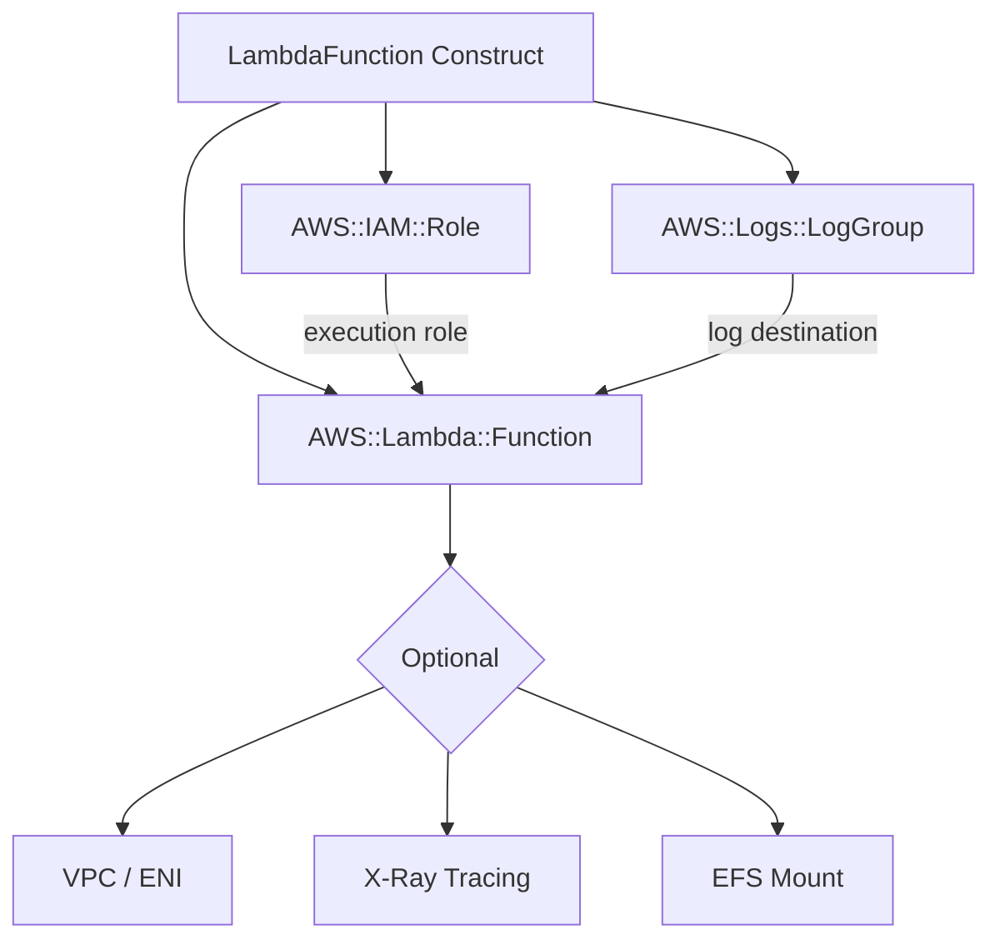

# @sevenpico/cdk-construct-lambda-function

> **Agent Context**: Before implementing this spec, read [`spec/AGENT-CONTEXT.md`](./AGENT-CONTEXT.md) for the full project context, functional architecture pattern, JSII constraints, and README generation requirements.

## Dependencies
- `@sevenpico/cdk-context` — **must be implemented first**

## Package
`@sevenpico/cdk-construct-lambda-function`
Directory: `packages/cdk-construct-lambda-function`

## Source Terraform Module
https://github.com/SevenPicoforks/terraform-aws-lambda-function

## Purpose
Provisions an AWS Lambda function with a dedicated IAM execution role, CloudWatch log group, and optional integrations: VPC, X-Ray tracing, Lambda Insights, SSM parameter access, EFS file system, EventBridge rules, and CloudWatch log subscription filters.

---

## CDK Imports
```typescript
import {
  aws_lambda as lambda,
  aws_iam as iam,
  aws_logs as logs,
  aws_ec2 as ec2,
  aws_efs as efs,
  Duration,
} from 'aws-cdk-lib';
```

## Props Interface (JSII-exported)

```typescript
import { Context } from '@sevenpico/cdk-context';

export interface LambdaVpcConfig {
  readonly securityGroupIds: string[];
  readonly subnetIds: string[];
}

export interface LambdaFileSystemConfig {
  readonly arn: string;            // EFS Access Point ARN
  readonly localMountPath: string; // e.g. '/mnt/data'
}

export interface LambdaEnvironment {
  readonly variables: Record<string, string>;
}

export interface LambdaFunctionProps {
  readonly context: Context;

  /** Function name. Default: context.id */
  readonly functionName?: string;

  /** Handler entrypoint (e.g. 'index.handler'). Required for Zip packages. */
  readonly handler?: string;

  /** Runtime (e.g. 'nodejs20.x'). Required for Zip packages. */
  readonly runtime?: string;

  /** Local path to deployment ZIP file */
  readonly filename?: string;

  /** S3 bucket containing deployment package */
  readonly s3Bucket?: string;

  /** S3 key of deployment package */
  readonly s3Key?: string;

  /** S3 object version */
  readonly s3ObjectVersion?: string;

  /** ECR image URI. Use when packageType = 'Image'. */
  readonly imageUri?: string;

  /** Deployment package type. 'Zip' | 'Image'. Default: 'Zip' */
  readonly packageType?: string;

  /** Function description */
  readonly description?: string;

  /** Memory in MB. Default: 128 */
  readonly memorySizeMb?: number;

  /** Timeout in seconds. Default: 3 */
  readonly timeoutSeconds?: number;

  /** Reserved concurrent executions. -1 = no limit. Default: -1 */
  readonly reservedConcurrentExecutions?: number;

  /** Instruction set architecture. 'x86_64' | 'arm64'. Default: 'x86_64' */
  readonly architecture?: string;

  /** Environment variables */
  readonly environment?: LambdaEnvironment;

  /** KMS key ARN for environment variable encryption */
  readonly kmsKeyArn?: string;

  /** Lambda layer ARNs (max 5) */
  readonly layers?: string[];

  /** Publish new version on each deploy. Default: false */
  readonly publish?: boolean;

  /** X-Ray tracing mode. 'Active' | 'PassThrough'. Default: no tracing */
  readonly tracingMode?: string;

  /** Enable CloudWatch Lambda Insights. Default: false */
  readonly lambdaInsightsEnabled?: boolean;

  /** CloudWatch log retention in days. Default: no expiry */
  readonly cloudwatchLogsRetentionDays?: number;

  /** KMS key ARN for CloudWatch log encryption */
  readonly cloudwatchLogsKmsKeyArn?: string;

  /** VPC configuration */
  readonly vpcConfig?: LambdaVpcConfig;

  /** EFS file system configuration */
  readonly fileSystemConfig?: LambdaFileSystemConfig;

  /** SSM parameter name prefixes this function should be able to read */
  readonly ssmParameterNames?: string[];

  /** Additional IAM policy document JSON strings for the execution role */
  readonly roleSourcePolicyDocuments?: string[];

  /** Existing IAM role name to use instead of creating one */
  readonly roleName?: string;
}
```

---

## Pure Functions (`src/lambda-function-fns.ts`)

```typescript
export const functionName = (ctx: Context, props: LambdaFunctionProps): string =>
  props.functionName ?? contextId(ctx);

export const logGroupName = (ctx: Context, props: LambdaFunctionProps): string =>
  `/aws/lambda/${functionName(ctx, props)}`;

export const lambdaRuntime = (runtime?: string): lambda.Runtime =>
  runtime ? new lambda.Runtime(runtime) : lambda.Runtime.NODEJS_20_X;

export const lambdaArchitecture = (arch?: string): lambda.Architecture =>
  arch === 'arm64' ? lambda.Architecture.ARM_64 : lambda.Architecture.X86_64;

export const lambdaCode = (props: LambdaFunctionProps): lambda.Code => {
  if (props.imageUri) return lambda.Code.fromEcrImage(/* resolve */ );
  if (props.s3Bucket && props.s3Key)
    return lambda.Code.fromBucket(/* resolve */, props.s3Key, props.s3ObjectVersion);
  if (props.filename) return lambda.Code.fromAsset(props.filename);
  throw new Error('LambdaFunction: one of filename, s3Bucket/s3Key, or imageUri must be provided');
};

export const lambdaTracingConfig = (mode?: string): lambda.Tracing => {
  if (mode === 'Active')      return lambda.Tracing.ACTIVE;
  if (mode === 'PassThrough') return lambda.Tracing.PASS_THROUGH;
  return lambda.Tracing.DISABLED;
};

export const logRetention = (days?: number): logs.RetentionDays | undefined => {
  if (!days) return undefined;
  return days as logs.RetentionDays;
};
```

---

## Construct Class (`src/lambda-function.ts`)

```typescript
export class LambdaFunction extends Construct {
  public readonly fn?: lambda.Function;
  public readonly role?: iam.Role;
  public readonly logGroup?: logs.LogGroup;

  constructor(scope: Construct, id: string, props: LambdaFunctionProps) {
    super(scope, id);
    if (!isEnabled(props.context)) return;

    // Log group (created before function so we control retention)
    this.logGroup = new logs.LogGroup(this, 'LogGroup', {
      logGroupName:  logGroupName(props.context, props),
      retention:     logRetention(props.cloudwatchLogsRetentionDays),
      encryptionKey: props.cloudwatchLogsKmsKeyArn
        ? kms.Key.fromKeyArn(this, 'LogKey', props.cloudwatchLogsKmsKeyArn)
        : undefined,
      removalPolicy: RemovalPolicy.DESTROY,
    });

    // Execution role
    this.role = new iam.Role(this, 'Role', {
      roleName:   `${contextId(props.context)}-role`,
      assumedBy:  new iam.ServicePrincipal('lambda.amazonaws.com'),
    });

    // Base CloudWatch Logs policy
    this.role.addManagedPolicy(
      iam.ManagedPolicy.fromAwsManagedPolicyName('service-role/AWSLambdaBasicExecutionRole')
    );

    // VPC policy
    if (props.vpcConfig) {
      this.role.addManagedPolicy(
        iam.ManagedPolicy.fromAwsManagedPolicyName('service-role/AWSLambdaVPCAccessExecutionRole')
      );
    }

    // X-Ray policy
    if (props.tracingMode) {
      this.role.addManagedPolicy(
        iam.ManagedPolicy.fromAwsManagedPolicyName('AWSXRayDaemonWriteAccess')
      );
    }

    // Lambda Insights policy
    if (props.lambdaInsightsEnabled) {
      this.role.addManagedPolicy(
        iam.ManagedPolicy.fromAwsManagedPolicyName('CloudWatchLambdaInsightsExecutionRolePolicy')
      );
    }

    // SSM parameter access
    if (props.ssmParameterNames?.length) {
      this.role.addToPolicy(new iam.PolicyStatement({
        actions:   ['ssm:GetParameter', 'ssm:GetParameters', 'ssm:GetParametersByPath'],
        resources: props.ssmParameterNames.map(n =>
          `arn:aws:ssm:*:*:parameter/${n.replace(/^\//, '')}`
        ),
      }));
    }

    // Additional policy documents
    (props.roleSourcePolicyDocuments ?? []).forEach((doc, i) => {
      iam.PolicyDocument.fromJson(JSON.parse(doc)).statements.forEach(s =>
        this.role!.addToPolicy(s)
      );
    });

    // VPC config
    let vpc: ec2.IVpc | undefined;
    let securityGroups: ec2.ISecurityGroup[] | undefined;
    let subnets: ec2.SubnetSelection | undefined;
    if (props.vpcConfig) {
      // Resolve from IDs — requires lookups in the constructor
      securityGroups = props.vpcConfig.securityGroupIds.map((id, i) =>
        ec2.SecurityGroup.fromSecurityGroupId(this, `Sg${i}`, id)
      );
      subnets = { subnets: props.vpcConfig.subnetIds.map((id, i) =>
        ec2.Subnet.fromSubnetId(this, `Subnet${i}`, id)
      )};
    }

    // EFS access point
    let filesystem: lambda.FileSystem | undefined;
    if (props.fileSystemConfig) {
      const ap = efs.AccessPoint.fromAccessPointAttributes(this, 'EfsAp', {
        accessPointArn: props.fileSystemConfig.arn,
        fileSystem: efs.FileSystem.fromFileSystemAttributes(this, 'Efs', {
          fileSystemId: 'placeholder', securityGroup: securityGroups?.[0]!,
        }),
      });
      filesystem = lambda.FileSystem.fromEfsAccessPoint(ap, props.fileSystemConfig.localMountPath);
    }

    this.fn = new lambda.Function(this, 'Function', {
      functionName:                  functionName(props.context, props),
      handler:                       props.handler ?? 'index.handler',
      runtime:                       lambdaRuntime(props.runtime),
      code:                          lambdaCode(props),
      role:                          this.role,
      description:                   props.description,
      memorySize:                    props.memorySizeMb ?? 128,
      timeout:                       Duration.seconds(props.timeoutSeconds ?? 3),
      reservedConcurrentExecutions:  props.reservedConcurrentExecutions === -1
                                       ? undefined
                                       : props.reservedConcurrentExecutions,
      architecture:                  lambdaArchitecture(props.architecture),
      environment:                   props.environment?.variables,
      layers:                        (props.layers ?? []).map((arn, i) =>
                                       lambda.LayerVersion.fromLayerVersionArn(this, `Layer${i}`, arn)
                                     ),
      tracing:                       lambdaTracingConfig(props.tracingMode),
      logGroup:                      this.logGroup,
      filesystem,
      vpc,
      securityGroups,
      vpcSubnets: subnets,
    });

    Object.entries(contextTags(props.context)).forEach(([k, v]) => Tags.of(this).add(k, v));
  }
}
```

---

## Public Properties

| Property | Type | Description |
|----------|------|-------------|
| `fn` | `lambda.Function \| undefined` | The Lambda function |
| `role` | `iam.Role \| undefined` | The execution role |
| `logGroup` | `logs.LogGroup \| undefined` | The CloudWatch log group |

---

## Context Usage

| Context Field | Usage |
|---------------|-------|
| `context.id` | Function name (default), role name, log group name |
| `context.tags` | Applied to function, role, and log group |
| `context.enabled` | If false, no resources created |

---

## BDD Tests

### Feature: Lambda Function Naming

**Scenario: Function uses context ID as name by default**
- **Given** a context with namespace `7p`, stage `prod`, name `processor`
- **When** a `LambdaFunction` is created without explicit `functionName`
- **Then** the Lambda function name is `7p-prod-processor`

**Scenario: Custom function name overrides context ID**
- **Given** a context with namespace `7p`, stage `prod`, name `processor`
- **And** `functionName` is set to `my-custom-function`
- **When** a `LambdaFunction` is created
- **Then** the Lambda function name is `my-custom-function`

### Feature: Lambda Function Resources

**Scenario: CloudWatch log group is always created**
- **Given** a valid context and function code
- **When** a `LambdaFunction` is created
- **Then** a CloudWatch log group named `/aws/lambda/{functionName}` exists

**Scenario: IAM execution role is created with Lambda trust**
- **Given** a valid context
- **When** a `LambdaFunction` is created
- **Then** an IAM role exists with trust policy allowing `lambda.amazonaws.com`

**Scenario: VPC access policy added when VPC config provided**
- **Given** a context and a `vpcConfig` with security group and subnet IDs
- **When** a `LambdaFunction` is created
- **Then** the execution role has the `AWSLambdaVPCAccessExecutionRole` managed policy

**Scenario: X-Ray write policy added when tracingMode is Active**
- **Given** a context and `tracingMode: 'Active'`
- **When** a `LambdaFunction` is created
- **Then** the execution role has the `AWSXRayDaemonWriteAccess` managed policy

### Feature: Disabled Lambda Function

**Scenario: No resources created when context is disabled**
- **Given** a context with `enabled: false`
- **When** a `LambdaFunction` is created
- **Then** no `AWS::Lambda::Function` resources exist in the stack
- **And** no `AWS::IAM::Role` resources exist in the stack

## README

Generate a `README.md` following the template in [`spec/AGENT-CONTEXT.md`](./AGENT-CONTEXT.md#readme-generation-requirement).

The Mermaid diagram should show:


