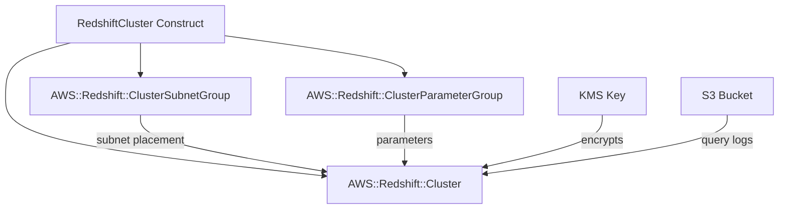

# @sevenpico/cdk-construct-redshift-cluster

> **Agent Context**: Before implementing this spec, read [`spec/AGENT-CONTEXT.md`](./AGENT-CONTEXT.md) for the full project context, functional architecture pattern, JSII constraints, and README generation requirements.

## Dependencies
- `@sevenpico/cdk-context` — **must be implemented first**

## Package
`@sevenpico/cdk-construct-redshift-cluster`
Directory: `packages/cdk-construct-redshift-cluster`

## Source Terraform Module
https://github.com/SevenPico/terraform-aws-redshift-cluster

## Purpose
Provisions an Amazon Redshift cluster with a subnet group and parameter group. Supports single-node and multi-node configurations, optional encryption, optional S3 query logging, snapshot restore, and IAM role associations.

> **Note:** CDK's `aws_redshift` L2 constructs are limited. Where L2 does not expose all configuration, use `aws_redshift.CfnCluster`, `CfnClusterSubnetGroup`, and `CfnClusterParameterGroup` (L1) directly.

---

## CDK Imports
```typescript
import { aws_redshift as redshift, aws_kms as kms, aws_ec2 as ec2 } from 'aws-cdk-lib';
```

## Props Interface (JSII-exported)

```typescript
import { Context } from '@sevenpico/cdk-context';

export interface RedshiftClusterParameter {
  readonly name: string;
  readonly value: string;
}

export interface RedshiftClusterProps {
  readonly context: Context;

  /** VPC subnet IDs for the cluster. Required. */
  readonly subnetIds: string[];

  /** Cluster identifier override. Default: context.id */
  readonly clusterIdentifier?: string;

  /** Initial database name. Default: 'dev' */
  readonly databaseName?: string;

  /** Master username. Default: 'admin' */
  readonly adminUser?: string;

  /** Master password. Required (recommend using Secrets Manager reference). */
  readonly adminPassword: string;

  /** Node instance type. Default: 'dc2.large' */
  readonly nodeType?: string;

  /** Cluster type. 'single-node' | 'multi-node'. Default: 'single-node' */
  readonly clusterType?: string;

  /** Number of compute nodes (multi-node only). Default: 1 */
  readonly numberOfNodes?: number;

  /** VPC security group IDs */
  readonly vpcSecurityGroupIds?: string[];

  /** Specific availability zone. Default: AWS selects */
  readonly availabilityZone?: string;

  /** Preferred maintenance window (e.g. 'Mon:03:00-Mon:03:30') */
  readonly preferredMaintenanceWindow?: string;

  /** Automated snapshot retention in days. Default: 1 */
  readonly automatedSnapshotRetentionPeriod?: number;

  /** Cluster port. Default: 5439 */
  readonly port?: number;

  /** Redshift engine version. Default: '1.0' */
  readonly engineVersion?: string;

  /** Make cluster publicly accessible. Default: false */
  readonly publiclyAccessible?: boolean;

  /** Enable encryption at rest. Default: false */
  readonly encrypted?: boolean;

  /** KMS key ARN for encryption */
  readonly kmsKeyArn?: string;

  /** Enable enhanced VPC routing. Default: false */
  readonly enhancedVpcRouting?: boolean;

  /** Elastic IP address */
  readonly elasticIp?: string;

  /** Skip final snapshot on deletion. Default: true */
  readonly skipFinalSnapshot?: boolean;

  /** Final snapshot identifier */
  readonly finalSnapshotIdentifier?: string;

  /** Snapshot identifier to restore from */
  readonly snapshotIdentifier?: string;

  /** IAM role ARNs to associate (max 10) */
  readonly iamRoles?: string[];

  /** Enable query/connection logging. Default: false */
  readonly loggingEnabled?: boolean;

  /** S3 bucket name for logs */
  readonly loggingBucketName?: string;

  /** S3 key prefix for logs */
  readonly loggingS3KeyPrefix?: string;

  /** Allow major version upgrades. Default: false */
  readonly allowVersionUpgrade?: boolean;

  /** Enable AZ relocation (RA3 nodes only). Default: false */
  readonly availabilityZoneRelocationEnabled?: boolean;

  /** Cluster parameter overrides */
  readonly clusterParameters?: RedshiftClusterParameter[];
}
```

---

## Pure Functions (`src/redshift-cluster-fns.ts`)

```typescript
import { aws_redshift as redshift } from 'aws-cdk-lib';
import { Context, contextId } from '@sevenpico/cdk-context';

export const clusterIdentifier = (ctx: Context, props: RedshiftClusterProps): string =>
  props.clusterIdentifier ?? contextId(ctx);

export const subnetGroupName = (ctx: Context): string => `${contextId(ctx)}-subnet-group`;
export const parameterGroupName = (ctx: Context): string => `${contextId(ctx)}-param-group`;

export const cfnClusterProps = (
  ctx: Context,
  props: RedshiftClusterProps,
  subnetGroupId: string,
  paramGroupName: string,
): redshift.CfnClusterProps => ({
  clusterIdentifier:                  clusterIdentifier(ctx, props),
  dbName:                             props.databaseName ?? 'dev',
  masterUsername:                     props.adminUser ?? 'admin',
  masterUserPassword:                 props.adminPassword,
  nodeType:                           props.nodeType ?? 'dc2.large',
  clusterType:                        props.clusterType ?? 'single-node',
  numberOfNodes:                      (props.clusterType === 'multi-node')
                                        ? (props.numberOfNodes ?? 2)
                                        : undefined,
  clusterSubnetGroupName:             subnetGroupId,
  clusterParameterGroupName:          paramGroupName,
  vpcSecurityGroupIds:                props.vpcSecurityGroupIds,
  availabilityZone:                   props.availabilityZone,
  preferredMaintenanceWindow:         props.preferredMaintenanceWindow,
  automatedSnapshotRetentionPeriod:   props.automatedSnapshotRetentionPeriod ?? 1,
  port:                               props.port ?? 5439,
  allowVersionUpgrade:                props.allowVersionUpgrade ?? false,
  publiclyAccessible:                 props.publiclyAccessible ?? false,
  encrypted:                          props.encrypted ?? false,
  kmsKeyId:                           props.kmsKeyArn,
  enhancedVpcRouting:                 props.enhancedVpcRouting ?? false,
  elasticIp:                          props.elasticIp,
  skipFinalSnapshot:                  props.skipFinalSnapshot ?? true,
  finalSnapshotIdentifier:            props.finalSnapshotIdentifier,
  snapshotIdentifier:                 props.snapshotIdentifier,
  iamRoles:                           props.iamRoles,
  availabilityZoneRelocation:         props.availabilityZoneRelocationEnabled ?? false,
  loggingProperties:                  (props.loggingEnabled && props.loggingBucketName)
                                        ? { bucketName: props.loggingBucketName, s3KeyPrefix: props.loggingS3KeyPrefix }
                                        : undefined,
  tags: Object.entries(contextTags(ctx)).map(([key, value]) => ({ key, value })),
});
```

---

## Construct Class (`src/redshift-cluster.ts`)

```typescript
export class RedshiftCluster extends Construct {
  public readonly cluster?: redshift.CfnCluster;
  public readonly subnetGroup?: redshift.CfnClusterSubnetGroup;
  public readonly parameterGroup?: redshift.CfnClusterParameterGroup;

  constructor(scope: Construct, id: string, props: RedshiftClusterProps) {
    super(scope, id);
    if (!isEnabled(props.context)) return;

    // Subnet group
    this.subnetGroup = new redshift.CfnClusterSubnetGroup(this, 'SubnetGroup', {
      description:   subnetGroupName(props.context),
      subnetIds:     props.subnetIds,
    });

    // Parameter group
    this.parameterGroup = new redshift.CfnClusterParameterGroup(this, 'ParamGroup', {
      description:    parameterGroupName(props.context),
      parameterGroupFamily: `redshift-${props.engineVersion ?? '1.0'}`,
      parameters:     (props.clusterParameters ?? []).map(p => ({
        parameterName:  p.name,
        parameterValue: p.value,
      })),
    });

    // Cluster
    this.cluster = new redshift.CfnCluster(this, 'Cluster',
      cfnClusterProps(
        props.context,
        props,
        this.subnetGroup.ref,
        this.parameterGroup.ref,
      )
    );

    Object.entries(contextTags(props.context)).forEach(([k, v]) => Tags.of(this).add(k, v));
  }
}
```

---

## Public Properties

| Property | Type | Description |
|----------|------|-------------|
| `cluster` | `redshift.CfnCluster \| undefined` | The Redshift cluster |
| `subnetGroup` | `redshift.CfnClusterSubnetGroup \| undefined` | The subnet group |
| `parameterGroup` | `redshift.CfnClusterParameterGroup \| undefined` | The parameter group |

---

## Context Usage

| Context Field | Usage |
|---------------|-------|
| `context.id` | Cluster identifier, subnet group name, parameter group name |
| `context.tags` | Applied via CfnCluster tags property and `Tags.of()` |
| `context.enabled` | If false, no resources created |

---

## BDD Tests

### Feature: Cluster Naming

**Scenario: Cluster identifier uses context ID**
- **Given** a context with namespace `7p`, stage `prod`, name `analytics`
- **When** a `RedshiftCluster` is created with required props
- **Then** the cluster identifier is `7p-prod-analytics`

### Feature: Defaults

**Scenario: Single-node cluster with dc2.large by default**
- **Given** no `clusterType` or `nodeType` props
- **When** a `RedshiftCluster` is created
- **Then** the cluster type is `single-node` and node type is `dc2.large`

**Scenario: Cluster is not publicly accessible by default**
- **Given** no `publiclyAccessible` prop
- **When** a `RedshiftCluster` is created
- **Then** `publiclyAccessible` is `false`

**Scenario: Encryption disabled by default**
- **Given** no `encrypted` prop
- **When** a `RedshiftCluster` is created
- **Then** `encrypted` is `false`

### Feature: Associated Resources

**Scenario: Subnet group and parameter group are created**
- **Given** a valid context and `subnetIds`
- **When** a `RedshiftCluster` is created
- **Then** a `AWS::Redshift::ClusterSubnetGroup` resource exists
- **And** a `AWS::Redshift::ClusterParameterGroup` resource exists

### Feature: Disabled Construct

**Scenario: No resources created when context is disabled**
- **Given** a context with `enabled: false`
- **When** a `RedshiftCluster` is created
- **Then** no `AWS::Redshift::Cluster` resources exist in the stack

## README

Generate a `README.md` following the template in [`spec/AGENT-CONTEXT.md`](./AGENT-CONTEXT.md#readme-generation-requirement).

The Mermaid diagram should show:


