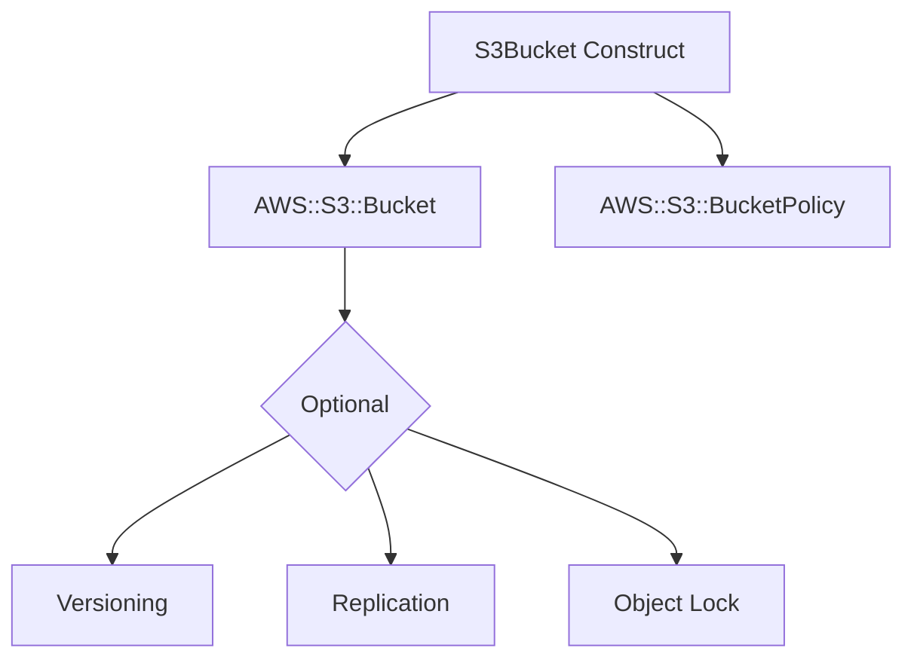

# @sevenpico/cdk-construct-s3-bucket

> **Agent Context**: Before implementing this spec, read [`spec/AGENT-CONTEXT.md`](./AGENT-CONTEXT.md) for the full project context, functional architecture pattern, JSII constraints, and README generation requirements.

## Dependencies
- `@sevenpico/cdk-context` — **must be implemented first**

## Package
`@sevenpico/cdk-construct-s3-bucket`
Directory: `packages/cdk-construct-s3-bucket`

## Source Terraform Module
https://github.com/SevenPicoforks/terraform-aws-s3-bucket

## Purpose
Provisions an S3 bucket with configurable versioning, server-side encryption, lifecycle rules, CORS, public access blocking, replication, and object lock. Mirrors the full feature set of the source Terraform module.

---

## CDK Imports
```typescript
import { aws_s3 as s3, aws_kms as kms, RemovalPolicy, Duration } from 'aws-cdk-lib';
```

## Props Interface (JSII-exported)

```typescript
import { Context } from '@sevenpico/cdk-context';

export interface S3CorsRule {
  readonly allowedMethods: string[];   // e.g. ['GET', 'PUT']
  readonly allowedOrigins: string[];
  readonly allowedHeaders?: string[];
  readonly exposedHeaders?: string[];
  readonly maxAge?: number;            // seconds
}

export interface S3LifecycleRule {
  readonly id?: string;
  readonly enabled?: boolean;
  readonly prefix?: string;
  readonly expirationDays?: number;
  readonly noncurrentVersionExpirationDays?: number;
  readonly transitions?: S3LifecycleTransition[];
  readonly noncurrentVersionTransitions?: S3LifecycleTransition[];
  readonly abortIncompleteMultipartUploadAfterDays?: number;
}

export interface S3LifecycleTransition {
  readonly storageClass: string;       // e.g. 'GLACIER', 'STANDARD_IA'
  readonly transitionAfterDays: number;
}

export interface S3ReplicationRule {
  readonly destinationBucketArn: string;
  readonly destinationStorageClass?: string;
  readonly prefix?: string;
  readonly status?: string;            // 'Enabled' | 'Disabled'
}

export interface S3BucketProps {
  readonly context: Context;

  /** Override the bucket name. Default: context.id */
  readonly bucketName?: string;

  /** Enable versioning. Default: true */
  readonly versioningEnabled?: boolean;

  /** SSE algorithm. 'AES256' | 'aws:kms'. Default: 'AES256' */
  readonly sseAlgorithm?: string;

  /** KMS key ARN for SSE-KMS encryption */
  readonly kmsKeyArn?: string;

  /** Enable S3 bucket key to reduce KMS costs. Default: false */
  readonly bucketKeyEnabled?: boolean;

  /** Block public ACLs. Default: true */
  readonly blockPublicAcls?: boolean;

  /** Block public bucket policies. Default: true */
  readonly blockPublicPolicy?: boolean;

  /** Ignore public ACLs. Default: true */
  readonly ignorePublicAcls?: boolean;

  /** Restrict public buckets. Default: true */
  readonly restrictPublicBuckets?: boolean;

  /** Force destroy even with objects. Default: false */
  readonly forceDestroy?: boolean;

  /** Lifecycle rules */
  readonly lifecycleRules?: S3LifecycleRule[];

  /** CORS rules */
  readonly corsRules?: S3CorsRule[];

  /** Object ownership. Default: 'BucketOwnerEnforced' */
  readonly objectOwnership?: string;

  /** Enable transfer acceleration. Default: false */
  readonly transferAccelerationEnabled?: boolean;

  /** Enable MFA delete (requires versioning). Default: false */
  readonly mfaDeleteEnabled?: boolean;

  /** Cross-region replication rules */
  readonly replicationRules?: S3ReplicationRule[];

  /** IAM role ARN for replication (required if replicationRules provided) */
  readonly replicationRoleArn?: string;

  /** Logging target bucket name */
  readonly loggingBucketName?: string;

  /** Logging target prefix */
  readonly loggingPrefix?: string;

  /** Additional IAM policy documents to merge into bucket policy (JSON strings) */
  readonly sourcePolicyDocuments?: string[];

  /** Enforce encrypted uploads only. Default: false */
  readonly allowEncryptedUploadsOnly?: boolean;

  /** Enforce SSL/TLS requests only. Default: false */
  readonly allowSslRequestsOnly?: boolean;

  /** Object lock mode. 'GOVERNANCE' | 'COMPLIANCE' */
  readonly objectLockMode?: string;

  /** Object lock retention days */
  readonly objectLockRetentionDays?: number;

  /** Object lock retention years */
  readonly objectLockRetentionYears?: number;
}
```

---

## Pure Functions (`src/s3-bucket-fns.ts`)

```typescript
export const s3BucketName = (ctx: Context, props: S3BucketProps): string =>
  props.bucketName ?? contextId(ctx);

export const s3EncryptionConfig = (props: S3BucketProps): s3.BucketEncryption => {
  if (props.sseAlgorithm === 'aws:kms') return s3.BucketEncryption.KMS;
  return s3.BucketEncryption.S3_MANAGED;
};

export const s3BucketProps = (ctx: Context, props: S3BucketProps): s3.BucketProps => ({
  bucketName:                 s3BucketName(ctx, props),
  versioned:                  props.versioningEnabled ?? true,
  encryption:                 s3EncryptionConfig(props),
  encryptionKey:              props.kmsKeyArn ? kms.Key.fromKeyArn(/* scope needed — pass as param */) : undefined,
  bucketKeyEnabled:           props.bucketKeyEnabled ?? false,
  blockPublicAccess:          new s3.BlockPublicAccess({
    blockPublicAcls:          props.blockPublicAcls ?? true,
    blockPublicPolicy:        props.blockPublicPolicy ?? true,
    ignorePublicAcls:         props.ignorePublicAcls ?? true,
    restrictPublicBuckets:    props.restrictPublicBuckets ?? true,
  }),
  removalPolicy:              (props.forceDestroy ?? false) ? RemovalPolicy.DESTROY : RemovalPolicy.RETAIN,
  autoDeleteObjects:          props.forceDestroy ?? false,
  lifecycleRules:             (props.lifecycleRules ?? []).map(mapLifecycleRule),
  cors:                       (props.corsRules ?? []).map(mapCorsRule),
  objectOwnership:            mapObjectOwnership(props.objectOwnership ?? 'BucketOwnerEnforced'),
  transferAcceleration:       props.transferAccelerationEnabled ?? false,
  serverAccessLogsBucket:     undefined, // set imperatively in constructor if loggingBucketName provided
  serverAccessLogsPrefix:     props.loggingPrefix,
  objectLockEnabled:          !!props.objectLockMode,
  objectLockDefaultRetention: mapObjectLock(props),
});

// Mapping helpers (all pure)
export const mapLifecycleRule = (r: S3LifecycleRule): s3.LifecycleRule => ({ ... });
export const mapCorsRule = (r: S3CorsRule): s3.CorsRule => ({ ... });
export const mapObjectOwnership = (v: string): s3.ObjectOwnership => ({ ... }[v] ?? s3.ObjectOwnership.BUCKET_OWNER_ENFORCED);
export const mapObjectLock = (props: S3BucketProps): s3.ObjectLockRetention | undefined => { ... };
```

> **Note:** `kmsKeyArn` requires looking up the key from the scope; the pure function should accept the `kms.IKey` object and the constructor resolves the lookup.

---

## Construct Class (`src/s3-bucket.ts`)

```typescript
export class S3Bucket extends Construct {
  public readonly bucket?: s3.Bucket;

  constructor(scope: Construct, id: string, props: S3BucketProps) {
    super(scope, id);
    if (!isEnabled(props.context)) return;

    const encryptionKey = props.kmsKeyArn
      ? kms.Key.fromKeyArn(this, 'Key', props.kmsKeyArn)
      : undefined;

    this.bucket = new s3.Bucket(this, 'Bucket', {
      ...s3BucketProps(props.context, props),
      encryptionKey,
    });

    // Logging bucket reference (cannot be computed purely — requires scope)
    if (props.loggingBucketName) {
      // set serverAccessLogsBucket imperatively via CfnBucket override if needed
    }

    // SSL/encrypted-only bucket policy
    if (props.allowSslRequestsOnly) {
      this.bucket.addToResourcePolicy(sslOnlyPolicyStatement(this.bucket.bucketArn));
    }
    if (props.allowEncryptedUploadsOnly) {
      this.bucket.addToResourcePolicy(encryptedUploadsOnlyPolicyStatement(this.bucket.bucketArn));
    }

    // Additional policy documents
    (props.sourcePolicyDocuments ?? []).forEach(doc => {
      PolicyDocument.fromJson(JSON.parse(doc)).statements.forEach(s =>
        this.bucket!.addToResourcePolicy(s)
      );
    });

    // Replication — use CfnBucket escape hatch if CDK L2 replication support is insufficient
    if (props.replicationRules?.length) {
      applyReplicationConfig(this.bucket, props);
    }

    Object.entries(contextTags(props.context)).forEach(([k, v]) => Tags.of(this).add(k, v));
  }
}
```

---

## Public Properties

| Property | Type | Description |
|----------|------|-------------|
| `bucket` | `s3.Bucket \| undefined` | The S3 bucket. Undefined when disabled. |

---

## Context Usage

| Context Field | Usage |
|---------------|-------|
| `context.id` | Bucket name (default) |
| `context.tags` | Applied to bucket via `Tags.of()` |
| `context.enabled` | If false, no resources created |

---

## BDD Tests

### Feature: Bucket Naming

**Scenario: Bucket name uses context ID**
- **Given** a context with namespace `7p`, stage `prod`, name `assets`
- **When** an `S3Bucket` construct is created
- **Then** the S3 bucket name is `7p-prod-assets`

### Feature: Versioning

**Scenario: Versioning disabled by default**
- **Given** no `versioningEnabled` prop
- **When** an `S3Bucket` construct is created
- **Then** versioning is not enabled on the bucket

**Scenario: Versioning enabled when prop is true**
- **Given** `versioningEnabled: true`
- **When** an `S3Bucket` construct is created
- **Then** the bucket has versioning enabled

### Feature: Encryption

**Scenario: SSE-S3 encryption applied by default**
- **Given** no `kmsKeyArn` prop
- **When** an `S3Bucket` construct is created
- **Then** the bucket uses `SSE-S3` server-side encryption

**Scenario: KMS encryption when kmsKeyArn provided**
- **Given** `kmsKeyArn: 'arn:aws:kms:...'`
- **When** an `S3Bucket` construct is created
- **Then** the bucket uses KMS encryption with the specified key

### Feature: Public Access

**Scenario: All public access blocked by default**
- **Given** no `blockPublicAccess` prop
- **When** an `S3Bucket` construct is created
- **Then** all four public access block settings are enabled

### Feature: Tagging

**Scenario: Context tags applied to bucket**
- **Given** a context with tags
- **When** an `S3Bucket` construct is created
- **Then** the S3 bucket resource has those tags

### Feature: Disabled Construct

**Scenario: No resources created when context is disabled**
- **Given** a context with `enabled: false`
- **When** an `S3Bucket` construct is created
- **Then** no `AWS::S3::Bucket` resources exist in the stack

## README

Generate a `README.md` following the template in [`spec/AGENT-CONTEXT.md`](./AGENT-CONTEXT.md#readme-generation-requirement).

The Mermaid diagram should show:


